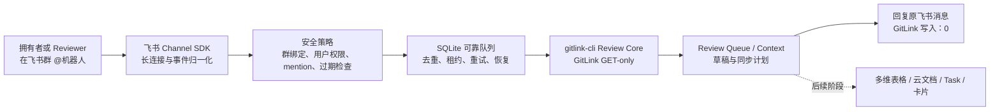

# GitLink 飞书 Review 机器人能力总结

日期：2026-07-30

对应阶段：

```text
P2.0：飞书只读入站与任务基础设施
P2.1：真实飞书只读收发与可靠性门禁
```

对应分支：

```text
feat/round2-review-collaboration-p21-live-reply
```

## 1. 完整定位

当前机器人是运行在 `gitlink-cli` 上方的 **飞书 PR Review 协作入口和可靠执行
Gateway**。

它服务的核心场景是：

> 比赛或集中贡献结束时，仓库拥有者在短时间内收到大量 PR。机器人把 GitLink
> 中分散的 PR、patchset、Review 和线程事实整理成可在飞书群中发起、查看和共同
> 跟进的 Review 工作，同时保留拥有者的最终判断权。

当前机器人不是一个新的大模型 Agent，也不会自行决定是否批准、拒绝或合并 PR。
它负责确定性的事件接入、权限校验、任务可靠执行、GitLink 只读取证和飞书回复。
后续可让已有 Agent 消费同一套 Review Context，负责风险分析、排序和草稿生成，
但 Agent 的建议仍然只是证据和草稿。

项目的责任划分是：

```text
GitLink     = 代码、PR、patchset、Review、线程、合并结果的正式事实源
gitlink-cli = 面向人、脚本、AI 和 Agent 的稳定工具与执行面
机器人      = 飞书事件、策略、任务、回复和协作资源的受控 Gateway
Agent       = 取证、分诊、总结、风险提示和草稿，不替代最终决定
飞书        = 群沟通、认领、进度、文档、看板、任务和协作审计
拥有者团队  = 最终 Review、批准、拒绝和合并责任人
```

## 2. 当前工作链路



真实在线链路为：

```text
飞书消息或卡片动作
-> 官方 Channel SDK WebSocket
-> NormalizedMessage / CardActionEvent
-> bot 身份与群策略校验
-> 绑定仓库与发送者权限校验
-> message_id / event_id 去重
-> SQLite 原子保存事件和 Job
-> 异步读取 GitLink
-> 持久化 feishu.review-result/v1
-> 回复原消息
```

## 3. 已实现的飞书能力

### 3.1 企业自建应用和应用机器人

当前采用飞书企业自建应用，而不是只依赖自定义 Webhook。

已经使用：

- App ID / App Secret 鉴权；
- 应用机器人身份发现；
- `tenant_access_token` 对应用可访问资源进行调用；
- 应用可见群聊发现；
- 应用身份发送和回复消息；
- 开发者后台的事件与回调配置；
- 长连接接收事件。

应用凭据从启动参数或运行环境读取；部署时优先使用受控环境变量或凭据存储。凭据
不会写入绑定文件、SQLite Job、回复内容或 Git 仓库。

### 3.2 Channel SDK 长连接

当前锁定：

```text
github.com/larksuite/oapi-sdk-go/v3 v3.9.9
```

已经借用 Channel SDK 的：

- WebSocket 长连接；
- 断线和连接生命周期；
- bot identity；
- 飞书消息归一化；
- mention 识别；
- `PolicyGate`；
- 卡片动作模型；
- 消息发送与回复。

普通消息持久化需要把失败返回给飞书以保留重投机会，因此 P2.1 在 SDK 使用的同一个
官方 dispatcher 上注册同步消息适配器，再复用 SDK normalizer、bot identity 和
安全策略。卡片动作继续使用 SDK 的 `OnCardAction`。

### 3.3 群发现与仓库预绑定

管理员可以只读列出应用当前可见的群：

```powershell
gitlink-cli feishu +review-gateway --discover-chats --format json
```

然后在本地配置中建立：

```text
飞书 chat_id
<-> GitLink owner/repo
```

绑定还可以设置：

- 是否启用；
- 管理员用户；
- 允许使用机器人的用户；
- 默认截止时间；
- 绑定配置版本。

首次绑定必须由管理员预配置。尚未绑定的群不在机器人 `GroupAllowlist` 内，不能
依靠该群中的聊天命令绕过准入策略完成自助绑定。

### 3.4 群消息安全策略

当前在线策略为：

```text
仅响应 enabled 的预绑定群
群聊必须 @机器人
不响应 @所有人
禁用机器人私聊入口
支持群内发送者 allowlist
支持管理员 allowlist
默认拒绝超过时间窗口的旧事件
忽略机器人自己发送的消息
```

只有被确认是机器人自身的 mention key 会从命令正文中移除；其他用户 mention
不会被误删。

### 3.5 回复原消息

收到有效请求后，机器人会异步尝试回复原消息：

```text
已接收只读 Review 请求
目标仓库和 PR
任务 ID
GitLink 写入：0
```

后台读取完成后，再回复最终结果。最终结果可能包括：

- Review Queue 数量和优先级；
- 高优先级 PR 摘要；
- PR 当前 head；
- patchset 完整性；
- Review 阶段；
- 当前决定；
- Review 数量；
- 线程和未解决线程数量；
- partial 状态；
- snapshot plan；
- Review 草稿摘要；
- 建议的人工下一步；
- 明确的 `GitLink 写入：0`。

当前正式输出是有长度上限的文本回复。飞书卡片事件入口已经接入，但 Review
卡片模板、按钮状态和卡片持续更新尚未完成。

### 3.6 飞书开发者后台配置面

机器人不是单个 Webhook 地址，而是一套企业自建应用配置。部署时需要在飞书
开发者后台完成：

1. 创建企业自建应用；
2. 启用机器人能力；
3. 配置应用名称、图标和说明；
4. 选择“使用长连接接收事件/回调”；
5. 订阅消息和后续所需的卡片事件；
6. 按最小权限申请群信息、消息发送与接收等 OpenAPI 权限；
7. 配置应用可用范围；
8. 创建并发布应用版本；
9. 将机器人加入测试群；
10. 通过 `--discover-chats` 获取群 ID 并由管理员建立仓库绑定。

进入 Base、Docx 和 Task 阶段时再分别追加对应权限，不在 P2.1 一次性申请所有
写权限。应用权限只说明“API 是否允许调用”，资源本身的文档协作者权限、知识库
权限和任务成员关系仍要单独处理。

## 4. 当前支持的命令

| 飞书群命令 | 当前行为 | 是否写 GitLink |
|---|---|---:|
| `帮助` | 返回支持命令和安全边界 | 否 |
| `查看绑定` | 查看当前群预绑定仓库 | 否 |
| `查看待 Review` / `查看待审查` | 读取开放 PR 并生成 Review Queue 摘要 | 否 |
| `查看 PR #431` | 读取 PR、文件、versions、Reviews 和线程 | 否 |
| `刷新 PR #431` | 重新读取当前 PR Context | 否 |
| `生成 PR #431 Review 草稿` | 读取 Context 并生成确定性草稿模板 | 否 |
| `查看我的 Review 任务` | 返回当前阶段说明，真实个人任务视图尚未落地 | 否 |
| `领取 PR #431` | 只生成认领计划，不写飞书 Base、Task 或 GitLink | 否 |
| `绑定仓库 owner/repo` | 只生成离线计划，在线首次绑定必须由管理员配置 | 否 |

明确禁止识别或执行：

```text
批准 PR
拒绝 PR
合并 PR
创建或解决行级评论
请求或移除 Reviewer
保存 GitLink 用户 Token
执行任意 shell 或任意 API
```

## 5. GitLink Review 能力

机器人通过 `gitlink-cli` 的稳定 Review Core 获取：

### 5.1 Review Queue

- 开放 PR；
- 当前页和全量分页；
- PR 基本信息；
- 规则化优先级；
- 高、中、低优先级数量；
- 前若干项的排名和标题。

### 5.2 单个 PR Review Context

- PR 当前状态；
- 当前 head、base 和 start SHA；
- patchset / version ID；
- 文件数量、提交数量、增删行；
- Review 记录；
- 每名 Reviewer 最后一条有效决定；
- 当前、过期、未知 freshness；
- Review 线程正文；
- 路径和行号；
- 未解决及需要贡献者响应的线程；
- `complete / partial / failed`；
- 分段状态和结构化 fetch errors；
- source fingerprint；
- merged / closed / re-review 等路由状态。

### 5.3 草稿与同步保护

Review 草稿是基于稳定模板生成的预览，不写回 GitLink。

同步计划遵循：

```text
完整且发生变化 -> apply
完整且未变化   -> unchanged
partial        -> preserve_previous
merged/closed  -> archive
```

这使未来的飞书 Base、Doc 和 Task 同步不会因一次 GitLink 分段读取失败而清空此前
完整事实或覆盖人工字段。

## 6. 可靠性和审计基础

### 6.1 事件与 Job 原子保存

飞书事件去重占位和 Job 保存处于同一个 SQLite 事务中：

```text
Reserve dedupe key
+ Save Job
= atomic enqueue
```

如果 P2.0 曾留下“有 dedupe key、没有 Job”的孤儿记录，P2.1 会识别并补建 Job。

### 6.2 崩溃恢复

SQLite 保存：

```text
attempt_count
max_attempts
next_attempt_at
lease_owner
lease_expires_at
result_json
handler_latency_ms
```

worker 启动和轮询时会：

- 领取到期的 queued Job；
- 恢复租约已过期的 running Job；
- 失败后退避重试；
- 默认最多执行三次；
- 保存成功或最终失败结果。

### 6.3 回复恢复

最终回复也有独立的：

```text
reply_status
reply_attempt_count
reply_next_attempt_at
reply_lease_owner
reply_lease_expires_at
reply_message_id
reply_error_summary
```

进程重启后可以继续发送尚未完成的最终回复。发送成功但在本地标记 `sent` 前崩溃
仍有极小重复窗口，因此这里是可恢复的至少一次交付，不虚构跨飞书 API 和 SQLite
的严格 exactly-once。

### 6.4 飞书处理时限

当前门禁：

```text
handler 总预算：默认 2 秒
SQLite 预算：默认 500 毫秒
SQLite busy timeout：400 毫秒
耗时 GitLink 读取：全部异步
stdout：有界非阻塞队列
```

数据库持久化失败时返回受控错误，不在任务尚未保存时向飞书返回伪成功。

### 6.5 脱敏

进入 SQLite、终端和飞书回复前会清理：

- URL query；
- URL user info；
- webhook 路径中的凭据；
- Authorization Bearer；
- Cookie；
- access token / refresh token；
- App Secret / client secret；
- password；
- 超长或包含空字符的错误。

## 7. 已验证与尚未验证

### 7.1 已验证

```text
飞书自建应用鉴权
远端应用检查
应用可见群发现
测试群管理员预绑定
Channel SDK WebSocket 连接
bot identity 获取
应用身份主动发送测试群消息
GitLink 公共 PR #431 GET-only
SQLite schema 迁移、恢复、重试、结果和回复测试
目标 Go 包测试与 vet
```

### 7.2 仍需真实用户触发

```text
测试群真实用户 @机器人“查看 PR #431”
-> handler 在预算内完成持久化
-> 用户收到已接收回复
-> 后台完成 GitLink GET-only
-> 用户收到最终 Review 回复
-> 重发同一 message_id 不产生第二个 Job 和最终回复
```

在保存这条链路的脱敏证据前，不把测试群端到端验收标记为通过。

## 8. 如何继续借用飞书的强势能力

以下能力都由飞书开放平台提供可实现基础，但当前实现程度不同。

| 飞书能力 | 对 Review 场景的价值 | 当前状态 | 推荐阶段 |
|---|---|---|---|
| Channel SDK | 群聊、单聊、评论事件、回复和安全策略 | 已使用群聊与回复 | P2.1 |
| 消息回复树 | 将回执和结果固定在原 PR 请求下 | 已使用 | P2.1 |
| 交互卡片 | 展示 PR 摘要、领取、刷新、打开证据 | 回调入口已接，模板未实现 | P2.2 |
| 流式卡片 | 展示“读取、分析、草拟”的实时进度 | 未实现 | P2.2 |
| 多维表格 Base | 团队 Review Queue、负责人、截止时间、筛选与视图 | 未实现 | P2.2 |
| 甘特图/看板视图 | 从 Base 协作字段观察 Review 进度和期限 | 未实现 | P2.2 |
| Docx 云文档 | 保存完整 Review 证据、草稿和人工修订 | 未实现 | P2.2 |
| 云文档评论 | 在 Review Doc 中 @机器人追问证据 | SDK 可接，尚未启用 | P2.2 |
| Task v2 | Reviewer 任务、负责人、关注人、截止时间、提醒 | 未实现 | P2.2 |
| OAuth | 飞书账号与 GitLink identity reference 的用户确认 | 未实现 | P3 前置 |
| 云空间权限 | 控制 Review Doc、Base 和知识库的可见与编辑范围 | 未实现 | P2.2 |

### 8.1 交互卡片：群内 Review 控制台

建议第一张卡片只提供安全动作：

```text
查看最新 Context
刷新
生成草稿
领取
释放
打开 GitLink PR
打开 Review Doc
```

卡片显示：

- PR 标题和作者；
- head 与 patchset；
- 当前 Review 状态；
- 阻塞线程；
- partial 告警；
- Reviewer 和截止时间；
- 数据更新时间；
- GitLink GET-only 标记。

卡片暂不提供“批准、拒绝、合并”。卡片回调的处理窗口有限，应先快速确认，再异步
更新卡片；这与当前可靠 Job 架构一致。

### 8.2 多维表格：团队 Review Queue

Base 适合保存团队协作字段：

```text
PR Key
优先级
当前阶段
负责人
截止时间
领取状态
人工风险标签
协作备注
最后同步时间
GitLink 链接
Review Doc 链接
Task GUID
```

字段所有权必须分开：

| GitLink 事实字段 | 飞书人工协作字段 |
|---|---|
| PR 状态、head、patchset、Review、线程 | 负责人、截止时间、备注、团队标签 |
| 只能由 GitLink 镜像更新 | 只能由飞书协作动作更新 |

完整快照可以更新 GitLink 事实列；`partial` 快照只显示告警并保留旧事实。Base 的
批量更新 API 支持批量记录写入，但仍需处理权限、限流、字段类型和一致性检查。

Base 中的数据可以由团队配置表格、看板、筛选和甘特图等视图；机器人负责稳定记录
合同，不把具体视图布局耦合进 Review Core。

### 8.3 云文档：Review 证据与共同编辑

每个重要 PR 可以生成一篇 Review Doc：

```text
PR 摘要
当前 patchset
改动范围
风险清单
Review 历史
阻塞线程
Agent 证据
Review 草稿
人工修订
最终决定记录
```

飞书 Docx OpenAPI 使用“文档 + 块”模型，适合结构化追加和局部更新。云文档的
所有者、应用访问权和协作者权限需要单独设计，不能只申请 API scope 就假定应用能
访问任意用户文档。

Channel SDK 还支持云文档评论事件。后续可以让 Reviewer 在文档评论中
`@gitlink` 询问“为什么这是高风险”或“哪些线程仍未解决”，机器人基于同一
Review Context 回答，避免群聊和文档形成两套事实。

### 8.4 Task v2：明确负责人和截止时间

飞书 Task v2 可以承载：

- Reviewer 负责人；
- 关注人；
- 截止时间；
- 子任务；
- Review 清单；
- 自定义分组；
- 自定义字段；
- 评论和附件。

建议一条 PR WorkItem 最多对应一个主 Task，避免刷新时重复创建。任务必须保存
稳定的 GitLink PR key 和本地映射，使用幂等键或查找后更新。

机器人用应用身份创建任务时，任务属于应用；再把真实 Reviewer 添加为负责人。
如果希望完全等价于用户本人操作，需要单独使用用户授权，而不能混用应用身份。

### 8.5 OAuth 与账号绑定

当前群消息只有飞书用户 ID，不等于 GitLink 用户身份。

未来账号绑定建议：

```text
飞书用户发起绑定
-> 打开受控网页授权
-> 获取一次性 authorization code
-> 服务端换取 user_access_token
-> 用户在 GitLink 侧确认身份
-> 只保存 identity reference / credential reference
```

不得把 `user_access_token`、`refresh_token` 或 GitLink Token 写进飞书消息、
Base、Doc、SQLite Job payload 或 Git 仓库。

P2 的只读查询不需要账号绑定；只有真实认领归属、用户权限和未来受控写回才需要
冻结身份方案。

## 9. 推荐的完整用户体验

### 场景一：比赛结束后的海量 PR 分诊

```text
拥有者：@gitlink 查看待 Review
机器人：回复队列总数、优先级和高风险 PR
拥有者：打开 Review Queue 卡片或 Base
团队：在 Base 中分配负责人和截止时间
机器人：为被领取 PR 创建或关联 Task
Reviewer：进入 PR 线程或 Review Doc
Agent：提供证据和草稿
拥有者：回到 GitLink 完成最终 Review 和合并
```

### 场景二：单个 PR 快速取证

```text
Reviewer：@gitlink 查看 PR #431
机器人：立即回执
机器人：异步读取当前 patchset、Reviews 和线程
机器人：在原消息下回复状态、阻塞项和证据链接
Reviewer：生成草稿或打开 Review Doc 共同修订
```

### 场景三：PR 更新后的重新 Review

```text
贡献者推送新 patchset
机器人：读取新 head
旧 Review：标记 stale
Base：状态变为 waiting_for_re_review
Task：重新提醒负责人
卡片：显示 head 已变化
Reviewer：基于新 Context 重新评估
```

## 10. 下一轮推荐顺序

### P2.1 验收收口

1. 完成真实用户群消息到两次回复；
2. 重复消息去重验证；
3. 执行中重启恢复验证；
4. 保存脱敏验收记录。

### P2.2 最小飞书协作闭环

1. Review Queue 卡片；
2. Reviewer 认领、释放和截止时间；
3. 单表 Base WorkItem；
4. Base 字段所有权与 partial 保护；
5. merged / closed 自动归档；
6. Task v2 最小映射；
7. Review Doc 最小模板。

### P3 之前

1. OAuth 和 GitLink identity reference；
2. 最小权限复核；
3. 审计存储；
4. stale head 二次确认；
5. 普通 Review 的 dry-run；
6. 明确人工确认。

在 P3 门禁完成前，飞书不得执行 GitLink Review、评论、Reviewer 或合并写入。

## 11. 当前一句话介绍

> GitLink 飞书 Review 机器人把 `gitlink-cli` 的稳定只读 Review 能力接入飞书
> 群，让拥有者团队可以快速查看海量 PR、共享证据、生成草稿并准备分工；飞书承载
> 沟通和协作，Agent 提供分析，GitLink 保留正式事实与最终决定。

## 12. 飞书官方能力依据

- Channel SDK：<https://open.feishu.cn/document/mcp_open_tools/integrating-agents-with-feishu/integrate-feishu-channel>
- 消息与回复 API：<https://open.feishu.cn/document/uAjLw4CM/ukTMukTMukTM/reference/im-v1/introduction>
- 消息卡片交互：<https://open.feishu.cn/document/common-capabilities/message-card/add-card-interaction/interaction-module>
- 多维表格快速接入：<https://open.feishu.cn/document/home/quick-access-to-base/preparation>
- 多维表格批量更新：<https://open.feishu.cn/document/server-docs/docs/bitable-v1/app-table-record/batch_update?lang=zh-CN>
- 多维表格甘特视图：<https://www.feishu.cn/hc/zh-CN/articles/558830919244-%E4%BD%BF%E7%94%A8%E5%A4%9A%E7%BB%B4%E8%A1%A8%E6%A0%BC%E7%9A%84%E7%94%98%E7%89%B9%E8%A7%86%E5%9B%BE>
- Docx 文档概述：<https://open.feishu.cn/document/server-docs/docs/docs/docx-v1/docx-overview>
- 云空间权限：<https://open.feishu.cn/document/server-docs/docs/permission/overview>
- Task v2：<https://open.feishu.cn/document/task-v2/overview>
- OAuth user access token：<https://open.feishu.cn/document/authentication-management/access-token/get-user-access-token?lang=zh-CN>
