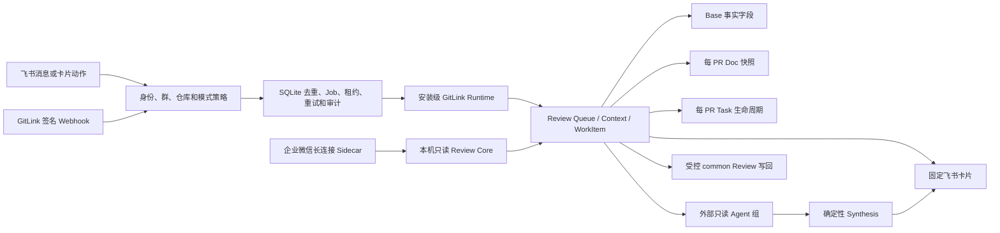

# GitLink 飞书 PR Review 协作平台 v2 实现说明

日期：2026-08-01  
分支：`feat/round2-feishu-platform-v2`  
基线：`6cc2d974fda992e7f5c1985ccb3c83fb5483b4cd`

## 1. 结果与产品边界

本轮把已经跑通的“飞书消息 → GitLink 只读查询 → 飞书回复”从单仓库演示链路扩展为可审计的多仓库协作平台合同。核心目标仍然是帮助仓库拥有者在短时间内处理大量 PR，同时让贡献者及时看到状态、负责人和下一步。

职责保持清晰：

- GitLink 是 PR、patchset、Review、线程与合并结果的事实源；
- 飞书是团队沟通、认领、进度、卡片、Base、Doc 和 Task 的协作面；
- `gitlink-cli` 是确定性的读取、归一化、权限、幂等和受控执行层；
- Agent 负责分析证据和生成建议，不代替 Owner 作最终批准或合并决定；
- 企业微信复用同一 WorkItem 和 Review Context，但保持独立平台凭据与入站边界。

默认行为仍然是只读 GitLink。只有安装模式、账号绑定、完整快照、当前 head、指纹、确认计划和显式启动开关同时通过时，才允许创建一条 `common` Review。批准、拒绝、行级评论、解决线程、Reviewer 管理和合并仍未开放。

## 2. 总体结构



所有平台资源均从同一个 `gitlink.review-work-item/v1` 派生。人工字段与 GitLink 事实字段分离，partial 快照不得覆盖已有完整事实。

## 3. G0：两个基础安全合同

### 3.1 写入结果为三态

GitLink 写入不再使用容易误导的单一布尔值：

- `none`：已确认没有越过远端写入边界；
- `confirmed`：远端返回成功且本地完成状态保存成功；
- `possible`：请求可能到达远端，但网络结果或本地落账不确定，必须人工对账。

`possible` 状态禁止自动重试，避免重复 Review。

### 3.2 Agent 结果必须证明做过工作

完成态 assessment 除 findings/unknowns 外，还必须包含：

- `assessment_summary`；
- `coverage`；
- `evidence_checked`。

空结果不能把综合状态推进到 `ready_for_owner_review`。

## 4. M1：Installation v2 与配置真源

配置 schema 为 `feishu.review-bindings/v2`。它把平台账号、GitLink 安装、仓库授权和飞书群绑定分开建模：

- `GitLinkInstallation`：主机、Owner、凭据引用、运行模式、仓库 allowlist、Webhook 标识；
- `ReviewChatBinding`：群、安装、多仓库、默认仓库、管理员和允许用户；
- `ReviewIdentityBinding`：某个安装内的飞书用户与 GitLink login 映射。

运行模式：

- `observe`：只读事实；
- `collaborate`：只读 GitLink，并允许修改本地协作状态和飞书资源；
- `write`：在全部门禁通过后，允许受控 `common` Review。

配置文件是管理员输入，SQLite 是原子应用后的运行时真源。数据库保存配置 revision 和审计记录，但只保存 `env:VARIABLE` 引用，不保存 Secret 值。v1 单仓库配置会迁移到受限的 legacy installation；不支持 `*` 仓库通配符。

参考配置：[feishu-review-bindings-v2.json](./examples/feishu-review-bindings-v2.json)。

## 5. M2：飞书多仓库命令与授权

一个群可以绑定同一 GitLink installation 中的多个明确仓库。解析规则：

- 单仓库或配置了默认仓库时，允许 `查看 PR #431`；
- 多仓库且无默认仓库时，必须使用 `查看 owner/repo PR #431`；
- 请求仓库不在群绑定或 installation allowlist 中时直接拒绝；
- `查看绑定` 和帮助信息会展示可用仓库与选择方式。

典型命令：

```text
查看 Gitlink/gitlink-cli PR #431
刷新 Gitlink/gitlink-cli PR #431
查看 Gitlink/gitlink-cli 待审查
生成 Gitlink/gitlink-cli PR #431 Review 草稿
启动 Gitlink/gitlink-cli PR #431 Agent 审查
```

配置同步是单事务操作；非法新配置不会部分覆盖当前有效配置。

## 6. M3：固定卡片而非消息洪泛

每个 WorkItem 在一个群中最多维护一条飞书交互卡片。资源映射保存：

```text
platform + chat_id + pr_key + resource_type
-> remote message_id + content fingerprint
```

首次同步创建卡片；内容变化时 PATCH 原卡片；指纹未变时跳过。已有映射但缺少更新器时会受控失败，不会悄悄再发一条重复卡片。

## 7. M4：GitLink Webhook 主动刷新

Gateway 可启动签名 Webhook 入站：

- 默认只监听回环地址；
- 最大 body 1 MiB；
- 使用原始 body 校验 HMAC-SHA256；
- 识别 GitLink/Gitea 风格 delivery 与签名头；
- delivery 持久去重；
- 仅接受 allowlist 内仓库的 PR 事件；
- 将事件路由到绑定该仓库的群并创建 `refresh_review_context` Job；
- Job 结果可主动发到群，而不要求存在原始飞书 message_id。

公网暴露必须位于 TLS 反向代理之后，并显式启用非回环监听。反向代理必须原样保留请求 body 与签名头。

## 8. M5：飞书 Base、Doc、Task 生命周期

这些写入均需显式 `--sync-feishu-resources`，默认关闭。

### Base

- 先使用本地 `record_id` 映射；首次对账才按 `pr_key` 搜索；
- 搜索到多条记录时拒绝继续，不能把 `pr_key` 假装成 Base 唯一索引；
- 更新 GitLink 管理的事实字段；
- 不覆盖 Base 中人工维护的负责人、协作状态和截止日期；
- 机器人执行领取、释放、截止命令时，才以人工字段权威模式写入。

### Doc

- 可使用固定汇总 Doc；
- 也可配置文件夹，为每个 PR 创建一份长期文档；
- 保存 document ID 与内容指纹；
- 只在事实变化时追加新快照。

### Task

- 每个 PR 最多创建一个 Task；
- 使用短期 `client_token` 防止创建请求重放，同时长期保存 Task GUID；
- WorkItem 变化时更新原 Task；
- PR merged/closed 后完成 Task；
- 删除或远端不确定状态进入对账，不盲目重复创建。

## 9. M6：安装级凭据、身份和受控写回

每个 Job 根据 `installation_id` 构造独立 GitLink Runtime：

- 使用安装自己的 GitLink host；
- 只解析该安装的 `credential_ref`；
- 不继承全局 `GITLINK_TOKEN`；
- 不把 Token 写入 Job、SQLite 配置、飞书资源或日志。

同一飞书用户可以在不同安装映射到不同 GitLink login。真正 POST 前还会调用 `/users/me`，要求当前凭据身份与安装范围内的绑定 login 一致。

受控 common Review 的完整门禁：

1. installation 为 `write`；
2. Gateway 显式带 `--enable-gitlink-review-write`；
3. 用户存在已验证身份绑定；
4. Context 为 complete 且 `partial=false`；
5. head SHA 和 SourceFingerprint 未变化；
6. ActionPlan 未过期且由同一用户确认；
7. `/users/me` 与绑定 login 一致；
8. 执行租约有效；
9. 远端写入边界前完成持久化。

## 10. M7：真实外部 Agent 运行器

`review-agent-run` 和飞书的“启动 … Agent 审查”命令会：

1. 读取当前完整 Review Context；
2. 生成角色化 `review.agent-plan/v1`；
3. 并发调用固定 HTTPS Agent endpoint；
4. 逐项校验 run、task、role、head 与 assessment 内容；
5. 按确定顺序合成结果；
6. 把 incomplete、冲突和风险返回 Owner；
7. 永远保持 `human_decision_required=true`。

Agent endpoint 使用 provider-neutral HTTP 合同，不要求在 `gitlink-cli` 内新建一个大模型 Agent。凭据只允许使用 `env:VARIABLE`，HTTP 仅可用于本机测试，响应上限 1 MiB，并发和每任务超时都有上限。Agent 不获得 GitLink 写权限。
调用合同只传仓库、PR、head、指纹、文件范围和任务要求，不传 GitLink Token，也不把它描述成
完整代码包；Agent Host 必须使用自己的只读 GitLink/代码读取能力取得实际 diff，并对同一 head
负责。没有源码读取能力的 endpoint 只能返回 incomplete，不能声称完成代码审查。

## 11. M8：企业微信多仓库只读适配

企业微信采用官方智能机器人长连接 Sidecar：

- Sidecar 持有企业微信 Bot ID/Secret；
- Go Review Core 持有 GitLink 读取能力；
- 两者通过回环地址和独立 Bearer Token 通信；
- Sidecar 不接收 GitLink Token，Core 不接收企业微信 Secret；
- chat/user allowlist 默认 fail-closed；
- 写操作意图在 Sidecar 层即被拒绝；
- 事件 ID 以完整 SHA-256 持久去重，日志中只显示短哈希；
- 支持显式多仓库 allowlist、默认仓库和限定仓库命令；
- 多仓库无默认值时，未限定仓库的命令受控失败；
- 使用流式回复返回只读 Review 结果。

启动示例：

```powershell
$env:GITLINK_REVIEW_CORE_TOKEN = "<random-local-token>"
go run . wecom +review-core `
  --repositories Gitlink/gitlink-cli,owner/second `
  --default-repository Gitlink/gitlink-cli

Set-Location .\bridges\wecom
$env:WECOM_BOT_ID = "<bot-id>"
$env:WECOM_BOT_SECRET = "<bot-secret>"
$env:WECOM_ALLOWED_CHAT_IDS = "<chat-id>"
$env:GITLINK_REVIEW_CORE_URL = "http://127.0.0.1:8765/v1/review/inbound"
$env:GITLINK_REVIEW_CORE_TOKEN = "<same-random-local-token>"
npm start
```

企业微信群机器人 Webhook 只承担主动通知；需要接收用户输入时使用智能机器人长连接，而不是把出站 Webhook 当成双向通道。

## 12. 部署和运行

保守的单实例 systemd 示例位于 [deploy/round2](../deploy/round2/README.md)。基础 unit 只启用：

- 飞书长连接；
- SQLite 持久 Job；
- GitLink 安装级只读；
- 回环 Webhook listener。

它不默认启用 GitLink 写回、Base/Doc/Task 同步或 Agent runner。生产多实例需要共享队列、分布式租约和长连接投递语义的额外设计；当前单实例模型不得通过同时启动多个进程来“扩容”。

## 13. 当前证据与尚未证明的内容

已证明：

- P2.1 真实飞书消息 → Gateway → GitLink GET → 最终回复链路已于 2026-08-01 通过；
- 多仓库、安装隔离、卡片更新、Webhook、资源生命周期、受控写入、Agent 与企业微信合同有自动化测试；
- 定向 Go 测试和企业微信 Node 合同测试可本地复现；
- 全程默认 GitLink 写入为 0。

尚未证明，不能写成“已上线”：

- v2 多仓库配置在真实飞书群的逐仓库查询；
- 固定卡片真实创建和 PATCH；
- Base、每 PR Doc、Task 的首次创建、重复同步、更新和归档；
- GitLink Webhook 经公网 TLS 代理后的真实签名投递；
- 专用测试 PR 的一次 common Review 写回及不确定态演练；
- 外部 Agent endpoint 的真实多角色运行；
- 企业微信智能机器人真实长连接与流式回复；
- 多实例生产部署。

2026-08-01 本地工程门禁结果：定向 Go 测试、企业微信 Node 合同测试、全仓生产包构建和本轮
`go vet` 通过。额外执行的 `go test ./...` 仍复现基线已有的非本轮失败，包括旧命令注册、
测试辅助函数缺失、i18n 断言漂移和若干历史 shortcut 合同；本轮相关的 `shortcuts/feishu`、
`shortcuts/wecom`、`shortcuts/workflow` 均通过。不能把“全仓测试通过”写入验收结论。

具体证据格式和执行顺序见 [平台验收清单](./ROUND2_PLATFORM_EVIDENCE_CHECKLIST.md)。
