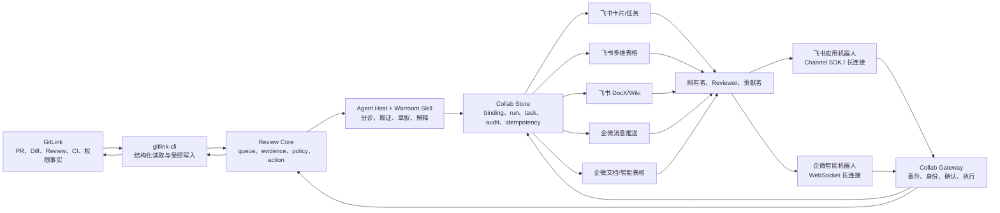
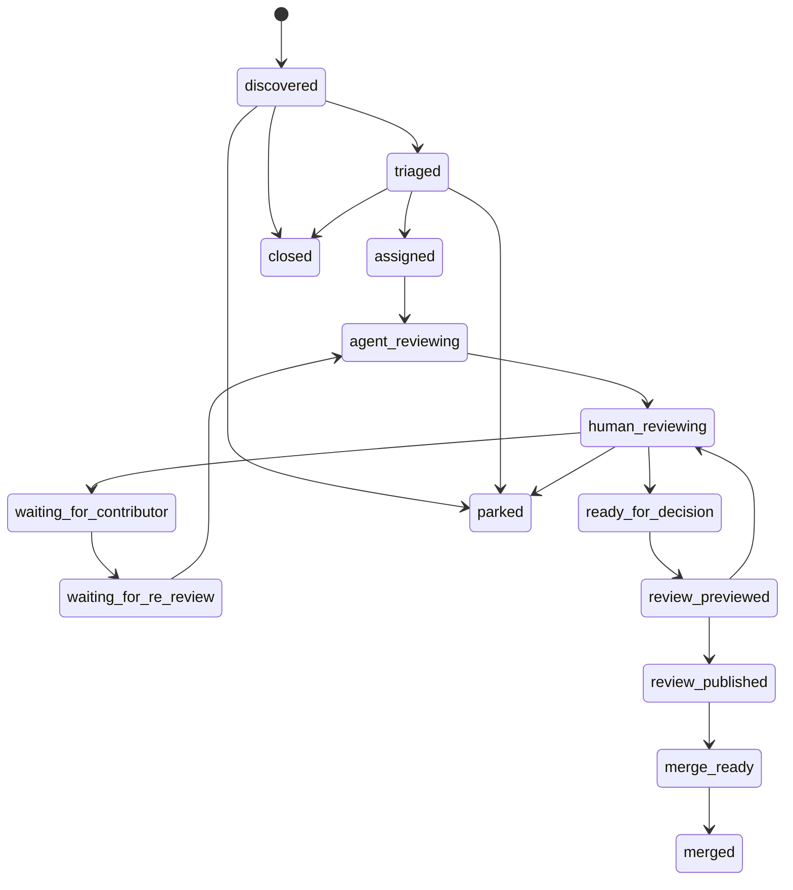
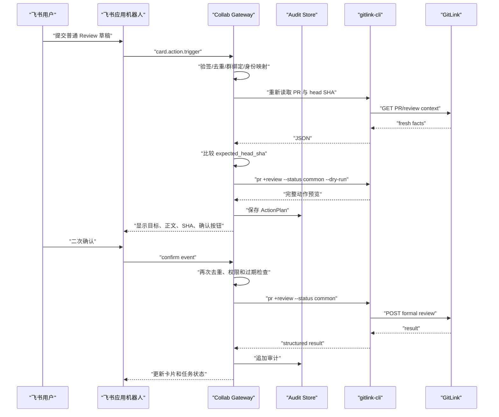

# GitLink CLI 复赛 PR Review 协同集成完整设计 v2.1

设计日期：2026-07-29
最新主线基线：`origin/master` @ `d3bcbae82a20963c70a20407f8dc578e2127a754`
复核日期：2026-07-29
文档状态：实现前设计基线（已完成代码级实施复核）
本轮边界：只完成设计与信息收集，不修改业务代码，不触发 GitLink、飞书或企业微信写入

实现进展：[P0 实施记录](./ROUND2_PR_REVIEW_COLLABORATION_P0_IMPLEMENTATION.md) ·
[P1 实施记录](./ROUND2_PR_REVIEW_COLLABORATION_P1_IMPLEMENTATION.md)

## 1. 执行摘要

### 1.1 要解决的问题

比赛结束、活动收口或大型版本发布前，拥有者会在短时间内收到大量 PR。原来逐条人工 Review 的节奏失效，但团队仍需要快速完成：

- PR 全量盘点。
- 优先级分诊。
- 重复、依赖和冲突识别。
- 代码、测试、CI 和合并风险检查。
- Review 分工和进度同步。
- 对贡献者的及时反馈。
- 是否进入合并队列的人工决策。

真正的问题不是“缺少一个会回复消息的机器人”，而是：

> 如何在 PR 洪峰下，让拥有者团队用更少时间完成有证据的高质量 Review，并让贡献者及时获得明确、可执行、可追踪的反馈。

### 1.2 产品定义

产品暂定名：

```text
GitLink PR Review Warroom
```

它不是新的通用 Agent Runtime，也不是 GitLink 的替代前端，而是一套：

```text
GitLink 事实
-> gitlink-cli 结构化工具
-> Agent 分诊与 Review 草拟
-> 飞书/企业微信协作
-> 人工复核与确认
-> 受控写回 GitLink
```

### 1.3 复赛主线

本设计采用“一套核心、两类渠道、分级动作”：

1. **平台无关 Review 核心**
   - PR 队列、证据、关系、任务、运行、动作和审计使用统一模型。
2. **飞书主交互平台**
   - 应用机器人 + 长连接/Channel SDK。
   - 多维表格、DocX/Wiki、Task、交互卡片。
3. **企业微信第二适配**
   - 消息推送用于通知。
   - 智能机器人 API 长连接用于群内只读交互和后续动作入口。
4. **动作风险分级**
   - 默认只读。
   - 第一个写动作只考虑 `pr +review --status common`。
   - approve、reject 和 merge 不进入第一轮。

### 1.4 当前必须先处理的事实

本次复核直接读取了 `c1446162d5821d4bbddec1dd50b4ce0cc1c12608` 的完整提交和其父提交中的实现，并重新 fetch 官方主线。`origin/master` 仍为 `d3bcbae82a20963c70a20407f8dc578e2127a754`，不存在基线漂移。

最新主线中：

- 飞书 PR #346 的功能文件已合入，`shortcuts/feishu` 单测通过，但根命令没有注册 `feishu`，实际无法调用。
- `workflow +review-context` 已注册且可见；`workflow +review-queue` 已有实现和测试文件，但未加入 `workflow.Shortcuts()`，实际不可调用。
- PR 行级 Review 评论的查询、创建、更新、删除源码已经存在，内部 API 参考也覆盖对应端点，但这些命令没有加入 `pr.Shortcuts()`，实际不可调用。
- `pr +review` 已支持 `common/approved/rejected`、`--commit` 和 `--dry-run`；实际写入成功后还会尝试追加一条 PR 会话评论，而 dry-run 只展示正式 Review 请求，没有展示这个附加写入。
- `pr +review` 当前直接返回首次 POST 结果，没有按 Review ID 回读，也没有对 head SHA 执行 compare-and-set 式前置校验。
- Reviewer 只在 PR 数据和创建参数中出现；当前 CLI 没有 PR 创建后请求或移除 Reviewer 的稳定命令，内部 API 参考也没有给出独立的 Reviewer 管理端点。
- `shortcuts/pr`、`shortcuts/workflow` 和根 `shortcuts` 测试仍失败，失败包括源码已存在但未注册、批量合并后的参数契约漂移和响应字段归一化问题。

上述结论区分四个层级：

```text
API 文档存在
!= 源码已实现
!= CLI 已注册可调用
!= 真实环境已验证
```

后续任何能力清单都必须同时记录这四个状态，不能再用“仓库里存在文件”代替“用户可用”。

因此实施顺序必须是：

```text
P0 主线恢复
-> P1 只读 Review 核心
-> P2 飞书协作闭环
-> P3 飞书普通 Review 受控写回
-> P4 企业微信复用适配
```

不能直接从 P2 或 P4 开始。

## 2. 产品发心

### 2.1 服务拥有者

拥有者最需要快速回答：

```text
现在最需要我决定的 PR 是哪些？
哪些 PR 可以快速反馈？
哪些 PR 需要深度 Review？
哪些 PR 重复、依赖或互相冲突？
谁正在处理，哪里停滞？
Agent 的判断依据是什么？
正式 Review 发出前，我能否看见并修改？
```

系统应减少：

- 浏览几十个页面的切换成本。
- 多人重复 Review。
- 对所有 PR 使用相同深审成本。
- 无证据的 AI 结论。
- 讨论结束但没有写回 GitLink 的信息丢失。

### 2.2 服务贡献者

贡献者最需要：

```text
我的 PR 是否已经被看到？
当前由谁处理？
阻塞点是什么？
我应该修改什么，完成条件是什么？
为什么暂缓、需要 rebase 或与其他 PR 一起处理？
维护者的正式反馈在哪里？
```

系统不得：

- 公开生成“低质量贡献者榜单”。
- 用模型评分替代维护者意见。
- 把规则提示冒充正式 Review。
- 在没有证据时推断动机、能力或贡献价值。
- 对同一阻塞重复刷屏。

### 2.3 GitLink 的定位

GitLink 是：

```text
代码、PR、Review、CI、Issue、贡献和正式决策的事实源
```

`gitlink-cli` 是：

```text
人类、脚本和 Agent 共用的结构化、可审计执行面
```

飞书和企业微信是：

```text
注意力、共享进度、知识、讨论和受控操作界面
```

Agent 是：

```text
有边界的取证、分析、编排、草拟和解释层
```

## 3. 目标与非目标

### 3.1 复赛目标

1. 读取一个 GitLink 仓库的全部开放 PR。
2. 在数分钟内生成第一版有理由的 Review 队列。
3. 识别需要一起 Review 的重复、依赖、替代和冲突候选。
4. 只对高价值、高风险或高优先级 PR进行深审。
5. 把队列、负责人、截止时间和证据同步到飞书协作空间。
6. 让团队在飞书中认领、讨论和修改 Review 草稿。
7. 生成绑定当前 head SHA 的正式 Review 预览。
8. 在身份和权限完成后，从飞书确认发布普通 Review 到 GitLink。
9. 为企业微信提供同一核心的通知和只读交互适配。
10. 保证每个结论、动作和结果可追踪。

### 3.2 第一轮非目标

- 自动修改贡献者代码。
- 自动批准或拒绝 PR。
- 自动合并 PR。
- 自动关闭 PR/Issue。
- 修改成员、仓库权限、分支保护或 Webhook。
- 从零开发大模型 Runtime。
- 第一版就实现多个自治 Agent 服务。
- 同时建设两套独立的飞书和企业微信业务逻辑。
- 把 Base/智能表格当作 GitLink 的第二事实源。
- 自动创建或修改办公平台分享权限。

### 3.3 成功定义

成功不以新增命令数衡量，而以：

| 指标 | 目标 |
| --- | --- |
| 首次队列时间 | 100 条 PR 元数据分诊目标在 5 分钟内完成；真实结果记录环境 |
| 队列覆盖率 | 全量，或明确显示采样范围和遗漏原因 |
| 证据覆盖率 | 深审结论 100% 有证据或显式 unknown |
| 重复提醒率 | 相同 fingerprint 不重复 |
| 人工可控性 | 未确认 GitLink 写操作为 0 |
| 版本安全 | stale head 上的正式写入为 0 |
| 贡献者反馈 | 每条已处理 PR 都有明确下一步或暂缓原因 |
| 可追踪性 | 正式动作 100% 有 action_id 和审计记录 |

## 4. 设计原则

### 4.1 事实、推断和决定分开

```text
Fact      = GitLink/API/测试返回的可验证事实
Inference = Agent 或规则根据事实形成的判断
Decision  = 人工确认后的正式协作决定
```

三者在 JSON、表格、文档和卡片中使用不同字段，不能混写。

### 4.2 只读优先

默认路径：

```text
read -> analyze -> preview
```

任何真实写入必须额外经过：

```text
identity -> permission -> fresh data -> preview -> confirm -> execute -> audit
```

### 4.3 一次分析绑定一个版本

Review 报告必须绑定：

- repository。
- PR number。
- base branch。
- head SHA。
- input fingerprint。
- analysis version。

PR 更新后：

- 旧报告标记 stale。
- 未执行 ActionPlan 过期。
- 只重审受影响内容，但不得直接复用旧结论写回。

### 4.4 协作平台不拥有 GitLink 状态

飞书/企业微信可以保存：

- 协作负责人。
- 当前 Review 阶段。
- 截止时间。
- 人工补充。
- Review 草稿。
- 动作审计索引。

GitLink 镜像字段由同步器覆盖；人工字段不能被同步清空。

### 4.5 Agent 上下文不等于权限

用户在群里说“合并它”，不能证明：

- 该群绑定了正确仓库。
- 该用户是 GitLink 维护者。
- 当前 token 有权限。
- PR 当前仍满足合并条件。

聊天上下文只用于理解目标，权限必须独立验证。

### 4.6 最小维护成本

- 复用 `gitlink-cli` 现有 API、PR 和 Workflow。
- 复用官方 SDK处理平台通道。
- 业务模型只实现一次。
- 先恢复主线再扩展。
- 新增能力按可审查的小 PR 提交。

## 5. 用户与角色

| 角色 | 主要任务 | 默认权限 |
| --- | --- | --- |
| 仓库拥有者 | 设定优先级、确认 Review、最终决定 | 只读 + 经绑定后的受控写入 |
| Review 协调者 | 启动 Warroom、分配任务、跟进 SLA | 协作字段写入，不自动拥有 GitLink 高风险权限 |
| Reviewer | 深审、测试、修改草稿 | 协作写入；GitLink 权限独立判断 |
| 贡献者 | 接收反馈、补充证据、修改 PR | 查看与自己有关的信息 |
| Agent 宿主 | 编排工具、生成分析和草稿 | 默认只读 |
| Gateway | 接收平台事件、执行已确认动作 | 固定 allowlist，不做自由推理 |
| 审计查看者 | 查询运行和动作记录 | 只读 |

## 6. 总体架构



### 6.1 组件边界

| 组件 | 负责 | 不负责 |
| --- | --- | --- |
| GitLink | 正式事实、角色和权限 | 飞书/企微协作字段 |
| gitlink-cli | GitLink 数据访问和受控动作 | 长连接、群会话生命周期 |
| Review Core | 平台无关模型、策略、幂等、动作计划 | 平台 SDK |
| Agent Skill | 编排步骤、证据收集、停止条件 | 模型 Runtime、凭证存储 |
| Gateway | 事件接入、固定路由、身份、确认和执行 | 开放式 shell、任意 API |
| 飞书/企微 Adapter | 消息转换、卡片渲染和投递 | PR 风险判断 |
| Collab Store | Binding、Run、Task、Action、Audit | GitLink 正式状态 |

### 6.2 运行形态

第一阶段：

```text
人工运行 Agent/CLI
-> 本地 JSON/Markdown
-> 飞书 preview
-> 显式同步测试 Base/Doc/群
```

交互阶段：

```text
常驻 Collab Gateway
-> 飞书/企微长连接
-> 快速 ack
-> 异步 Review Job
-> 更新卡片和协作空间
```

不建议让 `gitlink-cli feishu +serve` 自己承担所有职责。更合理的是仓库内独立可执行程序：

```text
cmd/gitlink-collab-gateway
```

它复用 Go 包和 CLI 能力，但生命周期、日志和部署与一次性 CLI 命令分开。

## 7. 主线恢复闸门 P0

### 7.1 必须修复

1. 恢复 `feishu` 根命令注册。
2. 对齐 `shortcuts/register.go` 与 `register_test.go`。
3. 注册计划使用的 `workflow +review-queue`；其他 Workflow 要么注册，要么删除错误宣称。
4. 将只读 `pr +review-comments` 纳入命令树；行级评论写命令保持禁用，直到合同测试和真实 smoke 完成。
5. 修复 `pr +review` 测试参数契约，并消除或显式建模隐式 journal 双写。
6. 修复批量合并后的 API 字段归一化测试。
7. 确认 README 命令示例与实际 `--help` 一致。

### 7.2 退出条件

至少满足：

```powershell
go test ./shortcuts/feishu
go test ./shortcuts/pr
go test ./shortcuts/workflow
go test ./shortcuts
go run . feishu --help
go run . workflow --help
go run . pr +review --help
```

并保存：

- commit SHA。
- Go 版本。
- 测试输出。
- 实际命令列表。
- 已知未通过项。

### 7.3 提交策略

P0 单独 PR，不混入新功能：

```text
PR-A: restore command registration and test consistency
```

这样拥有者可以快速 Review，也符合从最新合并退化中得到的维护偏好。

## 8. 统一领域模型

### 8.1 RepositoryBinding

```json
{
  "schema_version": "collab.binding/v1",
  "binding_id": "stable-id",
  "platform": "feishu",
  "tenant_id": "tenant-ref",
  "app_or_bot_id": "app-ref",
  "chat_id": "chat-ref",
  "repository": "Gitlink/gitlink-cli",
  "audience": "owner",
  "enabled_features": [
    "review_queue",
    "review_claim",
    "review_draft"
  ],
  "write_policy": "preview_only",
  "created_by": "mapped-actor-ref",
  "created_at": "RFC3339"
}
```

唯一键：

```text
platform + tenant_id + app_or_bot_id + chat_id
```

一个群可以绑定多个仓库，但第一版建议限制为一个默认仓库，减少误操作。

### 8.2 IdentityBinding

```json
{
  "schema_version": "collab.identity/v1",
  "platform": "feishu",
  "tenant_id": "tenant-ref",
  "app_or_bot_id": "app-ref",
  "platform_user_id": "user-ref",
  "gitlink_username": "alice",
  "credential_ref": "os-keyring://gitlink/alice",
  "verification_method": "local-pairing",
  "verified_at": "RFC3339",
  "expires_at": null,
  "revoked_at": null
}
```

禁止：

- 用显示名自动匹配。
- 用邮箱或手机号直接赋予写权限。
- 在飞书/企微消息或表格中保存 GitLink token。

### 8.3 ReviewWorkItem

```json
{
  "schema_version": "review.work-item/v1",
  "pr_key": "gitlink:Gitlink/gitlink-cli:pr:42",
  "repository": "Gitlink/gitlink-cli",
  "number": 42,
  "title": "feat: ...",
  "author": "contributor",
  "gitlink_url": "https://www.gitlink.org.cn/Gitlink/gitlink-cli/pulls/42",
  "base_branch": "master",
  "head_branch": "feature/x",
  "head_sha": "abc123",
  "gitlink_state": "open",
  "review_stage": "triaged",
  "priority": "high",
  "priority_reasons": [],
  "risk_level": "medium",
  "change_metrics": {},
  "ci_summary": {
    "state": "unknown",
    "source": "not_returned"
  },
  "mergeability": "unknown",
  "relationships": [],
  "evidence": [],
  "unknowns": [],
  "recommended_next_step": "human_review",
  "source_scope": {
    "complete": true,
    "sampled": false
  },
  "source_fingerprint": "sha256:...",
  "generated_at": "RFC3339"
}
```

### 8.4 Evidence

```json
{
  "type": "diff|ci|test|formal_review|journal|merge_check|policy",
  "source": "gitlink|local_test|agent_rule",
  "summary": "...",
  "location": {
    "path": "shortcuts/register.go",
    "line": 42
  },
  "source_url": "...",
  "observed_at": "RFC3339",
  "confidence": "verified|inferred"
}
```

### 8.5 ReviewRun

```json
{
  "schema_version": "review.run/v1",
  "run_id": "run-uuid",
  "scope": "queue|cluster|pull_request",
  "targets": ["gitlink:Gitlink/gitlink-cli:pr:42"],
  "agent_host": "agent-runtime",
  "skills_used": [],
  "input_fingerprint": "sha256:...",
  "status": "running|succeeded|partial|failed|stale",
  "findings": [],
  "verification": [],
  "unknowns": [],
  "started_at": "RFC3339",
  "finished_at": "RFC3339"
}
```

### 8.6 ReviewTask

```json
{
  "task_id": "task-uuid",
  "pr_key": "gitlink:Gitlink/gitlink-cli:pr:42",
  "type": "triage|code_review|test|ci|integration|human_check|publish",
  "state": "todo|doing|blocked|done|cancelled",
  "owner_identity_ref": "identity-ref",
  "collaborators": [],
  "depends_on": [],
  "start_at": "RFC3339",
  "due_at": "RFC3339",
  "result_ref": "doc-or-run-ref"
}
```

### 8.7 ActionPlan

```json
{
  "schema_version": "collab.action/v1",
  "action_id": "action-uuid",
  "repository": "Gitlink/gitlink-cli",
  "pr_number": 42,
  "expected_head_sha": "abc123",
  "action_type": "publish_common_review",
  "payload_preview": {
    "status": "common",
    "content": "..."
  },
  "requested_by": "identity-ref",
  "required_confirmations": 1,
  "confirmed_by": [],
  "expires_at": "RFC3339",
  "status": "draft|previewed|confirmed|executing|succeeded|failed|expired",
  "audit_ref": "audit-uuid"
}
```

### 8.8 AuditEvent

审计只追加：

```json
{
  "audit_id": "audit-uuid",
  "action_id": "action-uuid",
  "event_type": "requested|previewed|confirmed|executed|failed|expired",
  "actor_ref": "identity-ref",
  "request_event_id": "platform-event-id",
  "target_fingerprint": "sha256:...",
  "result_ref": "gitlink-url-or-error-ref",
  "created_at": "RFC3339"
}
```

## 9. Review 状态与转换模型

状态必须拆成四个互不覆盖的维度，禁止用单一 `status` 同时表达平台事实、团队进度和模型判断：

```text
gitlink_pr_state       = open | merged | closed | unknown
gitlink_review_status  = common | approved | rejected | none | unknown
review_freshness       = current | outdated | unknown
review_stage           = 协作流程状态
thread_state           = opened | resolved | disabled | none | unknown
```

### 9.1 协作流程状态



规则：

- `review_stage` 是协作状态，不覆盖 GitLink `state`。
- 只有工作流服务可以根据事实推进自动状态；认领、等待贡献者和人工决定由有权限的用户触发。
- PR head SHA 变化时，`agent_reviewing` 之后的分析结果标记 stale，并进入 `waiting_for_re_review`。
- `review_published` 只在 GitLink 返回正式 Review 结果后设置。
- `merge_ready` 只是候选状态，不自动执行 merge。

### 9.2 GitLink Review 决定

当前 GitLink API 和 CLI 真实枚举是：

```text
common
approved
rejected
```

因此产品层不得把 `changes_requested`、`commented` 或 `dismissed` 直接写入 GitLink。跨平台展示时使用下列映射：

| 产品展示 | GitLink 原始状态 | 含义 |
| --- | --- | --- |
| `commented` | `common` | 普通 Review，不代表批准或拒绝 |
| `approved` | `approved` | 正式通过 |
| `changes_requested` | `rejected` | 当前实现中最接近“要求修改”的正式状态，但文案必须说明平台原始值 |
| `none` | 无 Review | 尚未提交正式 Review |
| `unknown` | 字段缺失/解析失败 | 不允许推断为 `none` |

第一轮只允许发布 `common`。`approved` 和 `rejected` 仅用于只读展示，不能通过飞书或企业微信执行。

### 9.3 Review 与 patchset 的新鲜度

每条 Review 必须保留 `review.commit_id`，每次执行前重新读取 `current_head_sha`：

```text
commit_id == current_head_sha  -> current
commit_id != current_head_sha  -> outdated
commit_id 为空或 head 不可得    -> unknown
```

约束：

- 协作写回路径必须显式传递 `--commit <expected_head_sha>`，不允许省略。
- `outdated` Review 保留历史记录，但不计入当前版本的通过或阻断结论。
- `unknown` 按保守策略处理，不得使 PR 进入 `merge_ready`。
- 新 patchset 到达后，旧分析、旧草稿、旧 ActionPlan 和未消费确认全部失效。
- API 文档样例中存在 `commit_id: null`，所以必须真实验证不同状态 Review 的字段行为，不能假设该字段永远存在。

### 9.4 Review 线程

行级 Review 评论使用 GitLink 的真实状态：

```text
opened
resolved
disabled
```

并独立保留：

```text
need_respond
parent_id
review_id
commit_id
line_code
path
```

聚合规则：

- `opened && need_respond=true` 计为待贡献者处理意见。
- `opened && need_respond=false` 计为开放讨论，不自动阻断。
- `resolved` 不计入当前待处理数，但必须进入审计历史。
- `disabled` 视为失效意见，不得删除其历史引用。
- `commit_id != current_head_sha` 时同时标记 `outdated`；线程状态和版本新鲜度是两个维度。
- 回复由 `parent_id` 建树；孤儿回复进入 `unknown_parent` 告警，不静默丢弃。

### 9.5 多人 Review 聚合

```text
若存在 current rejected                         -> blocked
否则若存在 current opened problem/need_respond   -> changes_pending
否则若 required reviewers 均 current approved    -> approved
否则若存在 current common                        -> commented
否则                                                -> pending
```

这里的 `required reviewers` 第一轮只能来自人工配置或明确的仓库规则。GitLink 当前没有经过验证的 Reviewer 请求/移除接口，所以不能根据“建议 Reviewer”自动形成强制审批规则。

## 10. Agent 与 Skill 设计

### 10.1 不新建大模型 Runtime

第一版使用已有 Agent 宿主：

```text
OpenClaw / Claude Code / 其他兼容 Agent 宿主
```

仓库内新增的是：

```text
skills/gitlink-pr-review-warroom/SKILL.md
```

模型 API、上下文窗口和运行成本由宿主管理；GitLink CLI 不直接绑定某一家模型。

### 10.2 逻辑角色

第一版由一个 Agent 按顺序执行多个逻辑角色，不做自治多 Agent 调度：

| 逻辑角色 | 输入 | 输出 | 权限 |
| --- | --- | --- | --- |
| Queue Coordinator | 全量开放 PR | 优先队列和处理批次 | 只读 |
| Evidence Collector | 重点 PR | Diff、CI、Review、测试证据 | 只读/本地测试 |
| Review Drafter | 证据包 | Findings 和 Review 草稿 | 本地生成 |
| Collaboration Publisher | WorkItem/Run | Base、Doc、卡片 preview | 默认 preview |
| Action Executor | 已确认 ActionPlan | GitLink Review 结果 | 严格 allowlist |

### 10.3 两阶段资源策略

```text
全量开放 PR
-> 元数据分诊
-> 关系候选粗筛
-> Top N / 高风险 / 长等待 / 高价值
-> 深度 Diff、测试、CI 和集成分析
```

每次运行必须记录：

- 开放 PR 总数。
- 快速分诊数量。
- 深审数量。
- 跳过数量和原因。
- API 失败。
- 模型/规则版本。
- 预计与实际耗时。

### 10.4 Agent 停止条件

出现以下情况必须停止当前动作：

- 仓库没有绑定。
- 数据范围不完整且用户要求“全部”。
- GitLink 权限不足。
- head SHA 已变化。
- Diff 被截断且结论依赖被截断部分。
- CI 或测试状态未知但动作要求通过。
- 身份没有绑定。
- 动作不在 allowlist。
- 需要 approve、reject 或 merge。
- 用户确认已经过期。

## 11. 端到端工作流

### 11.1 启动 Warroom

输入：

```text
repository
target branch
review deadline
first response SLA
deep review limit
critical paths
```

流程：

1. 检查最新 GitLink CLI 基线。
2. 检查认证和只读访问。
3. 创建 `run_id`。
4. 读取全部开放 PR。
5. 记录分页、总量和失败。

### 11.2 快速分诊

对每条 PR 收集：

- number、title、author、URL。
- created/updated 时间和等待时长。
- base/head/head SHA。
- 文件数、提交数、增删行。
- 当前 Review、CI、冲突和维护者响应摘要。

输出：

- 完整队列。
- priority 和理由。
- risk 和 unknown。
- 是否进入深审。

### 11.3 关系分析

候选关系：

```text
depends_on
overlaps_with
supersedes
conflicts_with
review_together
merge_after
```

关系必须包含证据：

- 重叠文件。
- 相同目标功能。
- 显式依赖描述。
- base/head 关系。
- 测试或构建冲突。

标题相似只能作为候选，不能自动关闭或拒绝 PR。

### 11.4 深度 Review

收集：

- PR 描述和目标。
- 完整文件列表和 Diff。
- 提交历史。
- 已有正式 Review 和普通评论。
- CI/流水线和失败日志。
- 合并检查。
- 仓库 CONTRIBUTING、测试和安全规则。

输出模板：

```text
Summary
Verified Facts
Critical Findings
Warnings
Suggestions
Positive Notes
Tests and CI
Unknowns
Contributor Next Steps
Merge Conditions
Draft Review
```

### 11.5 发布协作空间

生成：

- PR 主队列记录。
- Review Task。
- Agent Run。
- 重点 PR Review Doc。
- 聚合卡片。

所有写入默认 preview；只有显式 `--send`/`--apply` 才进入测试资源。

### 11.6 团队协作

允许：

- 认领 Review。
- 修改人工负责人、截止时间和阻断说明。
- 在 Doc 中修改草稿。
- 补充业务上下文和人工测试。
- 退回 Agent 重新分析。

不允许直接修改：

- GitLink state。
- head SHA。
- CI 事实。
- Agent 输入 fingerprint。
- 历史审计事件。

### 11.7 普通 Review 写回



失败原则：

- GitLink 写入成功、飞书更新失败：审计状态为 `succeeded_sync_pending`，不得重发 Review。
- GitLink 超时结果未知：状态为 `execution_unknown`，先查询 GitLink 再决定是否重试。
- journal 同步失败：展示“正式 Review 已成功、会话镜像失败”，不得重复正式 Review。

## 12. 飞书接入设计

### 12.1 能力分层

| 层 | 技术 | 用途 | 稳定性 |
| --- | --- | --- | --- |
| 通知 | 自定义机器人 Webhook | 聚合摘要和链接 | 现有代码，恢复注册后可用 |
| OpenAPI | 自建应用 | Base、DocX、Task、应用消息 | 现有实验能力 |
| 入站 | 应用机器人 + 长连接 | 群命令、单聊和事件 | 新增 |
| Agent 通道 | 官方 Channel SDK | 去重、策略、流式、卡片 | 优先评估 Go |
| 动作 | Card callback + Gateway | 普通 Review 预览和确认 | P3 |

### 12.2 为什么选择 Channel SDK

它已经处理：

- WebSocket/Webhook 通道。
- 消息归一化。
- 去重和过期过滤。
- 群聊 @ 策略。
- 群白名单。
- 流式回复。
- 卡片交互。

项目只需实现：

- repo/chat binding。
- GitLink identity binding。
- Review intent。
- Job、ActionPlan 和 Audit。

### 12.3 飞书入站命令

第一版只读命令：

```text
帮助
绑定仓库 Gitlink/gitlink-cli
查看绑定
查看待 Review
查看 PR #42
领取 PR #42
生成 PR #42 Review 草稿
刷新 PR #42
查看我的 Review 任务
```

其中：

- “绑定仓库”要求群管理员或配置 allowlist。
- “领取”只修改飞书协作字段。
- “生成草稿”不写 GitLink。
- “刷新”重新读取 GitLink。

P3 增加：

```text
预览提交 PR #42 普通 Review
确认 action-xxx
取消 action-xxx
```

### 12.4 飞书响应时限

长连接事件需要快速处理。Gateway 应：

```text
3 秒内完成接收、校验和排队
-> 立即回复“已开始分析”
-> 异步运行 GitLink/Agent
-> 更新卡片或发送最终消息
```

不能在事件 handler 中同步等待完整深审。

### 12.5 飞书账号绑定

推荐本地配对：

1. 用户在飞书发送“绑定 GitLink”。
2. Gateway 返回一次性短码。
3. 用户在自己的受信机器执行：

```powershell
gitlink-cli collab +link-identity `
  --platform feishu `
  --code ABCD-EFGH `
  --gitlink-user alice
```

4. CLI 使用当前本地 GitLink 登录状态验证账号。
5. token 留在系统凭证库，Gateway 只保存 `credential_ref`。
6. 飞书返回绑定成功和可用权限范围。

若当前 GitLink CLI 不能安全共享个人凭据，则 P3 使用受控拥有者服务身份，但卡片和正式 Review 必须明确显示：

```text
由 GitLink Review Gateway 服务身份发布
飞书发起人：X
确认人：Y
```

不得冒充个人作者。

### 12.6 多维表格设计

Base 名称：

```text
GitLink PR Review Warroom
```

#### Repositories

| 字段 | 类型 |
| --- | --- |
| repo_key | 文本主键 |
| gitlink_url | URL |
| default_branch | 文本 |
| warroom_mode | 单选 |
| review_deadline | 日期时间 |
| first_response_sla_hours | 数字 |
| deep_review_limit | 数字 |
| critical_paths | 多行文本 |
| last_sync_at | 日期时间 |
| config_version | 文本 |

#### Pull Requests

| 字段组 | 字段 |
| --- | --- |
| 标识 | pr_key、number、title、gitlink_url |
| 人员 | author、review_owner、collaborators |
| 版本 | base_branch、head_branch、head_sha |
| GitLink | gitlink_state、ci_status、mergeability、updated_at |
| 分诊 | priority、priority_reasons、risk_level |
| 规模 | files、commits、additions、deletions |
| 关系 | cluster_id、relationships |
| 协作 | review_stage、due_at、blocked_by、next_action |
| 分析 | evidence_summary、unknowns、last_analyzed_at、fingerprint |
| 文档 | review_doc_url |

#### Review Tasks

```text
task_id
pr_key
task_type
owner
collaborators
state
start_at
due_at
finished_at
depends_on
blocker
run_id
result_url
```

#### Agent Runs

```text
run_id
scope
targets
agent_host
skills_used
input_fingerprint
head_sha
status
summary
unknowns
report_url
started_at
finished_at
error_summary
```

#### Decision Audit

```text
action_id
pr_key
action_type
target_head_sha
preview_body
requested_by
confirmed_by
confirmed_at
execution_status
gitlink_result_url
platform_event_id
executed_at
error_summary
```

字段所有权：

```text
GitLink 镜像字段 -> 只由同步器覆盖
Agent 字段       -> 新 run 更新，带 fingerprint
人工协作字段     -> 同步器永不清空
审计字段         -> 追加，不覆盖历史
```

### 12.7 Review Doc 模板

标题：

```text
[GitLink Review] <owner>/<repo> PR #<number> <title>
```

章节：

1. PR 元数据和 head SHA。
2. 一页结论。
3. 贡献目标和价值。
4. 改动范围。
5. 关系与处理批次。
6. 构建、测试、CI 和合并检查。
7. Verified Facts。
8. Critical/Warning/Suggestion/Positive。
9. Unknowns。
10. 贡献者下一步和完成条件。
11. Agent 建议。
12. 人工复核区。
13. GitLink 普通 Review 草稿。
14. 动作预览。
15. 版本和审计历史。

### 12.8 飞书卡片模板

#### 队列摘要卡

```text
GitLink PR Review Warroom

开放 PR：84
已分诊：84
高优先级：12
待认领：9
等待贡献者：16
等待最终决定：5

[打开 Owner Cockpit] [刷新队列] [查看异常]
```

#### PR 认领卡

```text
PR #42 feat: ...
作者：alice
等待：36 小时
优先级：高
原因：核心路径 + CI 未知 + 尚无维护者反馈
版本：abc123

[打开 GitLink] [打开 Review 文档]
[领取 Review] [生成草稿]
```

#### Review 动作预览卡

```text
准备发布 GitLink 普通 Review

仓库：Gitlink/gitlink-cli
PR：#42
Head SHA：abc123
发起人：张三
动作：pr +review --status common
草稿：已展开供检查
有效期：10 分钟

[确认发布] [退回修改] [取消]
```

卡片不得只显示“确认”，必须显示目标、动作、版本和正文摘要。

## 13. 企业微信接入设计

### 13.1 能力分层

| 层 | 技术 | 用途 | 复赛范围 |
| --- | --- | --- | --- |
| 通知 | 消息推送 Webhook | Owner 摘要、告警 | P4 稳定候选 |
| 入站 | 智能机器人 API 长连接 | 群 @、单聊、卡片事件 | P4 只读 PoC |
| 主动推送 | 智能机器人 `sendMessage(chatid)` | 异步分析完成通知 | P4 PoC |
| 组织应用 | 自建应用 | OAuth、成员和更广 API | 未来 |
| 知识协作 | 文档/智能表格 | 第二平台 Warroom | 未来 |

### 13.2 选择智能机器人 API 长连接

理由：

- 能从企微端接收命令和按钮。
- 提供 `chatid` 和 `from.userid`。
- 支持流式回复、模板卡片和主动推送。
- 无需公网域名。

关键运行约束：

- 一个机器人同一时间只能保持一个有效长连接。
- 长连接与 URL 回调不能同时启用。
- 需要常驻心跳和断线重连。
- 用户请求需要在平台时限内给出回复。
- 模板卡片事件需要快速响应。

### 13.3 与飞书共享的能力

以下完全共享：

- ReviewWorkItem。
- ReviewRun。
- RepositoryBinding。
- IdentityBinding。
- ActionPlan。
- AuditEvent。
- intent router。
- GitLink CLI runner。
- 权限与 stale-head 校验。

企业微信适配器只实现：

- WeCom frame -> NormalizedInboundEvent。
- WeCom user/chat -> binding key。
- Review model -> Markdown/template card。
- 消息回复、主动推送和卡片更新。

### 13.4 企微实现路线

第一版双向 PoC：

```text
Node.js sidecar
-> @wecom/aibot-node-sdk
-> 调用 Review Core 的本地 HTTP/stdio/JSON 契约
```

不得：

- 拼接 shell 命令。
- 接收任意可执行路径。
- 允许 `gitlink-cli api POST/PUT/DELETE`。
- 把 Bot Secret 或 GitLink token传给模型。

只有当官方 Go 支持或协议稳定性得到充分验证后，再考虑合并为单一 Go Gateway。

### 13.5 企微首批命令

与飞书保持语义一致：

```text
@GitLink 帮助
@GitLink 绑定 Gitlink/gitlink-cli
@GitLink 查看待 Review
@GitLink 查看 PR #42
@GitLink 生成 PR #42 Review 草稿
```

P4 不开放 GitLink 写回。它证明的是：

```text
同一 Review 核心可以被第二个协作平台复用
```

## 14. 平台无关接口

建议在 Go 中定义：

```go
type InboundEvent struct {
    EventID      string
    Platform     string
    TenantID     string
    AppID        string
    ChatID       string
    UserID       string
    Conversation string
    Kind         string
    Text         string
    ActionKey    string
    ActionValue  map[string]string
    ReceivedAt   time.Time
}

type PlatformAdapter interface {
    Normalize(raw []byte) (InboundEvent, error)
    Ack(ctx context.Context, event InboundEvent) error
    Send(ctx context.Context, target Target, message Message) (Delivery, error)
    Update(ctx context.Context, delivery Delivery, message Message) error
}

type GitLinkRunner interface {
    Read(ctx context.Context, request ReadRequest) (json.RawMessage, error)
    Preview(ctx context.Context, action ActionPlan) (ActionPreview, error)
    Execute(ctx context.Context, action ActionPlan) (ActionResult, error)
}
```

`GitLinkRunner.Execute` 内部必须使用固定 argv 模板和进程 API，不通过 shell。

## 15. CLI 和 Gateway 接口

### 15.1 代码级 API 能力矩阵

状态标记：

```text
已暴露：用户可从当前根命令调用
未注册：源码存在，但当前命令树不可达
待实现：没有可复用的稳定实现
待实测：本轮没有向真实 GitLink 写入
```

| 能力 | 方法与实现路径 | 源码 | CLI | 自动测试现状 | 生产验证 | 权限/回滚 |
| --- | --- | --- | --- | --- | --- | --- |
| 获取 PR | `GET /{owner}/{repo}/pulls/{index}` | 已有 | `pr +view` 已暴露 | 包级测试失败，单命令测试存在 | 只读待 smoke | repo read；无回滚 |
| 获取变更文件 | `GET /{owner}/{repo}/pulls/{index}/files` | 已有 | `pr +files`/`+diff` 已暴露 | 单命令测试存在，包级失败 | 只读待 smoke | repo read；无回滚 |
| 获取 patchset | `GET /v1/{owner}/{repo}/pulls/{index}/versions` | 已有 | `pr +versions` 已暴露 | 已有相关覆盖 | 只读待 smoke | repo read；无回滚 |
| 获取指定版本 diff | `GET /v1/{owner}/{repo}/pulls/{index}/versions/{version_id}/diff` | 已有 | `pr +version-diff` 已暴露 | 已有相关覆盖 | 只读待 smoke | repo read；无回滚 |
| 获取 Review | `GET /v1/{owner}/{repo}/pulls/{index}/reviews` | 已有 | `pr +reviews` 已暴露 | 测试存在但当前失败 | 只读待 smoke | repo read；无回滚 |
| 创建 Review | `POST /v1/{owner}/{repo}/pulls/{index}/reviews` | 已有 | `pr +review` 已暴露 | 测试存在但参数契约已漂移 | 写入待测试仓库实测 | repo write；通常只能追加后续 Review |
| 获取 Review 评论 | `GET /v1/{owner}/{repo}/pulls/{index}/journals` | 已有 | 未注册 | 未发现对应命令测试 | 只读待 smoke | repo read；无回滚 |
| 创建 Review 评论/回复 | `POST /v1/{owner}/{repo}/pulls/{index}/journals` | 已有 | 未注册 | 未发现对应命令测试 | 写入待实测 | repo write；可删除但审计保留 |
| 更新/解决/重开评论 | `PUT /v1/{owner}/{repo}/pulls/{index}/journals/{id}` | 已有 | 未注册 | 未发现对应命令测试 | 写入待实测 | repo write；可用旧状态反向更新 |
| 删除 Review 评论 | `DELETE /v1/{owner}/{repo}/pulls/{index}/journals/{id}` | 已有 | 未注册 | 未发现对应命令测试 | 写入待实测 | repo write；远端删除不可可靠回滚 |
| 聚合 Review 上下文 | 混合调用 PR、files、reviews 等只读端点 | 已有 | `workflow +review-context` 已暴露 | 测试存在但字段归一化失败 | 只读待 smoke | repo read；无回滚 |
| 生成 Review 队列 | `GET /v1/{owner}/{repo}/pulls` | 已有 | 未注册 | 测试文件存在，workflow 包仍失败 | 只读待 smoke | repo read；无回滚 |
| 请求/移除 Reviewer | 独立端点未在内部 API 参考中确认 | 待实现 | 不存在 | 无 | 必须先做 Raw API 实测 | maintain 级候选；回滚语义待确认 |

矩阵中的路径省略了运行时自动追加的 `/api` 前缀和 `.json` 后缀。实施时必须以实际发送的 HTTP 请求为准保留 contract test。

重要结论：

- 行级评论不是“从零开发”，而是“已有源码尚未注册、测试和生产验证”。
- `workflow +review-context` 不是规划中的新命令，应该直接修复字段归一化并复用。
- `workflow +review-queue` 应优先完成注册和分页验收，不应另写一套队列实现。
- Reviewer 指派仍属于 API 发现任务。在确认新增、移除、幂等和权限行为前，不进入功能承诺。

### 15.2 保留并恢复现有飞书命令

```text
gitlink-cli feishu +notify
gitlink-cli feishu +owner-digest
gitlink-cli feishu +contributor-digest
gitlink-cli feishu +bitable-sync
gitlink-cli feishu +doc-export
gitlink-cli feishu +task-create
```

### 15.3 补齐并复用 Workflow

```text
gitlink-cli workflow +review-queue --all
gitlink-cli workflow +review-context --id 42
gitlink-cli workflow +pr-summary --id 42
```

`review-queue --all` 必须真正处理分页，不只接受 `page/limit`。

### 15.4 新增平台无关命令候选

```text
gitlink-cli collab +snapshot
gitlink-cli collab +render
gitlink-cli collab +bind-chat
gitlink-cli collab +link-identity
gitlink-cli collab +action-preview
gitlink-cli collab +action-apply
gitlink-cli collab +audit-list
gitlink-cli collab +doctor
```

其中稳定顺序：

1. `snapshot/render/doctor`
2. `bind-chat`
3. `link-identity`
4. `action-preview`
5. `action-apply`

### 15.5 Gateway

```powershell
gitlink-collab-gateway `
  --platform feishu `
  --config .local/collab.yaml
```

或：

```powershell
gitlink-collab-gateway `
  --platform wecom `
  --config .local/collab.yaml
```

安全默认值：

- `write_enabled=false`
- `allowed_chats=[]` 时拒绝启动
- `allowed_repositories=[]` 时拒绝启动
- `allowed_actions=[]`
- 不接受 `--shell`
- 不接受明文 token 参数

## 16. 身份与授权

### 16.1 三个权限域

```text
协作平台身份和会话权限
GitLink 用户、仓库角色和 token 权限
Agent/Gateway 工具 allowlist
```

动作只有同时满足三者才可执行。

### 16.2 第一阶段身份方案

只读查询：

- 群绑定仓库。
- 群在 allowlist。
- GitLink 凭据能够读取。
- 不要求个人 GitLink 绑定。

协作字段写入：

- 平台用户身份已验证。
- 用户在群内可见。
- 只修改负责人、阶段和人工备注。

GitLink 普通 Review：

- 平台用户已与 GitLink 用户显式绑定，或明确使用服务身份。
- 当前 GitLink token 有权限。
- ActionPlan 由同一绑定用户或允许确认人确认。
- 重新检查 head SHA。

### 16.3 高风险动作

| 动作 | 第一轮 | 确认 |
| --- | --- | --- |
| 查询 | 允许 | 无 |
| 生成草稿 | 允许 | 无 |
| 修改飞书协作字段 | 允许 | 一次按钮 |
| 发布 `common` Review | P3 | 预览 + 二次确认 |
| approved/rejected Review | 禁止 | 后续双确认和角色校验 |
| merge | 禁止 | 后续维护者二次确认、CI/冲突/规则重验 |
| close/delete/permission | 禁止 | 不在复赛范围 |

## 17. 安全设计

### 17.1 凭证

- GitLink token、Feishu App Secret、WeCom Bot Secret 和 Webhook 只来自环境变量或系统凭证。
- 配置文件只保存环境变量名或 `credential_ref`。
- URL 脱敏必须删除完整 query。
- 日志、测试、截图、表格和文档不得出现完整 secret。
- 模型输入不得包含凭证。

### 17.2 入站事件

- 飞书 Webhook 模式必须验签；长连接使用官方 SDK鉴权。
- 企业微信使用官方 SDK或严格实现订阅认证。
- 使用平台 event_id/msgid/req_id 去重。
- 过期事件拒绝执行动作。
- Action confirmation 一次性消费。

### 17.3 命令执行

- 自然语言先解析为枚举 intent。
- intent 映射固定 argv。
- 不启动 shell。
- 禁止任意 `api` 路径和 method。
- 子进程有超时、输出大小、并发和工作目录限制。
- 只解析 JSON schema，不从 Markdown 猜执行结果。

### 17.4 内容安全

- 私有仓库只发到明确绑定的受控群。
- 贡献者反馈避免泄露其他私有 PR。
- Diff 和日志进入协作平台前进行 secret redaction。
- 大段代码不直接放群卡，改为受权限控制的 GitLink/Doc 链接。

### 17.5 GitLink 写操作契约

现有 `pr +review` 是底层写入原语，不等于协作场景已经安全。Gateway 或 Workflow 的任何正式 Review 必须执行：

```text
读取 PR 与 current_head_sha
-> 生成绑定 expected_head_sha 的 ActionPlan
-> 展示全部请求和全部副作用
-> 已绑定维护者确认
-> 再次读取 current_head_sha
-> 不一致则拒绝
-> 仅执行 allowlist 中的写入
-> 提取 Review ID
-> GET reviews 回读匹配 Review ID/commit/status/content
-> 写入审计结果
```

命令约束：

- `collab +action-preview` 永不写入，输出与 apply 相同的结构化 ActionPlan。
- `collab +action-apply` 必须同时具备一次性 `action_id`、`expected_head_sha` 和显式 `--yes`；聊天入口的二次确认等价于 `--yes`，但仍要记录确认人。
- 协作路径调用 `pr +review` 时必须传 `--status common --commit <expected_head_sha>`。
- `approved`、`rejected`、merge、close、delete 和权限修改不在第一轮 allowlist。
- 空正文、目标仓库不明确、PR 不为 open、head 不可读取、身份或权限不明时直接失败并返回非零退出码。
- 日志不得打印 Authorization、Token、Cookie、Webhook query 或完整凭据。

当前 `pr +review` 的实际行为还包含一个附加写入：正式 Review 成功后，会尽力向 PR 对应 Issue journal 再发一条摘要，且失败被忽略。该行为在协作接入前必须二选一处理：

1. 推荐：移除隐式附加评论，正式 Review 保持单一写入。
2. 如确需双写：增加显式参数，把两个请求都放入 dry-run、ActionPlan、幂等账本和结果报告。

在完成上述修订前，飞书和企业微信不得直接调用现有非 dry-run Review。

## 18. 幂等、可靠性与并发

### 18.1 幂等键

```text
event_key    = platform|tenant|event_id
work_key     = repository|pr_number|head_sha|analysis_version
delivery_key = event_id|binding_id|render_version
action_key   = action_id|expected_head_sha
```

### 18.2 事件处理

```text
receive
-> validate
-> dedupe
-> persist
-> ack
-> enqueue
-> process
-> render
-> deliver/update
```

### 18.3 超时和未知结果

- 未连接成功：可以有限重试。
- 明确 429/5xx：带抖动退避。
- 响应超时且可能已写入：标记 unknown，先查询目标状态。
- GitLink Review 结果未知：禁止直接重发。
- 平台卡片更新失败：不回滚已成功的 GitLink Review。
- API 未提供客户端幂等键时，由本地 action ledger 保证同一 `action_id|expected_head_sha` 最多执行一次；进程重启后仍需有效。
- 回读未找到 Review 时不能立即重试 POST，先按 reviewer、commit、status、content hash 和时间窗口对账。

### 18.4 并发

- 同一 PR 使用单队列。
- 同一 action_id 只允许一个执行者。
- 飞书 Base 同表写入使用小批量/串行。
- 企业微信一个机器人只保持一个活跃长连接。
- 飞书多客户端是集群消费，必须共享去重存储。

## 19. 存储

### 19.1 原型

可以使用用户状态目录中的 SQLite：

```text
bindings
identities
review_runs
review_tasks
action_plans
audit_events
event_dedupe
delivery_ledger
```

不建议继续用多个无锁 JSON 文件承担双向交互状态。

### 19.2 数据保留

- 完整消息正文默认不长期保存。
- 保存脱敏后的 intent、对象、结果和错误摘要。
- Review 证据按 run 和 head SHA 保存。
- Audit 只追加。
- 提供撤销身份绑定和清理测试数据的操作。

## 20. 可观测性

指标：

```text
events_received_total
events_deduplicated_total
jobs_started_total
jobs_failed_total
review_queue_duration_seconds
deep_review_duration_seconds
deliveries_sent_total
deliveries_failed_total
actions_previewed_total
actions_executed_total
actions_unknown_total
stale_head_rejections_total
gateway_reconnect_total
```

日志字段：

```text
request_id
event_id
run_id
action_id
platform
binding_id
repository
pr_number
intent
state
duration_ms
error_code
```

禁止日志字段：

```text
token
secret
webhook query
完整私聊正文
未脱敏用户标识
```

## 21. 测试计划

### 21.0 复核时的真实测试基线

2026-07-29 在干净 worktree、基线 `d3bcbae8` 上执行：

```bash
go test ./shortcuts/pr ./shortcuts/workflow ./shortcuts/feishu ./shortcuts
go run . feishu --help
go run . workflow --help
go run . pr --help
```

结果：

| 目标 | 结果 | 主要证据 |
| --- | --- | --- |
| `shortcuts/feishu` | 通过 | 包内实现可编译、单测通过 |
| 根命令 `feishu` | 失败 | `unknown command "feishu"` |
| `shortcuts/pr` | 失败 | 多个源码命令未注册；Review 测试参数契约漂移；部分 pipe 关闭错误 |
| `shortcuts/workflow` | 失败 | 多个 Workflow 未注册；Review Context 字段归一化失败；远端 fixture 契约漂移 |
| 根 `shortcuts` | 失败 | 预期 19 个 group，实际 20 个 |
| `workflow --help` | 部分可用 | `+review-context` 可见，`+review-queue` 不可见 |
| `pr --help` | 部分可用 | `+review/+reviews/+versions/+version-diff` 可见，行级 Review 评论命令不可见 |

这组结果是 P0 的输入，不得把单个包通过描述成主线可用。

### 21.1 P0 主线测试

- 注册表与实际命令一致。
- `feishu --help` 可用。
- Workflow 实现与注册一致。
- 现有根命令数测试不使用脆弱的硬编码，或硬编码同步更新。
- README 示例自动 smoke。

### 21.2 Review Core 单元测试

- 全量分页。
- 0、1、100+ PR。
- priority 理由稳定。
- unknown 不被转换为 false。
- relationship 循环。
- fingerprint 稳定。
- head SHA 变化导致 stale。
- 人工字段不被同步覆盖。

### 21.3 平台 Adapter

- 飞书/企微入站 fixture 归一化。
- 群聊与单聊。
- @ 机器人和无 @。
- 重复事件。
- 过期事件。
- 卡片按钮和篡改 action value。
- Markdown/卡片长度、中文和特殊字符。
- Webhook/Secret 脱敏。

### 21.4 Gateway

- allowlist。
- 未绑定仓库。
- 未绑定身份。
- 固定 argv，不可 shell 注入。
- 子进程超时和超大输出。
- event/action 幂等。
- 二次确认过期。
- stale head 拒绝。
- GitLink 成功、平台更新失败。
- GitLink 超时结果未知后的对账。

### 21.5 Agent 可复现

同一 fixture 和策略版本检查：

- schema 一致。
- Top 队列理由基本稳定。
- 事实、推断、决定分离。
- 每个阻断项有证据或 unknown。
- 未确认时没有网络写入。

### 21.6 真实 smoke 顺序

1. 最新主线只读测试。
2. 本地固定 fixture。
3. 飞书自定义机器人测试群通知。
4. 飞书应用机器人测试群只读问答。
5. 测试 Base/Doc/Task。
6. GitLink 测试 PR 的 `pr +review --dry-run`。
7. 完成身份和审计后，只发布一次 `common` Review。
8. 企业微信测试群消息推送。
9. 企业微信智能机器人只读问答。

禁止在比赛主仓库直接试验自动合并。

### 21.7 PR/Review 合同测试矩阵

| 维度 | 必测用例 |
| --- | --- |
| PR 来源 | 同仓库分支、Fork PR |
| PR 状态 | open、merged、closed、reopened |
| Review 数量 | 0、1、多 Reviewer、多次同人 Review |
| Review 状态 | common、approved、rejected、未知值 |
| 版本关系 | commit 匹配当前 head、旧 commit、commit 为空、head 缺失 |
| 文件变化 | 新增、修改、删除、重命名、二进制、LFS、超长行 |
| diff | 正常、按文件过滤、截断、不完整、分页、空 diff |
| 线程 | 顶层、回复、孤儿回复、opened、resolved、disabled、need_respond |
| Reviewer | 无 Reviewer、重复请求、外部用户、无权限、删除后保留已有 Review |
| 文本 | 中文用户名、中文评论、Markdown、特殊字符、超长正文 |
| 输出 | JSON schema、table、Markdown；unknown 保留 |
| 网络 | timeout、连接中断、429、5xx、重试后对账 |
| HTTP | 401、403、404、409、422、429；非零退出码和可执行提示 |
| 平台 | Windows、Linux、macOS |
| 兼容 | 新旧 GitLink 字段、对象/数组 envelope、数字/字符串 ID |

每个 API contract test 必须断言 method、path、query、body、输出 schema 和错误码，不能只断言“函数未报错”。

### 21.8 真实 API 验证协议

真实验证只在专用测试仓库和测试 PR 上进行，并按风险递增：

| 顺序 | 动作 | 成功标准 | 失败处置 |
| ---: | --- | --- | --- |
| 1 | GET PR/files/versions/diff/reviews | 字段可解析，记录原始响应 fixture | 标记字段 unknown，不猜测 |
| 2 | GET review journals | 能区分 thread、reply、state 和 commit | 不进入线程功能承诺 |
| 3 | Review dry-run | 远端零变化；计划包含全部副作用 | 修复 preview 后再继续 |
| 4 | POST 一次 `common` Review | 返回 Review ID、commit/status/content 正确 | 立即停止后续写入 |
| 5 | 回读 Review | 按 ID 找到且绑定预期 head | 标记 unknown，先对账 |
| 6 | 创建一条测试行评论 | 行定位正确，回复/解决可追踪 | 关闭行评论写入范围 |
| 7 | 更新为 resolved 再 reopened | 状态转换与权限符合文档 | 保持只读 |
| 8 | Reviewer Raw API 探测 | 明确端点、用户标识、权限、幂等和移除语义 | Reviewer 管理继续延期 |

每一步保存脱敏后的请求、响应、操作者、时间、测试 PR、head SHA 和清理结果。任何一步失败，都不能用下一步“顺便验证”。

## 22. 分阶段实施计划

### P0：恢复主线

交付：

- 根命令和 group 注册表修复。
- 暴露已实现的 `workflow +review-queue` 和只读 `pr +review-comments`。
- `workflow +review-context` 字段归一化修复。
- `pr +review` 参数契约测试修复，并明确处理隐式 journal 双写。
- 行级评论写命令在 contract test 和真实 API smoke 前保持不可从协作入口调用。
- 批量合并回归修复。
- 测试和命令清单。

预计：

```text
1–3 个小 PR
约 100–500 行改动，取决于字段归一化失败范围
```

退出条件：

```text
go test ./shortcuts/pr ./shortcuts/workflow ./shortcuts/feishu ./shortcuts
```

全部通过；`--help`、注册表、源码、README 和 API 矩阵一致。

### P1：只读 Warroom 核心

交付：

- `ReviewWorkItem/Run/Task`。
- 复用并扩展现有 `workflow +review-queue`，实现全量分页。
- 复用并扩展现有 `workflow +review-context`，加入当前 head、Review 新鲜度和线程聚合。
- head SHA/fingerprint。
- PR 行级 records。
- Review Doc Markdown。
- 固定 fixture 和 Agent Skill。

预计：

```text
生产代码约 500–1,100 行
含测试、Skill、fixture 和文档约 1,200–2,400 行
```

退出条件：无平台 secret 也能完成完整离线演示；真实只读 PR 能输出稳定 JSON schema，旧 Review 和待响应线程可被正确识别。

### P2：飞书协作闭环

交付：

- 飞书 Go Channel SDK spike。
- 常驻 Gateway 只读入站。
- 群绑定仓库。
- 队列、领取、生成草稿和刷新。
- Base、Doc、卡片和任务同步。
- 事件去重和异步 Job。

预计：

```text
生产代码约 1,200–2,200 行
含测试和部署约 2,400–4,000 行
```

退出条件：测试群可从飞书发起只读 Review 工作，协作字段稳定同步。

### P3：普通 Review 受控写回

前置：

- 身份方案冻结。
- 测试仓库权限确认。
- 审计存储可用。

交付：

- 本地配对/服务身份策略。
- ActionPlan。
- 单一写入语义的 `pr +review --status common --commit <head> --dry-run`。
- 卡片预览和二次确认。
- stale head、过期、幂等、Review ID 回读和未知结果对账。
- GitLink 结果回写飞书。

预计：

```text
生产代码约 900–1,800 行
含测试、安全和文档约 1,800–3,200 行
```

退出条件：测试 PR 上一次确认只产生一次正式 Review，回读结果与 ActionPlan 一致，并能完整追踪。行级评论写入和 Reviewer 管理不随本阶段自动开放。

### P4：企业微信适配

交付：

- 消息推送 preview/send。
- Owner/Contributor 摘要。
- 智能机器人 Node.js sidecar 只读 PoC。
- `chatid/userid` 归一化。
- 与飞书相同的 Review Core 语义测试。

预计：

```text
通知适配约 300–700 行 Go
双向 PoC 约 700–1,400 行 TypeScript/测试
```

退出条件：同一 WorkItem 能在两个平台展示一致事实、证据和下一步。

### P5：未来

- 企业微信个人身份和普通 Review 写回。
- approved/rejected Review。
- 行级 Review 评论、回复、解决和重开写入。
- Reviewer 请求和移除；仅在 Raw API 验证完成后进入计划。
- 合并队列。
- GitLink Webhook 实时中继。
- 多 Agent 并行深审。
- 增量 Diff 重审。
- 跨仓库 Review Warroom。

## 23. 复赛演示方案

建议 8 分钟：

### 0:00–0:50 真实问题

展示比赛结束时的大量待审 PR、拥有者时间压力和贡献者等待反馈。

### 0:50–1:30 定位

说明：

```text
GitLink 是事实源
gitlink-cli 是 Agent 执行面
Agent 负责取证和草拟
飞书负责团队协作
```

### 1:30–2:30 主线真实性

展示：

- 最新提交 SHA。
- PR #346 已合入。
- P0 修复前后的 `feishu --help` 和测试。

这能证明方案建立在真实仓库演化上，而不是孤立原型。

### 2:30–3:40 全量分诊

展示：

- 开放 PR 总量。
- 优先队列和理由。
- 深审候选。
- 重复、依赖和冲突簇。

### 3:40–5:00 飞书 Warroom

展示：

- Owner Cockpit。
- Reviewer 看板。
- Review 甘特。
- 一条重点 PR 文档。
- 认领和生成草稿卡片。

### 5:00–6:20 高质量 Review

展示：

- Verified Facts。
- Findings。
- 测试/CI。
- Unknowns。
- Agent 草稿与人工修改区域。

### 6:20–7:20 受控写回

在测试 PR：

- 显示 head SHA。
- 展示 dry-run。
- 飞书二次确认。
- GitLink 正式 `common` Review。
- 回到飞书看审计状态。

### 7:20–8:00 企业微信与未来

展示同一 WorkItem 的企微卡片/只读问答，强调不是复制业务逻辑。

结束语：

> Agent 没有替拥有者做最终决定，而是把海量 PR 变成有顺序、有证据、有负责人、可共同复核的 Review 工作流；飞书和企业微信承载协作，GitLink 保留正式事实与权限。

## 24. 验收清单

### 可执行发布闸门

| 阶段 | 可自动判断的通过条件 |
| --- | --- |
| P0 | 四个目标包测试退出码为 0；计划命令均出现在 `--help`；不存在“源码有命令但注册表缺失”的检查失败 |
| P1 | 一个真实 PR 的当前 patchset、文件、Review 和线程能够读取；JSON 通过 schema/golden test；新 patchset 后旧结果被标记 stale |
| P2 | 飞书测试群能启动只读工作、认领和同步进度；重复事件不产生重复任务；平台侧人工字段不会被刷新覆盖 |
| P3 | dry-run 远端变化为 0；一次确认只产生一次 `common` Review；响应和回读均得到同一 Review ID；无权限与 stale head 返回非零退出码 |
| P4 | 同一 WorkItem 在飞书和企业微信的事实、证据、状态枚举和下一步一致 |

以下条件任一不满足，不得宣称对应阶段“已实现”：

```text
[ ] Raw API/CLI 实际 method、path、query、body 已有 contract test
[ ] JSON 输出字段稳定，unknown 不被吞掉
[ ] dry-run 展示全部远端副作用
[ ] 执行前后 head SHA 一致
[ ] 写操作后完成回读
[ ] 同一 action_id 执行两次不会产生重复结果
[ ] 401/403/404/409/422/429 均返回非零退出码和明确提示
[ ] Token 和认证头不出现在 stdout、stderr、debug 和审计正文
```

### 主线

```text
[ ] 最新 origin/master 已记录
[ ] feishu 命令已恢复注册
[ ] workflow 计划命令已真实暴露
[ ] 目标测试通过
[ ] README 与 --help 一致
```

### Review

```text
[ ] 全量或明确采样
[ ] 每条 WorkItem 有 pr_key/head_sha/fingerprint
[ ] 深审结论有证据或 unknown
[ ] 旧 head 报告自动 stale
[ ] Agent 和人工结论分离
```

### 飞书

```text
[ ] 群绑定仓库
[ ] 入站事件去重
[ ] 3 秒内 ack/排队
[ ] 队列、领取、草稿和刷新可用
[ ] Base 人工字段不被覆盖
[ ] Doc 绑定 head SHA
[ ] 卡片只显示有限动作
```

### 写回

```text
[ ] 身份显式绑定或明确服务身份
[ ] GitLink 权限重新检查
[ ] 原生 dry-run
[ ] 完整正文预览
[ ] 二次确认
[ ] action_id 幂等
[ ] stale head 拒绝
[ ] 成功/失败/未知均有审计
```

### 企业微信

```text
[ ] 消息推送默认 preview
[ ] Webhook 完整脱敏
[ ] 智能机器人单活
[ ] chatid/userid 正确归一化
[ ] 只读 intent allowlist
[ ] 与飞书语义一致
```

### 安全

```text
[ ] secret 不进入 Git、日志、截图和模型
[ ] 不使用 shell 执行自然语言
[ ] 私有仓库只进入受控群
[ ] 未确认写入为 0
[ ] merge 自动执行为 0
```

## 25. 主要风险

| 风险 | 影响 | 应对 |
| --- | --- | --- |
| 主线批量合并持续变化 | 设计和实现再次漂移 | P0 小 PR、每阶段重新 fetch 和测试 |
| 源码存在但命令未注册 | 错把不可用功能当成已交付 | 四层能力矩阵、注册完整性测试、`--help` smoke |
| `pr +review` 隐式双写 | dry-run 与真实副作用不一致 | 移除隐式写入或显式建模两个动作 |
| Reviewer 端点靠推测 | 越权、覆盖或无法回滚 | Raw API 专项验证前不承诺、不实现自动指派 |
| Review 未绑定当前 head | 对旧代码给出有效结论 | `--commit` 强制传递、执行前重读、回读核对 |
| 行级 diff 定位漂移 | 评论落到错误代码或失效 | line_code/commit/path/diff 联合 contract test |
| PR 数量和 Diff 过大 | 时间和模型成本上升 | 全量粗筛 + Top N 深审 |
| Agent 结论不稳定 | 团队不信任 | 结构化证据、版本和人工复核 |
| 飞书成为第二事实源 | 状态冲突 | 字段所有权和单向镜像 |
| 身份域混淆 | 越权写入 | 本地配对、权限重验、服务身份透明 |
| 卡片回调重复 | 重复 Review | event_id/action_id 幂等 |
| head SHA 变化 | 对旧代码发布意见 | 执行前重新读取和拒绝 |
| GitLink 写入结果未知 | 重试造成重复 | 对账后再决定，不盲重试 |
| 企微多运行时 | 部署复杂 | P4 只读 sidecar PoC，核心契约稳定后再收敛 |
| 平台限流 | 同步延迟 | 聚合、节流、小批量和账本 |

## 26. 实现前仍需用户确认的决策

以下不阻塞 P0/P1，但进入 P3 前必须确认：

1. 普通 Review 使用个人 GitLink token，还是透明标记的拥有者服务身份。
2. 飞书中哪些人可以确认正式 Review。
3. 是否要求两名维护者确认，还是一名已绑定维护者确认。
4. Review Doc 是每个重点 PR 一份，还是每个关系簇一份。
5. P4 企业微信是否只展示通知/只读问答，还是必须进入复赛现场演示。

默认建议：

```text
个人绑定优先
普通 Review 一名已绑定维护者二次确认
每个重点 PR 一份 Doc
企业微信作为同核心第二适配的只读演示
```

## 27. 本轮停止点

本轮完成：

- 最新主线核查。
- 飞书和企业微信开发能力核查。
- 成熟聊天室集成模式整理。
- 完整产品、架构、数据、流程、安全、测试和分阶段设计。
- 对完整设计提交进行代码级复核。
- 补齐四层 API 能力矩阵、Review/线程状态模型、真实测试基线、写操作契约、合同测试矩阵和可执行验收闸门。

本轮不完成：

- P0 代码修复。
- 新 Skill。
- Gateway。
- 飞书/企业微信真实资源创建。
- GitLink Review 写入。

下一轮若开始实现，必须从 P0 主线恢复开始。

## 28. 参考资料

### 设计依据

- GitLink CLI 最新主线代码、命令注册和测试结果。
- 已合入的飞书协作导出能力及历史实测报告。
- 飞书、企业微信、GitHub Slack/Teams 的官方开发资料。

### 仓库内代码证据

- [`pr +review/+reviews/+versions/+version-diff`](../shortcuts/pr/pr.go)
- [行级 Review 评论实现](../shortcuts/pr/journal.go)
- [Workflow 实际注册表](../shortcuts/workflow/workflow.go)
- [`workflow +review-context`](../shortcuts/workflow/review_context.go)
- [`workflow +review-queue`](../shortcuts/workflow/review_queue.go)
- [飞书命令实现](../shortcuts/feishu/feishu.go)
- [GitLink 内部 API 参考](../doc/gitlink_api_reference.md)
- [PR Review 评论变更说明](../doc/changes/pr-review-comment-management.md)

### GitLink

- [GitLink CLI](https://www.gitlink.org.cn/Gitlink/gitlink-cli)
- [GitLink 帮助中心](https://help.gitlink.org.cn/)
- [GitLink forgeplus](https://www.gitlink.org.cn/Gitlink/forgeplus)

### 飞书

- [自定义机器人](https://open.feishu.cn/document/ukTMukTMukTM/ucTM5YjL3ETO24yNxkjN?lang=zh-CN)
- [长连接接收事件](https://open.feishu.cn/document/server-docs/event-subscription-guide/event-subscription-configure-/request-url-configuration-case?lang=zh-CN)
- [飞书 Channel SDK](https://open.feishu.cn/document/mcp_open_tools/integrating-agents-with-feishu/integrate-feishu-channel)
- [飞书卡片交互](https://open.feishu.cn/document/common-capabilities/message-card/add-card-interaction/interaction-module)
- [多维表格检索记录](https://open.feishu.cn/document/uAjLw4CM/ukTMukTMukTM/reference/bitable-v1/app-table-record/search)
- [DocX 数据结构](https://open.feishu.cn/document/server-docs/docs/docs/docx-v1/docx-structure)
- [Task v2](https://open.feishu.cn/document/uAjLw4CM/ukTMukTMukTM/task-v2/overview)

### 企业微信

- [企业微信消息推送](https://developer.work.weixin.qq.com/document/path/91770)
- [企业微信智能机器人长连接](https://developer.work.weixin.qq.com/document/path/101463)
- [WeCom 智能机器人 Node.js SDK](https://github.com/WecomTeam/aibot-node-sdk)
- [腾讯云企微智能机器人接入](https://cloud.tencent.cn/document/product/1759/121473)

### 聊天室集成参考

- [GitHub in Slack](https://docs.github.com/en/integrations/how-tos/slack/use-github-in-slack)
- [GitHub Teams 命令参考](https://docs.github.com/en/integrations/reference/teams-command-reference)
- [GitHub Webhook 最佳实践](https://docs.github.com/en/webhooks/using-webhooks/best-practices-for-using-webhooks)
