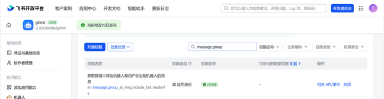
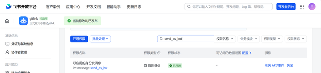
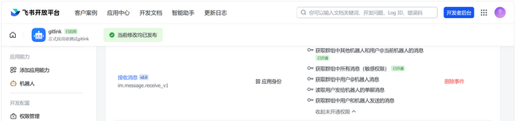
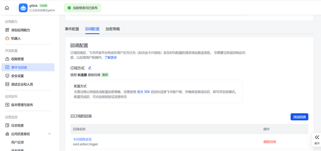
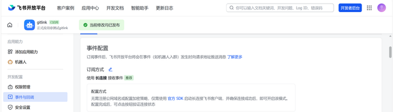
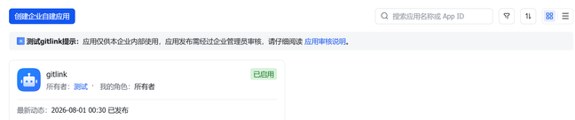
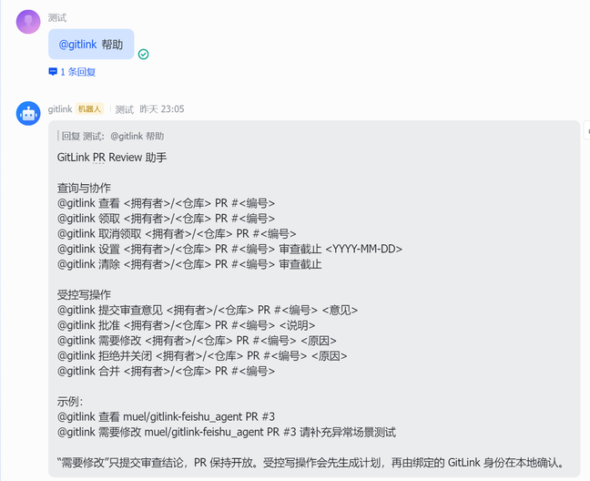
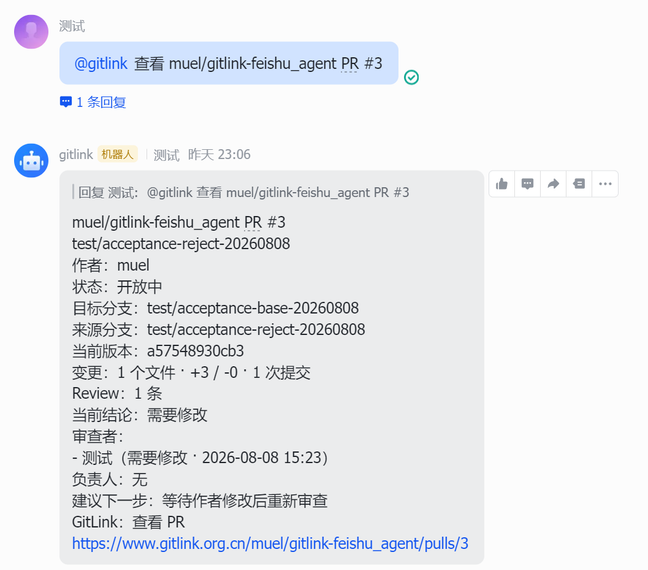
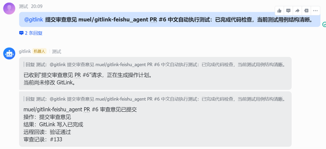
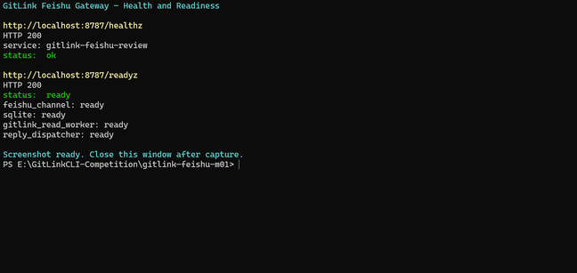

# GitLink CLI Feishu Review Gateway 技术报告

## 1. 项目概述

Pull Request 集中到达时，仓库维护者需要同时处理代码理解、审查分工、版本变化、意见反馈和最终决策。单纯把 GitLink 通知转发到群聊，只能改变信息出现的位置，不能形成可靠的审查闭环。

Feishu Review Gateway 将企业自建 Feishu App 的 Bot 作为协作入口，把群聊命令转换为结构化任务，再通过 GitLink API 获取 PR、版本、Review 和讨论信息。GitLink 始终保存仓库事实与最终权限；Feishu 负责信息呈现、协作状态和操作意图收集；Gateway 负责适配、校验、持久化和可靠执行。

系统覆盖以下能力：

- 查询公开 GitLink PR，并展示当前版本、变更和审查结论；
- 聚合 Reviewer 的当前有效意见，区分历史版本与当前版本；
- 在群内领取、取消领取和维护审查截止时间；
- 为普通审查意见、批准、需要修改、拒绝并关闭、合并生成受控操作计划；
- 以本地确认或身份受限的自动模式执行操作，并通过 GitLink GET 回读核验结果；
- 使用 SQLite 保存事件、任务、协作状态、操作状态和可选协作资源映射；
- 提供去重、租约、重试、死信、对账、健康检查、指标、备份与恢复能力。

本报告说明系统的技术结构与安全边界。具体部署参数、权限配置和故障处理步骤由[部署与使用指南](feishu-review-gateway.zh-CN.md)维护。

## 2. 设计目标与能力边界

### 2.1 设计目标

系统围绕四个目标构建：

1. **及时协作**：群成员可以在 Feishu 内查询 PR、认领工作和同步截止时间。
2. **事实一致**：所有 PR 状态、版本、Review 和最终操作结果以 GitLink 为准。
3. **写入可控**：写操作先冻结为 ActionPlan，执行前重新校验身份、版本和数据指纹。
4. **故障可恢复**：事件和任务先持久化，失败可以重试或进入人工对账，不以盲目重试掩盖不确定结果。

### 2.2 核心与可选能力

| 层次 | 能力 | 定位 |
| --- | --- | --- |
| 核心数据 | PR、版本、文件、Review、讨论、Reviewer | GitLink 事实适配 |
| 核心入口 | Bot、Long Connection、消息回复、交互卡片 | Feishu 协作入口 |
| 核心协作 | Claim、Release、Deadline、负责人展示 | 群内工作分配 |
| 受控操作 | Common、Approve、Need Changes、Reject and Close、Merge | 先计划、后校验、再写入 |
| 可靠性 | Inbox、去重、租约、重试、死信、对账 | 防丢失和防重复 |
| 运维 | 健康检查、就绪检查、指标、备份、恢复 | 常驻服务管理 |
| 可选投影 | Base、DocX、Wiki、Task | 协作资产，不是核心链路前置条件 |

### 2.3 明确边界

- Identity Binding 只声明 Feishu 用户对应的 GitLink Login，不授予仓库权限。
- Claim 只记录协作负责人，不修改 GitLink Reviewer 或成员角色。
- GitLink 服务端仍然决定读取、Review、关闭和合并是否有权执行。
- 当前不实现行级 Review Comment 写入、讨论解决、Reviewer Mutation、自动改代码或自动提升权限。
- Base、DocX、Wiki 和 Task 不参与核心写入判定，未配置时不影响 PR 查询和受控操作。

## 3. 总体架构

系统的数据流可以分为入口、事实、协作、执行和运维五层：

```text
Feishu 用户
  -> Feishu Bot / Long Connection
  -> Review Gateway / Command Parser
  -> Event Inbox / Job Queue / SQLite
  -> GitLink Review Data Provider
  -> Validated Review Model
  -> Reply / Canonical Card / Collaboration State
```

受控写入在读取链路之上增加独立安全门：

```text
操作意图
  -> ActionPlan
  -> Identity + Head SHA + Source Fingerprint 校验
  -> Lease + Single Mutation
  -> GitLink API
  -> bounded GET read-back
  -> verified / failed / stale / unknown
```

主要组件及职责如下：

| 组件 | 主要职责 |
| --- | --- |
| ReviewDataProvider | 读取并归一化 GitLink PR 数据 |
| Review Gateway | 接收事件、解析命令、执行业务路由 |
| Collaboration Store | 保存负责人、截止时间和群级协作状态 |
| ActionPlan Store | 冻结写入意图、身份、版本和执行状态 |
| Event Inbox / Operation Store | 去重、租约、重试、死信和对账 |
| Asset Publisher | 将快照投影到可选 Feishu 协作资源 |
| Review Service | 组件生命周期、健康状态和维护任务 |

接口层使用稳定 schema version，例如 `feishu.review-data/v1`、`feishu.review-gateway/v1`、`feishu.review-bindings/v1`、`feishu.review-collaboration/v1` 和 `feishu.review-action-plan/v1`。内部枚举保持稳定，用户可见文本由统一展示层映射，避免协议字段与界面文案耦合。

## 4. GitLink Review 数据适配

### 4.1 有界读取与兼容适配

`GitLinkReviewDataProvider` 实现 `ReviewDataProvider`，通过 GET 请求读取仓库、PR、文件、版本、Review 和 journal 数据。分页和采样上限受控，避免单次查询无限扩张。适配层兼容底层字段差异，并输出统一的 `ReviewData`。

统一模型包含：

- 仓库、PR 编号、标题、作者、源分支和目标分支；
- 当前 `head_sha`、`base_sha`、patchset 与变更统计；
- 标准化 Review、ReviewerSummary 与讨论线程；
- 每个数据分段的加载状态和结构化错误；
- `collection_status`、`partial`、`unknowns` 与 `source_fingerprint`。

PR 主对象属于必需数据，读取失败时整体失败；文件、版本、Review 或讨论等分段失败时保留结构化 partial 结果。上层因此能够区分“确实为空”“接口未启用”“读取失败”和“数据不完整”，不会把缺失数据当成健康结果。

### 4.2 Reviewer 聚合

同一 Reviewer 可能对不同版本或同一版本多次提交 Review。聚合逻辑先按 Reviewer 分组，再在可确定顺序时选择当前版本的最后有效决定。顺序不能可靠确定时返回 `unknown`，不猜测最终结论。

负责人和 Reviewer 是两个独立概念：

- Reviewer 来自 GitLink Review 事实；
- 负责人来自 Feishu 协作状态；
- Claim 不会把负责人写成 GitLink Reviewer；
- Review 结论变化不会自动覆盖群内负责人。

### 4.3 Head SHA 与 Source Fingerprint

`head_sha` 标识当前代码版本。`source_fingerprint` 对归一化后的关键上下文计算确定性摘要，用于发现不仅是提交 SHA，而且是审查上下文发生的变化。

ActionPlan 创建时冻结二者。执行前重新读取 GitLink 数据并比较：

- Head 不同：计划 stale，零写入；
- Fingerprint 不同：计划 stale，零写入；
- 数据 partial 或不完整：拒绝执行；
- 无法可靠确定 Reviewer 顺序：保持待确认语义。

这一机制避免用户基于旧卡片对新版本代码执行决定。

### 4.4 错误与敏感信息

适配层把分段错误保存为结构化 `fetch_errors`，同时对 URL、Token、Cookie 和可能的凭据内容进行脱敏。面向用户的回复只展示可操作的错误摘要，原始协议字段保留在受控日志中用于诊断。

## 5. Feishu Gateway 与 Long Connection

### 5.1 应用、Bot 与权限

Gateway 使用企业自建 Feishu App。核心入口需要 Bot 能力、群内 @Bot 消息读取权限和 Bot 发消息权限；企业成员显示名读取属于推荐能力，失败时可以安全回退到绑定的 GitLink Login。

群内命令入口依赖 `im:message.group_at_msg:readonly`。该配置证明应用可以接收群成员 @Bot 的消息，而不是读取任意私聊内容。



Bot 需要以应用身份发送确认、查询结果和 Review Card。该截图对应 `im:message:send_as_bot` 已启用的状态。



### 5.2 消息事件与卡片回调

`im.message.receive_v1` 是核心消息事件。Gateway 通过消息 ID 完成幂等处理，将事件正规化后写入 SQLite，再交给后台任务执行。



`card.action.trigger` 仅在卡片按钮携带命令 payload 时需要。打开 PR 的普通链接按钮不依赖该回调，卡片按钮也不会绕过受控写入门禁直接完成高风险操作。



### 5.3 Long Connection

Gateway 使用 SDK 的 WebSocket Client 主动建立 Long Connection。基础部署不要求公网 IP、公网域名或 Feishu HTTP Callback URL，但运行主机必须能够访问 Feishu Open Platform。



长连接收到事件后，Handler 只完成正规化、权限策略、去重和持久化等有界工作；GitLink 查询、卡片生成和回复在后台任务中执行。这样可以缩短事件处理时延，并应对至少一次投递。

### 5.4 发布状态

Feishu 权限、事件和 Bot 配置需要进入已发布应用版本后才对群内用户生效。应用启用但未发布新版本时，后台配置与实际 Bot 行为可能不一致。



## 6. Repository Binding 与身份绑定

### 6.1 群与仓库

`ReviewChatBinding` 保存群到默认仓库的映射：

```text
Feishu Chat ID -> GitLink owner/repo
```

群绑定还包含启用状态、管理员、可选用户范围、默认截止时长和配置 revision。用户显式写出 `owner/repo` 时，Gateway 可以按策略查询不同于默认仓库的公开 PR；省略仓库时才使用群默认仓库。

绑定的作用是提供路由和策略上下文，不把某个仓库设置为系统级特权仓库。公开仓库查询可以采用显式仓库名，受控写入仍需身份绑定和 GitLink 服务端权限。

### 6.2 Feishu 与 GitLink 身份

`ReviewIdentityBinding` 保存：

```text
Feishu User ID -> GitLink Login
```

该映射用于显示身份、Claim 合作者校验以及受控操作的执行身份检查。它不保存用户级 GitLink Token，也不代表用户拥有仓库权限。

身份与权限分层如下：

1. Feishu 事件提供消息发送者；
2. Identity Binding 找到预期 GitLink Login；
3. Claim 读取 GitLink Collaborator 信息确认协作资格；
4. 写操作执行时调用 `GET /v1/users/me` 确认 Credential 的真实 Login；
5. GitLink 服务端对目标仓库执行最终权限校验。

企业成员 Display Name 优先用于界面展示；读取失败时回退 GitLink Login，不把完整 Open ID 或内部哈希当作用户名展示。

## 7. PR 协作能力

### 7.1 命令入口

帮助命令以中文正式语法展示查询、协作和受控操作，同时保留英文旧命令作为兼容接口。命令必须包含明确的仓库与 PR，示例不会使用可能被误解为真实目标的固定占位编号。



### 7.2 PR 查询

查询结果聚合 PR 标题、作者、状态、分支、当前版本、变更、Review、审查者、负责人和建议下一步。用户界面使用中文展示映射，内部 schema 和枚举保持稳定。



### 7.3 Claim、Release 与 Deadline

协作状态由 `ReviewCollaborationStore` 持久化，并与 GitLink Review 事实分离：

- Claim：设置当前负责人并保存企业显示名；
- 重复 Claim：若仍由同一用户负责，返回幂等结果；
- 冲突 Claim：明确提示已有负责人，不静默覆盖；
- Release：取消负责人；
- Deadline：设置、更新或清除审查截止日期。

Claim 前会检查 Identity Binding，并确认映射的 GitLink Login 是仓库 Collaborator。该校验只决定谁可以领取协作任务，不授予 GitLink 写权限。

### 7.4 一致性与群隔离

协作数据以群和 PR 作用域保存。不同群可以对同一 PR 维护独立负责人和截止时间，Canonical Card 的资源映射同样包含群级作用域，避免一个群的更新覆盖另一个群的消息。

## 8. ActionPlan 与受控写操作

### 8.1 为什么需要计划阶段

飞书消息表达的是操作意图，不是直接执行凭据。Gateway 先把意图转换为 `ReviewActionPlan`，冻结执行所需的上下文，再等待本地确认或进入满足条件的自动执行。

计划包含：

- Feishu actor、Chat、GitLink Login；
- repository、PR number、action；
- expected head、source fingerprint；
- review status、content 或 reason；
- request ID、幂等键、创建与过期时间；
- plan status、mutation status、reconciliation status；
- attempt、lease 和结果信息。

### 8.2 支持的动作

| 用户动作 | GitLink 语义 | 额外边界 |
| --- | --- | --- |
| 提交审查意见 | common Review | PR 保持开放 |
| 批准 | approved Review | 权限由 GitLink 校验 |
| 需要修改 | rejected Review | PR 保持开放 |
| 拒绝并关闭 | 关闭 PR | 不额外创建 rejected Review |
| 合并 | merge PR | 显式失败的 CI 会阻断 |

准备阶段只创建 ActionPlan，GitLink 写入次数为零。计划只有在完整数据、身份、版本和作用域均满足时才能进入执行阶段。

### 8.3 状态合同

- `pending_confirmation`：计划已创建，尚未修改 GitLink；
- `completed`：远端写入完成，且 GET 回读验证通过；
- `stale`：PR 版本或上下文已变化，零写入；
- `cancelled`：用户取消，零写入；
- `unknown_needs_reconciliation`：远端结果无法确认，停止自动重试并等待对账；
- `failed`：确定性失败，不伪装为成功。

用户界面不会混合“待确认”和“已完成”语义。相同 ActionPlan 的 Card、Reply 与 Store 使用同一计划身份，Request ID 作为可读的操作编号，完整 Plan ID 保留在内部 payload 和持久化层。

## 9. 两种执行模式

### 9.1 Local 模式

默认模式为：

```text
--controlled-action-mode local
```

飞书端生成计划后，使用已登录对应 GitLink 身份的本地 CLI 完成最终确认。执行器读取同一 State DB 中的 ActionPlan，调用 `/v1/users/me` 验证实际登录身份，再执行安全校验和单次写入。

Local 模式适合不希望 Gateway 常驻持有可写 Credential 的部署。飞书仍然完成意图收集、上下文冻结、结果展示和审计；本地 CLI 只负责最后一段身份可信执行。

### 9.2 Auto 模式

Auto 模式必须显式启用：

```text
--enable-gitlink-review-write
--controlled-action-mode auto
```

执行流程如下：

```text
Feishu 操作
  -> ActionPlan
  -> Gateway Credential
  -> GET /v1/users/me
  -> Login 与 Identity Binding 匹配
  -> Head / Fingerprint / Plan / Lease 校验
  -> 单次 Mutation
  -> 有界 GET 回读
  -> Feishu 结果
```

若 Gateway Credential 缺失、不可用或身份不匹配，系统不借用其他 Credential，不自动提升权限，也不降级为未校验写入；满足配置时可以回到本地确认流程。401 和 403 属于确定性失败。网络错误导致远端结果不确定时进入 `unknown`，禁止盲目重试。

执行结果使用 `execution_path` 记录实际路径：Gateway 直接执行为 `gateway_direct`，需要本地 CLI 确认为 `local_confirmation`。回到本地确认时，`fallback_reason` 明确区分 `mode_local`、`credential_unavailable`、`identity_unverified` 和 `identity_mismatch`；这些字段用于审计和诊断，不改变 GitLink 服务端的最终权限判断。

下面的真实链路结果显示普通 Review 已写入 GitLink，并由 GET 回读确认远端 Review 记录。该证据只证明此条普通 Review 链路，不外推为所有动作都完成了同等外部验证。



## 10. 可靠事件处理

### 10.1 Event Inbox 与去重

事件先写入 Inbox，再由 Worker 消费。消息事件以稳定消息身份去重，重复投递不会生成第二个逻辑任务或第二条最终回复。标准事件模型隔离 GitLink Webhook 字段差异，使消息入口、Webhook 入口和定时校准可以复用下游处理链路。

### 10.2 Outbox 与持久任务

Gateway Job、Reply 状态和 Operation 保存在 SQLite。Operation Outbox 把“计划业务动作”和“实际执行动作”分离：事务先提交待执行记录，Worker 再领取并执行。进程在持久化后退出，重启时仍可恢复未完成任务。

### 10.3 Lease 与单次写入

Worker 通过 lease 领取任务，保存 owner、到期时间和 attempt。只有持有有效 lease 的执行者可以推进状态。ActionPlan 终态不可再次执行，幂等键和 mutation boundary 共同约束最多一次主动写入。

### 10.4 重试、Retry-After 与死信

对明确可重试的读取或处理失败，Operation 保存 attempt 和下一次执行时间。GitLink HTTP 响应中的 `Retry-After` 会转成有界调度信息，避免固定频率冲击远端。超过最大尝试次数的确定性失败进入 Dead Letter，保留错误摘要供人工检查与 Replay。

### 10.5 Unknown 与 Reconciliation

POST 返回网络错误时，远端可能已经成功。系统将 mutation 标记为 possible，进入 `unknown_needs_reconciliation`，停止自动重试。Reconciliation 使用 GET 读取远端事实，并根据 Request ID、状态、Head、内容和 actor 等信息核对；只有证据充分时才转为 verified。

### 10.6 Refresh Coalescing

同一 PR 在短窗口内连续触发刷新时使用 coalesce key 合并请求，减少重复 GitLink GET、重复卡片 Patch 和队列压力。合并只作用于可安全合并的刷新，不合并不同写操作。

### 10.7 SQLite 持久性

SQLite 保存 Inbox、Job、Reply、Collaboration、ActionPlan、Operation、Attempt、Reconciliation 和资源映射。WAL 模式、超时预算、事务边界和启动恢复共同保证单实例部署下的持久性；数据库锁竞争会被健康与就绪检查暴露，而不是在事件 Handler 中无限等待。

## 11. 运维与可观测性

### 11.1 健康与就绪

管理 HTTP 提供：

- `/healthz`：进程存活；
- `/readyz`：配置、SQLite、迁移、实例锁和必要组件已就绪；
- `/metrics`：Prometheus 文本指标；
- `/admin/v1/*`：只读管理状态。

就绪检查不依赖实时调用 GitLink 或 Feishu，避免外部短暂抖动把本地服务错误判为不可启动。下面的运行结果同时显示健康和就绪检查通过，并列出 Feishu Channel、SQLite 和后台处理组件状态。



### 11.2 管理边界

管理监听地址只接受 loopback 配置。`/metrics` 和 `/admin/v1/*` 需要 Bearer Token，Token 通过环境变量引用提供；管理 API 只接受 GET。指标标签避免直接暴露 Chat ID、Repository、Operation ID 等高基数或敏感标识。

### 11.3 服务生命周期

`ReviewService` 按顺序管理 Admin HTTP、Webhook、Feishu Channel、Event/Job Worker、Operation Worker、Reconciliation 和 Maintenance。优雅关闭时先进入 draining，使 `/readyz` 返回不可接流量，再停止入口、等待有界任务结束并释放实例锁。

### 11.4 维护与部署

- 单实例锁阻止两个 Gateway 共享同一 State DB；
- SQLite backup API 生成一致性备份；
- restore 前执行完整性检查，并拒绝覆盖活跃数据库；
- WAL checkpoint 和 retention 控制长期磁盘增长；
- retention 不删除活跃或 unknown 状态；
- 提供 systemd 与 Windows WinSW 常驻服务示例；
- Nginx 和 Caddy 示例只代理健康端点，不代理 Long Connection。

## 12. 可选协作资产

核心链路之外，`ReviewAssetPublisher` 可以把 PR 快照投影到 Feishu 协作资源：

- Base/Bitable：Review Queue、负责人、截止时间和状态；
- DocX/Wiki：面向协作的审查文档；
- Task：可选的审查任务和归档状态。

`ReviewAssetBundle` 为同一快照生成稳定 fingerprint。SQLite 中的资源映射保存 scope、remote ID、fingerprint、状态和错误，使发布器能够判断创建、更新、跳过或归档。

资产同步遵循以下规则：

- fingerprint 未变化时不重复写入；
- 更新系统字段时保留人工维护字段；
- partial 快照不覆盖此前完整快照；
- 远端写入结果不确定时停止自动重试；
- PR closed 或 merged 后按资源类型归档。

这些能力是 optional projection。未配置 Base、DocX、Wiki 或 Task 时，普通 PR Card 不展示运维噪声，核心 Review 链路继续工作。

## 13. 安全设计

### 13.1 权限来源

GitLink 是最终权限来源。Gateway 不维护一套平行 RBAC，也不把 Feishu 管理员、群负责人或 Claim 状态解释为 GitLink Owner、Maintainer 或 Reviewer 权限。

### 13.2 Credential 隔离

- Feishu App Secret 和 GitLink Token 只通过受控参数、环境变量或 CLI Credential Store 提供；
- `bindings.json` 不保存 Token 或 Secret；
- Identity Binding 不保存用户 Token；
- Auto 模式不能回退使用与绑定 Login 不一致的 Credential；
- 日志、指标、Card 和 Reply 不输出 Secret、完整 Open ID 或原始授权头。

### 13.3 写入前门禁

每次受控执行必须依次满足：

1. ActionPlan 未过期且仍可执行；
2. source job、actor、chat、repository 和 PR 作用域一致；
3. Credential 的 `/users/me` Login 与绑定身份一致；
4. 最新数据完整且不是 partial；
5. Head SHA 与 expected head 一致；
6. Source Fingerprint 一致；
7. 当前执行者取得有效 lease；
8. 写入开关和执行模式显式允许该动作。

任一条件不满足都不会调用 GitLink mutation API。

### 13.4 写入后门禁

系统只执行一次主动 mutation，然后进行有界 GET 回读。回读核对远端 ID、动作状态、Head、内容和 actor；无法确认时进入 unknown，而不是把网络失败解释为零写入或自动再写一次。

### 13.5 高风险动作

批准、需要修改、拒绝并关闭和合并在 Feishu 中都先生成计划。Local 模式要求本地确认；Auto 模式要求显式开关和身份一致。合并还会检查明确失败的 CI 状态。系统不提供通过普通卡片按钮绕过这些门禁的一键写入路径。

## 14. 测试与验证

测试采用单元测试、Fake Server、临时 SQLite 和真实链路证据分层验证，不用外部写入替代可重复的安全测试。

### 14.1 数据与展示

- PR、版本、Review、线程正规化；
- 同一 Reviewer 多次 Review 的保守排序；
- structured partial 与必需 PR 失败；
- Credential 错误脱敏；
- 中文命令与兼容 alias；
- Card/Reply 不泄漏内部枚举和身份标识；
- closed、merged、stale、unknown 的互斥展示。

### 14.2 协作

- Claim 首次领取、重复领取和冲突；
- Identity Binding 与 Collaborator 校验；
- Release、Deadline 设置、更新和清除；
- 企业显示名优先与安全回退；
- 不同群的资源和状态隔离。

### 14.3 受控操作

- 五类 ActionPlan 的 prepare 与执行路径；
- dry-run 和 prepare 阶段零 POST；
- identity mismatch 零写入；
- Credential 缺失或不可用时不冒用身份；
- 401/403 终止失败；
- Head 或 Fingerprint stale 零写入；
- 单次 mutation 与终态不可重跑；
- GET read-back；
- network uncertainty 进入 unknown 且不盲目重试；
- Reject Review 不关闭 PR；
- Reject and Close 不额外创建 rejected Review；
- explicit failed CI 阻止 Merge；
- 非法执行模式被拒绝。

### 14.4 可靠性与运维

- Inbox 去重、重试、死信与 Replay；
- Operation lease、attempt、completion 和 reconciliation；
- 同一 PR 刷新合并；
- Job 崩溃恢复和 Reply 状态持久化；
- `/healthz`、`/readyz` 的正常与失败条件；
- 只读 Admin API 与指标脱敏；
- 实例锁、优雅关闭、WAL checkpoint；
- backup、integrity check、restore 和 retention。

常用本地质量门禁为：

```bash
go test ./shortcuts/feishu -count=1
go test ./... -count=1
go vet ./...
go build ./...
git diff --check
```

测试没有提供可复核的容量基准，因此本报告不声明 QPS、P95 或最大吞吐量。

## 15. 实际运行效果

现有运行证据覆盖了以下端到端链路：

```text
已发布 Feishu App
  -> Long Connection
  -> 群内 @Bot 帮助
  -> GitLink PR GET
  -> Feishu 查询结果
  -> 受控普通 Review
  -> GitLink GET 回读
  -> Feishu 完成结果
```

前文图片分别证明应用版本已发布、权限和事件已生效、Long Connection 已配置、Gateway 已就绪、帮助和查询命令可返回，以及一条普通 Review 已完成远端写入与回读。

这些证据说明核心“入口—读取—协作—计划—执行—核验—反馈”路径可以闭环。它不代表所有仓库天然可写，也不代表每个高风险动作都已获得相同的外部执行证据；不同仓库仍由 GitLink 根据真实 Credential 和仓库权限决定结果。

## 16. 部署与使用

最短部署流程为：

1. 创建企业自建 Feishu App，启用 Bot；
2. 开通核心消息权限并订阅 `im.message.receive_v1`；
3. 选择 Long Connection，发布应用版本并将 Bot 加入目标群；
4. 准备 Feishu App Credential 与 GitLink Credential；
5. 创建 Chat/Repository 和 Identity Binding 配置；
6. 启动 Gateway；
7. 检查 `/healthz` 与 `/readyz`；
8. 在群内执行帮助、PR 查询和协作命令；
9. 按安全策略选择 Local 或 Auto 受控执行模式。

核心启动形式为：

```bash
gitlink-cli feishu +review-gateway \
  --listen \
  --bindings <BINDINGS_JSON> \
  --state-db <STATE_DB>
```

默认使用 Local 模式。只有部署者明确接受 Gateway 持有可写 Credential，并完成 Identity Binding 后，才增加：

```bash
--enable-gitlink-review-write \
--controlled-action-mode auto
```

完整的 Feishu 权限、事件、Credential、Bindings、systemd、WinSW、Nginx、Caddy、备份恢复和故障排查步骤，请使用[Feishu Review Gateway 部署与使用指南](feishu-review-gateway.zh-CN.md)。

## 17. 总结

Feishu Review Gateway 把 Feishu 的群聊、机器人、卡片和协作体验连接到 GitLink PR Review，同时保持 GitLink 作为仓库事实与权限来源。系统没有把聊天命令直接等同于远端写入，而是通过标准化数据、ActionPlan、身份核对、版本新鲜度、租约、单次 mutation 和 GET 回读建立可审计边界。

可靠事件处理使消息重复、进程重启、限流和网络不确定性可以被显式管理；健康检查、指标、优雅关闭和 SQLite 维护能力使 Gateway 可以作为常驻服务部署；Base、DocX、Wiki 和 Task 则以可选投影扩展协作视图，而不侵入核心 Review 判断。

最终形成的分层关系是：Feishu 提供协作入口，Gateway 提供安全与可靠执行，GitLink 提供真实代码、审查事实和最终授权。
