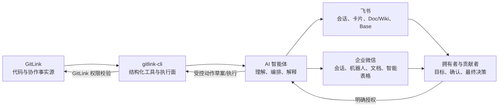

# GitLink 定位与智能体协同原则

调研日期：2026-07-18

## 1. 先重新强调 GitLink 是什么

GitLink 官方定位是 CCF 官方指定的开源创新服务平台，以“为开源创新服务”为使命，覆盖：

- 分布式协作开发。
- Issue、里程碑、Wiki 和组织管理。
- CI/CD 和工作流。
- 代码溯源、许可证和漏洞分析。
- 贡献统计和用户画像。

本项目不能把 GitLink 缩写成一个“待办数据源”。在复赛材料中应强调：

> GitLink 是开源项目的事实源、贡献发生地和可验证协作记录；gitlink-cli 让这些能力变成对人类、脚本和智能体都一致的操作界面。

## 2. 推荐的新定位

### 对 GitLink

```text
开放协作系统的事实源
```

仓库、Issue、PR、review、CI、里程碑、成员和贡献记录最终都以 GitLink 为准。

### 对 gitlink-cli

```text
面向人类与智能体的结构化、可审计执行面
```

它负责：

- 读取和归一化 GitLink 数据。
- 提供稳定的 JSON 输出。
- 提供明确的 dry-run、确认和危险动作分级。
- 让 Agent Skill 复用同一套命令，而不是为每个 Agent 重写 GitLink 客户端。

### 对飞书和企业微信

```text
注意力、知识和协作界面
```

它们负责：

- 把合适的信息送到合适的人。
- 承载卡片、会话、文档、智能表格和任务。
- 帮助团队在日常工作流中看到 GitLink 上下文。

它们不负责决定 GitLink 的真实状态，也不应绕过 GitLink 权限。

### 对 AI 智能体

```text
有边界的理解、编排和解释层
```

智能体负责：

- 理解用户目标。
- 选择只读工具并收集证据。
- 形成角色化摘要和下一步建议。
- 对写动作生成预览并等待授权。
- 说明失败、未知和采样范围。

智能体不应凭名字猜身份、凭自然语言猜权限，或因为“看起来合理”就执行真实世界写操作。

## 3. 三个事实域



关键规则：

```text
GitLink 决定“事实是什么”。
协作平台决定“信息在哪里被看到和讨论”。
人决定“高风险动作是否应该发生”。
智能体负责把三者连接起来，但不能吞掉边界。
```

## 4. 为什么适合 AI 和多智能体协同开发

gitlink-cli 已经具备 Agent-Native 的基础：

- 统一命令入口。
- JSON/表格/Markdown 等结构化输出。
- Skills 中的领域知识和安全规则。
- repo/owner 自动解析。
- 工作流报告和 PR 审查证据。
- Raw API 兜底。

下一步要补的不是“更多 prompt”，而是可共享的协作协议：

```text
任务目标
数据范围
证据列表
未知项
建议动作
动作风险级别
所需确认
执行结果
审计 ID
```

不同智能体可以承担不同角色：

| 智能体角色 | 输入 | 输出 | 权限 |
| --- | --- | --- | --- |
| 采集 Agent | repo binding、时间范围 | 规范化快照 | 只读 |
| 分析 Agent | 快照、项目策略 | 风险和优先级 | 本地分析 |
| 沟通 Agent | 角色、渠道、事件 | 卡片/摘要/文档 | preview 默认 |
| 执行 Agent | 已确认动作草案 | GitLink 操作结果 | 按命令和用户授权 |
| 审计 Agent | 事件、确认、结果 | 可追溯日志 | 只读写审计存储 |

不要让一个智能体同时无条件拥有采集、判断、授权和执行四种权力。

## 5. 借鉴 Slack，而不是照搬 Slack

Slack 官方 Agent 文档有几条非常适合本项目的原则。

### 人要感到自己掌控过程

Slack 强调：

- 动作和决策应对用户可见。
- 真实世界输出需要显式人工确认。
- 失败和幻觉必须有可理解的恢复方式。

对应到 GitLink：

- 每个建议显示证据和 GitLink 链接。
- 写动作先展示命令、目标仓库和影响。
- 不确定的数据标为 unknown，不用零或 false 伪装。
- 失败时保留已完成步骤和重试建议。

### 智能体应出现在用户工作的地方，但不应打扰

Slack 的多入口、上下文感知和 App Home 思路可借鉴为：

- 拥有者群收到聚合摘要，而不是每个事件一条通知。
- 贡献者只收到与自己工作有关的下一步。
- 文档/智能表格保存长期上下文。
- 卡片只显示短结论，证据包在 GitLink 或文档中。

### Agent 不等于 Bot，也不等于固定 Workflow

项目材料应区分：

- Bot：按规则收发消息。
- Workflow：固定、可重复的步骤。
- Assistant：响应问题。
- Agent：在明确边界内制定步骤、调用工具、观察结果并继续。

本项目只有在能够选择合适的 GitLink 只读工具、形成有证据的下一步、遇到越权时暂停，才适合称为 Agent；否则应诚实称为通知机器人或工作流。

### 上下文感知不等于权限继承

Slack 的 Agent 能感知用户正在查看的 channel/thread/canvas，但仍要按应用权限访问。对应到本项目：

- 飞书群、企业微信群或当前文档只能提供上下文。
- repo binding 决定当前关联仓库。
- GitLink token 和仓库角色决定是否有动作权限。
- 当前聊天发言者不能自动继承群管理员或仓库拥有者权限。

## 6. 贡献者和拥有者优先

### 拥有者价值

拥有者真正需要回答：

```text
今天哪三件事最需要我决定？
哪些贡献已经接近合并？
哪些贡献者在等待反馈？
哪些风险是规则提示，哪些已有人工 review 证据？
项目进度和里程碑在哪里偏离？
```

不需要：

- 每个 PR/评论/提交一条消息。
- 没有数据范围的“健康分”。
- 不可追溯的 AI 判断。
- 把办公平台表格当成第二套 GitLink。

### 贡献者价值

贡献者真正需要回答：

```text
我下一步该做什么？
维护者的最新反馈是什么？
CI/冲突/rebase/测试/文档中哪项阻塞了我？
我的贡献是否已经被看到、审查、合并？
如果还没有反馈，我应该等待还是补充信息？
```

不需要：

- 与自己无关的项目噪声。
- 被公开排名或贴“低质量贡献者”标签。
- 把规则风险提示冒充维护者结论。
- 重复提醒同一件事。

## 7. 产品不应成为的东西

```text
不是 GitLink 的替代前端。
不是飞书或企业微信项目管理功能大合集。
不是自动合并机器人。
不是贡献者打分和监督工具。
不是把所有 OpenAPI 都封装一遍的 CLI。
不是没有证据的 AI 项目经理。
```

## 8. 复赛表述建议

推荐短句：

> GitLink 记录开源协作，gitlink-cli 让智能体安全地理解和操作这些记录，飞书与企业微信把恰当的上下文带到拥有者和贡献者身边。

推荐技术表述：

> 项目采用“GitLink 事实源—CLI 结构化执行面—智能体编排层—协作平台适配层”的分层架构，以只读优先、证据可追溯、身份域隔离、预览确认和高风险动作默认关闭为安全基线。

## 9. 衡量是否真的服务了用户

下一轮不以“新增命令数”为第一指标，而以：

| 指标 | 含义 |
| --- | --- |
| owner scan time | 拥有者找到最需处理事项的时间 |
| contributor response latency | 贡献者从关键反馈发生到看到下一步的时间 |
| notification precision | 收到的提醒中真正需要该角色处理的比例 |
| duplicate rate | 重复通知比例 |
| evidence coverage | 建议中带原始 GitLink 证据链接的比例 |
| unknown honesty | 不可确认数据被明确标为 unknown 的比例 |
| preview-to-send ratio | 真实发送前经过预览的比例 |
| unsafe action count | 未确认高风险动作次数，目标恒为 0 |
