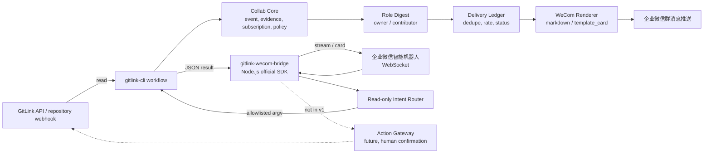
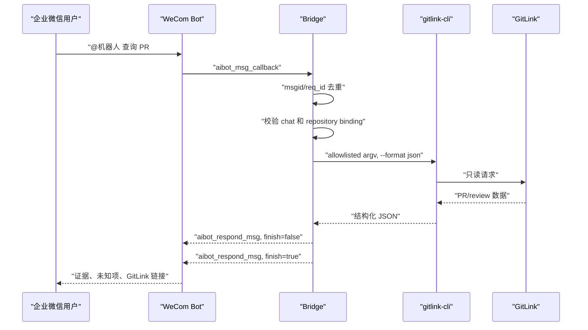

# GitLink 企业微信机器人接入方案 v1

> 历史版本提示（2026-07-29）：本文件保留为早期方案记录。企业微信智能机器人、飞书 Channel SDK 和最新 GitLink CLI 主线的重新核查结果见 [11-信息收集文档-飞书企业微信与最新主线-20260729.md](11-信息收集文档-飞书企业微信与最新主线-20260729.md)，当前完整设计以 [12-复赛PR-Review协同集成完整设计-v2.md](12-复赛PR-Review协同集成完整设计-v2.md) 为准。

方案日期：2026-07-19  
本地基线：`E:\GitLinkCLI-Competition\gitlink-cli-feishu-clean`  
方案状态：可进入实现评审；尚未接入真实企业微信  
目标阶段：GitLink CLI 复赛功能加强

## 1. 方案摘要

采用“双通道、同一核心”的接入方式：

1. **通知通道**：企业微信群消息推送 Webhook，负责 Owner 简报、Contributor 下一步、PR/Issue/CI 告警和周报。
2. **交互通道**：企业微信智能机器人 WebSocket 长连接，负责群聊 @ 和单聊中的 GitLink 只读查询、解释和流式回复。
3. **共享核心**：GitLink 读取、规则分析、证据、角色视图、订阅、去重和安全策略都放在平台无关层；飞书和企业微信只负责渲染与投递。

复赛稳定范围建议只包含通知通道；交互通道完成只读技术验证即可，不进入稳定 CLI 主进程。

```text
复赛稳定路径
GitLink read -> CollabEvent -> policy/digest -> WeCom message push

复赛技术验证
WeCom intelligent bot -> bridge -> allowlisted gitlink-cli read -> streaming reply

本轮禁止
WeCom -> automatic GitLink write
```

## 2. 用户价值

### 2.1 服务仓库拥有者

默认回答：

```text
今天最需要我决定的 3-5 个事项是什么？
```

每项提供：

- GitLink 原始对象和链接。
- 为什么现在需要关注。
- 正式 review、CI、冲突或活动时间证据。
- 数据范围与未知项。
- 建议下一步，但不自动执行。

### 2.2 服务贡献者

默认回答：

```text
我的贡献处于什么状态，下一步做什么？
```

第一版先输出群级、角色化摘要。只有完成 GitLink username 与企业微信 userid 的显式绑定后，才允许个人提及或私聊。

### 2.3 服务复赛演示

演示重点不是 API 数量，而是：

- 同一 GitLink 事实生成飞书和企业微信一致语义。
- 默认 preview，不需要真实 secret 才能完成主流程。
- 重复输入不重复提醒。
- 智能体只执行允许的只读工具。
- 所有结论带证据、范围和 GitLink 深链。

## 3. 官方能力选择

### 3.1 企业微信群消息推送

官方当前支持：

```text
text
markdown
markdown_v2
image
news
file
voice
template_card
```

关键限制：

- 每个消息推送最多 20 条/分钟。
- text/markdown 可以通过 `<@userid>` 提及成员。
- markdown_v2 不支持上述提及语法。
- Webhook URL 中的 key 是敏感凭证。

选型：

- 默认使用 `template_card` 展示 Owner 简报。
- 内容较简单或降级时使用 markdown。
- 不在第一版使用个人 @。
- 内部限速采用 15 条/分钟，为平台限制留出余量。

### 3.2 智能机器人长连接

官方当前能力：

- BotID + 长连接专用 Secret 建立 WebSocket。
- 支持单聊、群聊 @、消息回调和卡片事件。
- 支持流式回复、卡片更新和无用户消息触发的主动推送。
- 无需固定公网 IP，不需要自行处理回调消息加解密。
- 提供官方 Node.js 和 Python SDK。

关键限制：

- 每个机器人同一时间只能保持一个有效长连接；新连接会踢掉旧连接。
- 建议每 30 秒心跳。
- 同一会话回复和主动推送合计 30 条/分钟、1000 条/小时。
- 收到消息回调后 24 小时内可以向该会话回复。
- 流式消息必须在首次发送后的 10 分钟内完成。
- 同一个 API 模式机器人不能同时使用长连接和回调 URL 两种方式。

选型：

- 使用官方 Node.js SDK 做独立 bridge。
- bridge 通过参数数组调用 Go `gitlink-cli`，不拼接 shell 命令。
- 只允许预定义只读意图。
- 单实例工作，另一个实例只作冷备或主备切换。

### 3.3 自建应用消息与回调

自建应用适合后续个人消息和组织级身份治理，但需要：

- CorpID、应用凭证和 access_token。
- agentid、可见范围和接收用户。
- URL、Token、EncodingAESKey 回调服务。
- 消息验签、解密和快速响应。

官方回调在 5 秒内未收到响应会断开并对网络失败/超时重试，总计三次；官方也提示不能假定回调 100% 到达。因此业务处理必须异步，并保留对账机制。

选型：不进入 v1，实现到身份和权限设计为止。

## 4. 总体架构



### 4.1 三个权限域

```text
GitLink 权限域
企业微信组织/会话权限域
Agent 工具权限域
```

允许一次查询必须同时满足：

```text
chat/user 在 allowlist
AND repository 已绑定
AND GitLink credential 可以读取目标资源
AND intent 在只读工具清单
```

任何一项不满足就停止，不进行模糊猜测。

## 5. 组件设计

### 5.1 `internal/collab`

职责：

- 规范化 GitLink 仓库、PR、Issue、CI 和 review 事实。
- 生成稳定 `event_id` 和 `source_fingerprint`。
- 区分事实、规则推断、未知项和建议。
- 根据 binding 应用事件、分支、标签和角色过滤。
- 合并相同对象在时间窗口内的普通更新。

不允许：

- 引用飞书/企业微信 payload 类型。
- 直接发送 HTTP 请求。
- 根据企业微信显示名猜 GitLink 身份。

建议目录：

```text
internal/collab/
  event.go
  evidence.go
  subscription.go
  policy.go
  digest.go
  ledger.go
```

### 5.2 `shortcuts/wecom`

职责：

- CLI 命令注册。
- markdown/template_card 渲染。
- Webhook URL 验证和完整脱敏。
- 显式超时、业务错误解析和限速。
- preview 与发送输出。

建议目录：

```text
shortcuts/wecom/
  wecom.go
  options.go
  markdown.go
  template_card.go
  client.go
  render.go
  diagnostics.go
  *_test.go
```

### 5.3 `gitlink-wecom-bridge`

职责：

- 使用企业微信官方 Node SDK 建立唯一长连接。
- 心跳、断线重连和主备切换。
- 对 msgid/req_id 去重。
- 把消息转换为有限意图。
- 通过 `execFile`/等价安全接口调用 `gitlink-cli`。
- 解析 JSON，不解析人类可读 Markdown。
- 输出流式消息或模板卡片。

不允许：

- 把用户文本作为 shell 命令执行。
- 接受任意 GitLink API 路径。
- 使用 `gitlink-cli api POST/PUT/PATCH/DELETE`。
- 记录 Bot Secret、GitLink token 或完整对话敏感内容。

建议目录：

```text
cmd/gitlink-wecom-bridge/
  package.json
  src/config.ts
  src/connection.ts
  src/dedupe.ts
  src/intent.ts
  src/runner.ts
  src/render.ts
  src/audit.ts
  test/
```

## 6. CLI 接口方案

### 6.1 稳定候选

```powershell
gitlink-cli wecom +check

gitlink-cli wecom +bot-test `
  --message "GitLink 企业微信接入测试" `
  --format json

gitlink-cli wecom +notify `
  --from-workflow-json report.json `
  --include health,issues,prs `
  --format json

gitlink-cli wecom +owner-digest `
  --from-workflow-json report.json `
  --lang zh-CN `
  --format markdown

gitlink-cli wecom +contributor-digest `
  --from-workflow-json report.json `
  --lang zh-CN `
  --format markdown
```

所有命令默认 preview。发送时：

```powershell
$env:WECOM_WEBHOOK_URL='***'

gitlink-cli wecom +owner-digest `
  --from-workflow-json report.json `
  --message-type template_card `
  --send
```

规则：

- `--send` 与 `--dry-run` 冲突时报错。
- 正式文档不展示真实 Webhook。
- 不建议提供 `--webhook-url` 明文参数；如为兼容性保留，帮助文本必须提示命令历史泄露风险。
- 测试通过注入 BaseURL/HTTP client，不放宽生产 URL 校验。

### 6.2 Bridge 只读意图

第一批允许：

```text
help
repo.health
repo.attention
pr.summary
pr.review_evidence
issue.summary
contributor.next_step
```

示例交互：

```text
@GitLink 助手 查看 Gitlink/gitlink-cli 健康状态
@GitLink 助手 总结 PR #42 的 review 证据
@GitLink 助手 今天有哪些事项需要 owner 决策
```

不允许：

```text
merge PR
approve/request changes
close/reopen Issue
comment
修改成员、权限、分支保护、Webhook
任意 raw API
```

## 7. 配置与绑定

非敏感配置示例：

```yaml
version: 1

bindings:
  - id: gitlink-cli-owner-room
    repository: Gitlink/gitlink-cli
    audience: owner
    mode: group_webhook
    webhook_env: WECOM_WEBHOOK_OWNER_ROOM
    message_type: template_card
    events:
      - issue.high_risk
      - pr.needs_review
      - ci.failed
    branches:
      - master
    delivery:
      strategy: digest
      interval: 30m
      max_per_minute: 15

agent:
  enabled: false
  bot_id_env: WECOM_BOT_ID
  bot_secret_env: WECOM_BOT_SECRET
  allowed_repositories:
    - Gitlink/gitlink-cli
  allowed_chats: []
  command_timeout: 20s
```

安全规则：

- 配置只保存环境变量名称。
- `allowed_chats` 为空时 Agent 拒绝启动，而不是允许所有群。
- `agent.enabled` 默认 false。
- 仓库没有显式绑定时拒绝查询私有信息。
- 如果 GitLink 无法提供最低权限服务凭证，Agent 只允许公开仓库或测试仓库。

## 8. 数据契约

### 8.1 CollabEvent

沿用现有离线样例，并补充：

```json
{
  "schema_version": "collab.event/v1",
  "event_id": "stable-event-id",
  "subject_key": "pr:Gitlink/gitlink-cli:42",
  "source_delivery_id": "optional-gitlink-delivery-id",
  "source_fingerprint": "sha256:...",
  "repository": "Gitlink/gitlink-cli",
  "kind": "pr.needs_review",
  "audience": ["owner"],
  "severity": "attention",
  "evidence": [],
  "unknowns": [],
  "next_steps": [],
  "data_scope": {},
  "delivery_policy": {
    "gitlink_write_allowed": false,
    "personal_delivery_allowed": false
  }
}
```

### 8.2 ChatRequest

```json
{
  "request_id": "wecom-req-id",
  "message_id": "wecom-msg-id",
  "chat_id": "redacted-stable-ref",
  "wecom_user_id": "redacted-stable-ref",
  "repository": "Gitlink/gitlink-cli",
  "intent": "pr.review_evidence",
  "arguments": {
    "number": 42
  },
  "authorization": {
    "chat_allowed": true,
    "repository_bound": true,
    "gitlink_identity_mapped": false,
    "write_allowed": false
  }
}
```

### 8.3 DeliveryRecord

```json
{
  "delivery_key": "sha256(event_id|binding_id|render_version)",
  "event_id": "stable-event-id",
  "binding_id": "gitlink-cli-owner-room",
  "platform": "wecom",
  "render_version": "wecom-template-card/v1",
  "state": "previewed|sent|failed|unknown|suppressed",
  "attempts": 1,
  "platform_code": 0,
  "created_at": "RFC3339",
  "updated_at": "RFC3339"
}
```

第一版账本可使用用户状态目录中的原子 JSON 文件；bridge 稳定化后切换 SQLite。状态文件不得提交仓库。

## 9. 关键流程

### 9.1 Owner 摘要发送

```text
1. 读取 GitLink 或固定 workflow fixture。
2. 生成 CollabEvent。
3. 应用 repository/binding/event/branch 过滤。
4. 按 subject_key 聚合。
5. 只选择 3-5 个需要决策的事项。
6. 计算 delivery_key。
7. 已成功发送则 suppressed。
8. 未发送则生成 template_card preview。
9. 只有显式 --send 才 POST。
10. 保存 sent/failed/unknown，不记录完整 webhook。
```

### 9.2 长连接只读问答



### 9.3 超时与不确定投递

企业微信群 Webhook 没有由本项目控制的幂等键。发生连接超时后，平台可能已经收到消息。

处理原则：

- HTTP 明确未连接时可有限重试。
- 收到明确限流或 5xx 时进入带抖动退避队列。
- 响应未知时记录 `unknown`，不立即盲重试。
- 后续摘要包含未确认状态，不重复刷屏。
- 重要事件仍以 GitLink 页面为准。

## 10. 安全设计

### 10.1 凭证

- `WECOM_WEBHOOK_URL`、`WECOM_BOT_SECRET`、GitLink token 只来自环境变量或凭证系统。
- URL 脱敏必须删除完整 query，而不是只缩短最后一段路径。
- 生产 URL 默认只允许 HTTPS 和企业微信官方 host/path。
- mock client 使用注入的测试 server，不通过生产 flag 放宽 host。
- Secret 不进入 stdout、错误、fixture、截图和 delivery ledger。

### 10.2 内容与隐私

- 只向明确绑定的群发送仓库内容。
- 群成员可见不等于拥有 GitLink 权限。
- 私有仓库第一版只在受控测试群使用。
- 群聊内容进入 GitLink 前必须单独确认；v1 不进入 GitLink。
- 默认不保存完整用户消息，只保存 request ID、意图、结果和脱敏引用。

### 10.3 命令执行

- 自然语言先映射到枚举意图。
- 每个意图对应固定可执行文件和 argv 模板。
- 不启动 shell。
- 不允许 `gitlink-cli api`。
- 单次命令有超时、输出大小和并发限制。
- 输出只接受 JSON schema；解析失败时停止并返回可解释错误。

## 11. 可靠性与可观测性

指标：

```text
events_received_total
events_suppressed_total
deliveries_sent_total
deliveries_failed_total
deliveries_unknown_total
rate_limit_wait_seconds
bridge_reconnect_total
duplicate_message_total
gitlink_command_duration_seconds
```

日志字段：

```text
event_id
subject_key
binding_id
request_id
intent
repository
delivery_state
platform_code
duration_ms
```

禁止日志字段：

```text
webhook query/key
Bot Secret
GitLink token
完整私聊内容
未经脱敏的 userid/chatid
```

## 12. 测试方案

### 12.1 单元测试

- URL 验证和 query 脱敏。
- markdown/template_card golden file。
- 中文、特殊字符和长度边界。
- `--send` / `--dry-run` 冲突。
- 业务非零返回码。
- HTTP timeout、429、5xx。
- 15 条/分钟内部限速。
- event/delivery 去重。
- 未绑定个人不生成 @。
- 自然语言不能逃逸 allowlisted argv。

### 12.2 集成测试

- `httptest` 验证请求 method/header/body。
- 同一 fixture 的飞书和企业微信语义一致。
- 同一 event 两次运行只生成一次 send candidate。
- bridge 使用假 SDK adapter 验证心跳、断线、重连和重复回调。
- GitLink CLI 超时后正确结束子进程。
- 超大输出截断并提供 GitLink 原始链接。

### 12.3 真实 smoke

仅在测试企业、测试群运行：

1. `+check`。
2. `+bot-test` 单条模板卡片。
3. Owner digest 单条。
4. 同一 event 重跑，确认不重复。
5. 人工制造业务错误，确认凭证不泄露。
6. 长连接测试机器人只允许测试群和测试仓库。
7. 断开网络后恢复，确认不重复回复。

## 13. 分阶段交付

### 阶段 A：契约收口

交付：

- `internal/collab` v1。
- subscription fixture。
- delivery ledger interface。
- 飞书/企业微信 golden contract。

退出条件：相同输入生成稳定 event_id，平台差异只在 renderer。

### 阶段 B：企业微信群通知

交付：

- `wecom +check/+bot-test/+notify/+owner-digest/+contributor-digest`。
- markdown/template_card。
- preview、显式发送、限速、脱敏和超时。
- mock HTTP 与测试群 smoke。

退出条件：默认无写入、重复事件不重复发送、所有消息有 GitLink 链接和范围。

### 阶段 C：只读智能机器人 spike

交付：

- Node bridge + 官方 SDK。
- 7 个 allowlisted read-only intent。
- chat/repository allowlist。
- 流式回复、心跳、重连和去重。

退出条件：只能读取，无法构造任意命令；断线重连不重复回复。

### 阶段 D：实时 GitLink 事件中继

前置：GitLink webhook 签名、delivery ID 和重放契约得到文档或真实验证。

交付：

- HTTPS receiver。
- 快速 ack + 异步队列。
- GitLink event normalize。
- 投递失败查询和 replay preview。

退出条件：重复 source delivery 只生成一个 CollabEvent。

### 阶段 E：身份与动作网关

不属于复赛稳定范围。只有满足以下条件才开始：

- GitLink username 与 WeCom userid 可绑定、查看和撤销。
- 每次动作重新校验 GitLink 权限。
- 动作 preview 显示仓库、对象、内容和影响。
- 用户明确确认。
- 完整审计与恢复策略。

## 14. 复赛范围裁剪

### 必做

- 平台无关事件。
- 企业微信卡片 preview。
- 测试群受控发送。
- Owner/Contributor 摘要。
- 去重、限速、脱敏、超时。
- 双平台语义一致性测试。

### 可选加分

- 长连接只读机器人 spike。
- `repo.health`、`pr.review_evidence` 两个流式问答。
- GitLink webhook fixture 到企业微信的离线中继演示。

### 不做

- 企业微信触发 merge/close/review/comment。
- 个人身份自动猜测。
- 私有仓库任意群查询。
- 同一机器人多实例同时在线。
- 直接把 GitLink raw webhook 转发到企业微信群。
- 只在 CLI 枚举中增加 `wecom` 并称为原生支持。

## 15. 验收标准

```text
[ ] 无 secret 也能完成离线主演示
[ ] 默认 preview
[ ] 显式 --send
[ ] 官方 URL 严格校验
[ ] query/key 完全脱敏
[ ] HTTP 总超时
[ ] 业务错误可解释
[ ] 每群内部限制 <= 15 条/分钟
[ ] event/delivery 幂等
[ ] Owner 卡片最多 3-5 个决策项
[ ] Contributor 输出明确下一步但不定向错误用户
[ ] CI unknown 保持 unknown
[ ] 每项有 GitLink 链接、生成时间和数据范围
[ ] 长连接单活、30 秒心跳、重连不重复
[ ] Agent 只允许预定义只读命令
[ ] 所有代码工作树不包含真实凭证
```

## 16. 实施决策

建议批准以下实现边界：

1. 先实现阶段 A、B，作为复赛稳定功能。
2. 阶段 C 只做独立、只读、测试群技术验证。
3. 阶段 D 等 GitLink webhook 安全契约明确后再做。
4. 阶段 E 不进入本轮开发。
5. 飞书与企业微信共享 `internal/collab`，不复制业务规则。

一句话定位：

> GitLink 是协作事实和权限源；企业微信机器人是低噪声通知与只读交互入口；gitlink-cli 是人类和智能体共同使用的结构化执行面。

## 17. 官方资料

### 企业微信

- [消息推送配置说明](https://developer.work.weixin.qq.com/document/path/91770)
- [发送应用消息](https://developer.work.weixin.qq.com/document/path/90236)
- [接收消息和事件](https://developer.work.weixin.qq.com/document/path/94670)
- [回调配置](https://developer.work.weixin.qq.com/document/path/90930)
- [智能机器人长连接](https://developer.work.weixin.qq.com/document/path/101463)
- [官方程序 SDK 与示例入口](https://developer.work.weixin.qq.com/document/path/100249)
- [企业微信智能机器人 Node SDK](https://www.npmjs.com/package/@wecom/aibot-node-sdk)
- [企业微信智能机器人 Python SDK](https://pypi.org/project/wecom-aibot-python-sdk/)

### 借鉴的聊天室集成

- [GitHub for Slack](https://docs.github.com/en/integrations/how-tos/slack/integrate-github-with-slack)
- [GitHub for Teams](https://docs.github.com/en/integrations/how-tos/teams/integrate-github-with-teams)
- [GitHub Webhook 最佳实践](https://docs.github.com/en/webhooks/using-webhooks/best-practices-for-using-webhooks)
