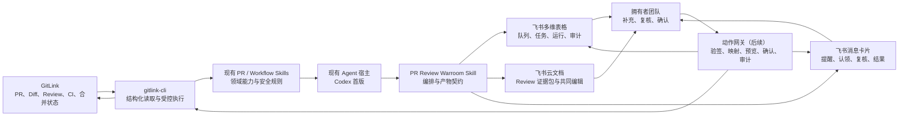

# GitLink × 飞书 PR Review Warroom 完整规划 v1

> 历史版本提示（2026-07-29）：本文件把部分“已存在实现文件”视为“已暴露稳定命令”，但最新主线验证发现 `feishu` 和多个 Workflow 命令注册缺失、相关测试回归。事实核查见 [11-信息收集文档-飞书企业微信与最新主线-20260729.md](11-信息收集文档-飞书企业微信与最新主线-20260729.md)，当前完整设计以 [12-复赛PR-Review协同集成完整设计-v2.md](12-复赛PR-Review协同集成完整设计-v2.md) 为准。

规划日期：2026-07-21  
最新核查基线：`origin/master` @ `d3bcbae82a20963c70a20407f8dc578e2127a754`  
本地参考仓库：`E:\GitLinkCLI-Competition\gitlink-cli-feishu-clean`  
文档状态：规划稿，不包含业务代码修改，不触发 GitLink 或飞书写入

## 1. 执行摘要

本规划针对一个已经得到确认的真实场景：

> 比赛结束或大型活动收口时，GitLink 仓库在短时间内积压大量 PR。拥有者团队无法继续按比赛中期的节奏逐条及时 Review，却又必须在很短时间内完成分诊、审查、反馈和是否进入合并队列的判断。团队需要借助 Agent 扩展审查能力，同时在飞书中共享进度、分工、证据和决策，最终把正式 Review 结果写回 GitLink。

核心产品不是新的通用 Agent，也不是把 GitLink 搬进飞书，而是：

```text
GitLink PR Review Warroom Skill
```

它由 Codex、OpenClaw、Claude Code 等现有 Agent 宿主执行，编排已经合入 GitLink 主线的 CLI 命令与 PR Skills，再使用飞书消息、多维表格、云文档和任务能力建立团队协作空间。

本规划采用四个基本判断：

1. GitLink 是代码、PR、CI、正式 Review 和合并结果的事实源。
2. `gitlink-cli` 是人类与 Agent 共同使用的结构化读取和受控执行面。
3. Agent 负责分诊、取证、审查草拟、验证和解释，不自动取得最终决策权。
4. 飞书是共享进度、分工、讨论、审计和人工确认的协作控制面，不成为第二套 GitLink。

第一轮建设不从零实现 Agent Runtime，也不立即实现多 Agent 调度平台。推荐先建设一个编排 Skill、一个 PR 行级数据契约、一套飞书模板和一个可重复运行的工作流；当身份与动作边界完成后，再增加飞书回调到 GitLink 的受控写回。

## 2. 与现有文档的关系

本规划继承以下文档的事实与原则：

- [01-当前项目盘点与边界.md](01-当前项目盘点与边界.md)
- [02-飞书与企业微信接入知识库.md](02-飞书与企业微信接入知识库.md)
- [03-GitLink定位与智能体协同原则.md](03-GitLink定位与智能体协同原则.md)
- [04-功能策划与一轮拓展计划.md](04-功能策划与一轮拓展计划.md)
- [05-复赛演示与验收清单.md](05-复赛演示与验收清单.md)
- [06-集成尝试结果与未来展望.md](06-集成尝试结果与未来展望.md)

01–08 文档是 2026-07-18 的阶段快照。2026-07-21 重新核查主线后，有两项变化：

1. 飞书能力已经通过 PR #346 合入主线，`shortcuts/feishu` 与原飞书分支对应目录一致。
2. 主线已经新增大量 Issue、PR、Workflow 和 Agent Skills，原来“先只做通知”的优先级需要调整为“复用现有审查能力，建设 PR 洪峰协作闭环”。

本规划不否定旧文档中的身份、安全和事实域边界，但在复赛方向上优先于旧文档的企业微信扩展顺序。

## 3. 产品发心与赛题对应

### 3.1 GitLink 的定位

GitLink 不只是 PR 数据来源，而是开源贡献发生、被验证、被讨论并形成正式记录的地方。

推荐统一表述：

> GitLink 记录开源协作事实，gitlink-cli 让 Agent 能够结构化、可审计地理解和操作这些事实；飞书让拥有者团队共享 Agent 的工作过程、证据和决策，并把经过确认的正式结果送回 GitLink。

### 3.2 解决的不是“Review 不够自动”

PR 洪峰包含五个不同问题：

1. 看不清全部队列，无法判断先看什么。
2. 多个 PR 可能重复、依赖或互相冲突，逐条孤立 Review 会返工。
3. 深度 Review 成本高，不能对所有 PR 使用同样资源。
4. 团队成员和 Agent 的进度缺乏共享上下文。
5. Agent 结论如果没有证据、人工复核和正式写回，就不能形成有效协作。

因此本产品必须同时提高：

| 目标 | 实现方式 |
| --- | --- |
| 快速 | 全量元数据先分诊，只对候选 PR 深审 |
| 及时 | 飞书卡片提醒、任务分工、停滞和 SLA 视图 |
| 高质量 | Diff、测试、CI、Review、冲突和关系证据共同进入报告 |
| 可协作 | 多维表格共享状态，云文档共同修改结论 |
| 可审计 | 保存输入版本、Agent 运行、人工修改、确认和 GitLink 结果 |

### 3.3 对贡献者的价值

Warroom 不是维护者的“批量裁决机器”。它必须让贡献者更快获得：

- PR 已被看到的明确反馈。
- 当前所处阶段和下一步。
- 可定位到文件、行、CI 或测试的具体证据。
- 对重复、依赖或暂缓原因的解释。
- 人工确认后的正式 GitLink Review，而不是不可追溯的内部评分。

## 4. 已有能力与真实缺口

### 4.1 最新主线已有能力

截至本次核查，主线已经具备：

- `pr +list --all`、PR 详情、文件、Diff、提交、Review、评论和合并检查。
- `workflow +review-queue`：对开放 PR 做元数据级评分和排序。
- `workflow +pr-summary`：生成单条 PR 摘要。
- `gitlink-maintainer-radar`：识别超时、负载失衡和责任停滞。
- `gitlink-pr-topology`：识别依赖、重叠、替代和冲突关系。
- `gitlink-pr-assessor`：评估贡献价值、可行性、质量和验证结果。
- `gitlink-pr-integrator`：评估集成和发布就绪度。
- `gitlink-code-review`、`gitlink-pr-gate`、`gitlink-pr-review-quality`。
- 飞书卡片、摘要、DocX/Wiki、Bitable 和 Task 相关命令。

### 4.2 不应重复建设的部分

本轮不重新实现：

- GitLink API 客户端。
- PR Diff、Review、CI 的读取命令。
- 通用代码审查提示词集合。
- 飞书 access token、DocX、Bitable 和 Task 基础客户端。
- 通用大模型 Agent 或多 Agent Runtime。

### 4.3 当前缺口

| 缺口 | 当前表现 | 本规划处理方式 |
| --- | --- | --- |
| 全量队列 | `workflow +review-queue` 当前主要按 page/limit 拉取 | 复用 `pr +list --all` 或为队列命令补齐全量模式 |
| 队列分析深度 | 当前排序主要基于列表元数据 | 增加分层取证和深审选择策略 |
| PR 关系 | topology Skill 已有知识，但未成为共享队列字段 | 输出关系簇和建议处理顺序 |
| 飞书表格粒度 | 当前 records 主要是汇总桶 | 改为一条 PR 一条记录，并分离运行和审计表 |
| 团队协同 | 尚无统一阶段、分配、截止日期和阻断模型 | 设计 Warroom Base 模板 |
| Review 文档 | 能写 DocX，但没有 PR 专用模板和版本约束 | 建立一条重点 PR 一份 Review 文档 |
| 飞书到 GitLink | 没有回调网关 | 在后续里程碑增加签名、身份、确认和审计 |
| 写操作保护 | CLI 的 dry-run 覆盖不一致 | 网关补统一预览；首选原生支持 dry-run 的动作 |

## 5. 第一轮产品范围

### 5.1 纳入范围

1. 手动启动一次 PR Warroom。
2. 读取一个 GitLink 仓库的全部开放 PR。
3. 快速分诊并给出带理由的处理顺序。
4. 识别重复、依赖、替代和冲突候选。
5. 对选中的高优先级 PR 执行深度审查和验证。
6. 同步 PR 行级数据到飞书多维表格预览或测试 Base。
7. 为重点 PR 生成结构化 Review 云文档。
8. 使用卡片通知需要认领、复核或决策的事项。
9. 保存 Agent 输入、输出、未知项和人工修改记录。
10. 为后续从飞书发布正式 GitLink Review 预留动作计划。

### 5.2 暂不纳入

- 在飞书中直接修改代码。
- 把飞书文档当作 PR 正文或 GitLink Review 的事实源。
- 自动创建或修改飞书资源权限。
- 自动批准、拒绝或合并 PR。
- 自动关闭 PR、删除评论或改仓库设置。
- 从零实现通用 Agent Runtime。
- 第一版就运行多个拥有独立权限的 Agent 服务。
- 没有证据地给贡献者排名或打分。

### 5.3 暂定定义

“在飞书里进行 PR 内容编写”在第一轮暂定为：

> 团队在飞书云文档中共同编写、修改和确认 Review 结论、风险说明、测试证据、待修改项与合并建议。代码修改仍在开发工作区完成，正式 Review 最终写回 GitLink。

该定义可以在实际构建过程中调整，但不默认扩展为“在飞书编辑代码”。

## 6. 总体架构



### 6.1 组件职责

| 组件 | 负责 | 不负责 |
| --- | --- | --- |
| GitLink | 代码和正式协作事实 | 飞书中的分工和讨论 |
| gitlink-cli | 读取、结构化输出、受控写入 | 团队调度和办公界面 |
| 现有 Agent | 理解目标、选择 Skills、分析证据 | 自行获得仓库授权 |
| Warroom Skill | 编排顺序、数据契约、停止条件 | 实现大模型 Runtime |
| 飞书 Base | 共享队列和协作状态 | 覆盖 GitLink 原始状态 |
| 飞书 Doc | 共同编辑 Review 证据包 | 直接代表正式 Review |
| 飞书卡片 | 低噪声提醒和入口 | 承载完整报告 |
| 动作网关 | 写回时的安全和审计 | 替代 GitLink 权限判断 |

## 7. Agent 与 Skill 设计

### 7.1 “已有 Agent”的准确含义

第一版执行宿主是当前已有的 Codex，也应允许其他兼容 Agent Skills 的宿主运行。

```text
Codex / OpenClaw / Claude Code = Agent Runtime
SKILL.md                       = 工作流程和边界
gitlink-cli                    = GitLink 工具
lark-cli / feishu commands     = 飞书工具
```

仓库内不直接接入新的大模型 API。模型调用由所选 Agent 宿主管理。

### 7.2 新增 Skill

建议名称：

```text
skills/gitlink-pr-review-warroom/SKILL.md
```

职责：

1. 确认仓库、扫描范围和当前主线。
2. 调用全量 PR 列表和快速分诊。
3. 选择需要关系分析和深度审查的候选。
4. 编排 topology、assessor、integrator、code-review、CI 等能力。
5. 生成统一 `ReviewWorkItem` 和 `ReviewRun`。
6. 生成飞书表格记录、Review 文档和消息卡片。
7. 在数据缺失、权限不足或写动作出现时停止并说明原因。

### 7.3 第一版不做真正的多 Agent 调度

第一版由一个 Agent 宿主按阶段调用多个 Skill。逻辑角色仍然分开：

| 逻辑角色 | 复用能力 | 输出 |
| --- | --- | --- |
| 队列协调 | review-queue、maintainer-radar | 排序、SLA、批次 |
| 关系分析 | pr-topology | 重叠簇、依赖链、冲突热点 |
| 深度审查 | pr-assessor、code-review | 质量、风险、验证证据 |
| 集成评估 | pr-integrator、pr-gate | 合并条件和后续动作 |
| 协作发布 | gitlink-feishu、lark-cli | Base、Doc、卡片 |

等单 Agent 流程稳定、数据契约固定后，才把深度审查拆成可并行 Worker。

### 7.4 资源控制

为了避免对所有 PR 进行昂贵深审：

```text
全量 PR
  -> 元数据快速分诊
  -> 关系候选粗筛
  -> Top N / 高风险 / 高价值候选
  -> 深度 Diff、测试、CI、集成分析
```

每次运行必须记录：

- 全部开放 PR 数。
- 完成快速分诊的数量。
- 完成深审的数量。
- 跳过原因。
- 数据是否完整或采样。
- Agent 和规则版本。

## 8. 端到端工作流

### 8.1 Step 0：启动 Warroom

第一版采用人工明确启动：

```text
启动仓库 PR Warroom
-> 确认 owner/repo
-> 记录目标分支和截止时间
-> 建立本轮 run_id
-> 只读检查认证和仓库访问
```

不在第一版依赖 GitLink Webhook 或常驻监听。

### 8.2 Step 1：全量快速分诊

读取全部开放 PR，建立每条 PR 的基础画像：

- PR 编号、标题、作者和 URL。
- 创建、更新时间和等待时长。
- base/head、head SHA、来源 fork。
- 文件数、提交数、增删行。
- 当前 Review、CI 和可合并性摘要。
- 是否已有维护者响应。

输出：

- 完整 PR 主队列。
- 处理优先级与理由。
- 需要深审的候选集合。
- 数据缺失和 API 失败清单。

### 8.3 Step 2：关系和批次分析

在候选 PR 间识别：

- `depends_on`
- `overlaps_with`
- `supersedes`
- `conflicts_with`
- `review_together`
- `merge_after`

形成 Review 批次：

```text
快速处理批次
同上下文打包审查批次
高风险深审批次
等待上游批次
重复/替代待人工确认批次
```

关系结论必须带证据，不能只根据标题相似度生成最终裁决。

### 8.4 Step 3：选择性深度审查

对进入深审的 PR 收集：

- PR 详情和描述。
- 完整变更文件与 Diff。
- 提交历史。
- 已有 Review 和评论。
- CI/流水线状态与失败日志。
- 合并冲突和基线漂移。
- 仓库构建、测试和贡献规范。

审查输出至少包含：

- 贡献价值和目标是否清楚。
- 声明与实际实现是否一致。
- Critical、Warning、Suggestion 和 Positive findings。
- 测试与文档覆盖。
- 安全、兼容和维护成本。
- 未知项和不能验证的内容。
- 建议下一步，不直接替人做最终决定。

### 8.5 Step 4：发布到飞书协作空间

Agent 将统一数据契约渲染为：

1. PR 主队列记录。
2. Review 任务和甘特数据。
3. Agent 运行记录。
4. 重点 PR 的 Review 云文档。
5. 需要人工行动的聚合卡片。

### 8.6 Step 5：团队复核与协作

拥有者团队可以：

- 认领 Review 任务。
- 调整协作优先级和截止时间。
- 在云文档中修改 Review 结论。
- 标记阻断项是否成立。
- 补充人工测试和业务上下文。
- 将 PR 标记为等待贡献者、等待复审或等待决策。

GitLink 原始字段只读镜像；人工只编辑飞书协作字段。

### 8.7 Step 6：形成正式 Review 草案

当报告经过复核后，系统生成：

- 最终 Review 正文。
- 目标 GitLink 仓库和 PR。
- 使用的 head SHA。
- Review 类型候选。
- 将要执行的 CLI 动作预览。
- 证据和未知项摘要。

第一版到此即可完成完整的只读协作闭环。

### 8.8 Step 7：受控写回（后续里程碑）

在身份和动作边界确认后：

```text
飞书提交 Review 草案
-> 卡片回调验签和去重
-> repo binding
-> 身份映射和 GitLink 权限检查
-> 重新读取 PR 与 head SHA
-> dry-run 预览
-> 人工确认
-> gitlink-cli 执行
-> GitLink 返回正式结果
-> 更新飞书卡片、表格和审计记录
```

首个候选动作建议使用：

```text
gitlink-cli pr +review --status common --dry-run
```

原因：它能够形成正式 Review，又具备原生 dry-run。`approve`、`rejected` 和 `merge` 不作为第一个写回动作。

## 9. 飞书多维表格模板

建议建立一个 Base 应用：

```text
GitLink PR Review Warroom
```

模板由五张表组成。第一版可以只启用前四张，仓库配置也可以暂存在本地配置中，但字段契约应一次设计完整。

### 9.1 表一：仓库配置 `Repositories`

| 字段 | 类型 | 所有者 | 说明 |
| --- | --- | --- | --- |
| `repo_key` | 单行文本/主键 | 系统 | `owner/repo` |
| `gitlink_url` | URL | 系统 | 仓库链接 |
| `default_branch` | 单行文本 | GitLink | 默认分支 |
| `warroom_mode` | 单选 | 人工 | planning/active/frozen/closed |
| `review_deadline` | 日期时间 | 人工 | 本轮总体截止时间 |
| `first_response_sla_hours` | 数字 | 人工 | 首次响应目标 |
| `deep_review_limit` | 数字 | 人工 | 单轮最多深审数量 |
| `critical_paths` | 多行文本 | 人工 | 核心目录/高风险文件规则 |
| `last_sync_cursor` | 单行文本 | 系统 | 增量同步位置 |
| `last_sync_at` | 日期时间 | 系统 | 最近同步时间 |
| `config_version` | 单行文本 | 系统 | 模板/规则版本 |

### 9.2 表二：PR 主队列 `Pull Requests`

稳定唯一键：

```text
pr_key = gitlink:<owner>/<repo>:pr:<number>
```

| 字段组 | 字段 | 类型 | 所有者/规则 |
| --- | --- | --- | --- |
| 标识 | `pr_key` | 单行文本/主键 | 系统，不可人工修改 |
| 标识 | `pr_number` | 数字 | GitLink 镜像 |
| 标识 | `title` | 单行文本 | GitLink 镜像 |
| 标识 | `gitlink_url` | URL | GitLink 镜像 |
| 人员 | `author` | 单行文本 | GitLink 镜像 |
| 人员 | `review_owner` | 人员 | 飞书协作字段 |
| 人员 | `review_collaborators` | 多人员 | 飞书协作字段 |
| 分支 | `base_branch` | 单行文本 | GitLink 镜像 |
| 分支 | `head_branch` | 单行文本 | GitLink 镜像 |
| 分支 | `head_sha` | 单行文本 | GitLink 镜像，报告版本关键字段 |
| GitLink 状态 | `gitlink_state` | 单选 | open/merged/closed |
| 协作状态 | `review_stage` | 单选 | 飞书协作状态机 |
| 分诊 | `priority` | 单选 | urgent/high/medium/low |
| 分诊 | `priority_reasons` | 多行文本 | Agent，必须可解释 |
| 分诊 | `risk_level` | 单选 | high/medium/low/unknown |
| 规模 | `changed_files` | 数字 | GitLink/分析 |
| 规模 | `commits` | 数字 | GitLink/分析 |
| 规模 | `additions` | 数字 | GitLink/分析 |
| 规模 | `deletions` | 数字 | GitLink/分析 |
| 质量 | `ci_status` | 单选 | success/failed/running/missing/unknown |
| 质量 | `mergeability` | 单选 | clean/conflict/blocked/unknown |
| 关系 | `relation_cluster` | 单行文本 | Agent 生成簇 ID |
| 关系 | `relationships` | 多行文本 | 关系与证据摘要 |
| 结论 | `blocking_count` | 数字 | Agent + 人工复核 |
| 结论 | `recommendation` | 单选 | review/needs_changes/recheck/ready/park/unknown |
| 结论 | `next_action` | 多行文本 | 当前明确下一步 |
| 协作 | `review_due_at` | 日期时间 | 人工或规则生成 |
| 协作 | `blocked_by` | 多行文本 | 人工可编辑 |
| 文档 | `review_doc_url` | URL | 系统写入 |
| 证据 | `evidence_summary` | 多行文本 | Agent 生成 |
| 同步 | `gitlink_updated_at` | 日期时间 | GitLink 镜像 |
| 同步 | `last_analyzed_at` | 日期时间 | 系统 |
| 同步 | `source_fingerprint` | 单行文本 | 系统，用于幂等和失效判断 |

建议 `review_stage`：

```text
discovered
-> triaged
-> assigned
-> agent_reviewing
-> human_reviewing
-> waiting_for_contributor
-> waiting_for_re_review
-> ready_for_decision
-> review_published
-> merge_ready
-> merged / closed / parked
```

### 9.3 表三：Review 任务 `Review Tasks`

一条 PR 可以有多个任务，甘特图从本表派生。

| 字段 | 类型 | 说明 |
| --- | --- | --- |
| `task_key` | 单行文本/主键 | 稳定任务键 |
| `pr_key` | 关联记录 | 关联 PR |
| `task_type` | 单选 | triage/code_review/test/ci/integration/human_check/publish |
| `owner` | 人员 | 当前负责人 |
| `collaborators` | 多人员 | 协作者 |
| `state` | 单选 | todo/doing/blocked/done/cancelled |
| `start_at` | 日期时间 | 甘特开始 |
| `due_at` | 日期时间 | 甘特截止 |
| `finished_at` | 日期时间 | 完成时间 |
| `depends_on` | 关联记录 | 任务依赖 |
| `blocker` | 多行文本 | 阻断原因 |
| `agent_run_id` | 关联记录 | 使用的 Agent 运行 |
| `result_url` | URL | 文档或 GitLink 结果 |

### 9.4 表四：Agent 运行 `Agent Runs`

| 字段 | 类型 | 说明 |
| --- | --- | --- |
| `run_id` | 单行文本/主键 | 每次运行唯一标识 |
| `scope` | 单选 | queue/cluster/pr/integration/publish |
| `target_keys` | 多行文本 | 本次处理对象 |
| `agent_host` | 单行文本 | Codex/OpenClaw 等 |
| `skills_used` | 多行文本 | 实际调用的 Skills |
| `input_fingerprint` | 单行文本 | 输入证据哈希 |
| `gitlink_head_sha` | 单行文本 | 目标 PR 版本 |
| `status` | 单选 | running/succeeded/partial/failed/stale |
| `finding_summary` | 多行文本 | 结果摘要 |
| `unknowns` | 多行文本 | 未知和缺失数据 |
| `report_url` | URL | 完整报告 |
| `started_at` | 日期时间 | 开始时间 |
| `finished_at` | 日期时间 | 完成时间 |
| `error_summary` | 多行文本 | 失败说明，需脱敏 |

### 9.5 表五：决策审计 `Decision Audit`

| 字段 | 类型 | 说明 |
| --- | --- | --- |
| `action_id` | 单行文本/主键 | 动作唯一标识 |
| `pr_key` | 关联记录 | 目标 PR |
| `action_type` | 单选 | draft_review/publish_common/approve/reject/merge/other |
| `target_head_sha` | 单行文本 | 防止对旧版本执行 |
| `preview_body` | 多行文本 | 执行前预览 |
| `requested_by` | 人员/文本 | 发起人 |
| `confirmed_by` | 人员/文本 | 确认人 |
| `confirmed_at` | 日期时间 | 确认时间 |
| `execution_status` | 单选 | planned/previewed/confirmed/executing/succeeded/failed/expired |
| `gitlink_result_url` | URL | 正式结果链接 |
| `event_id` | 单行文本 | 飞书回调事件 ID |
| `executed_at` | 日期时间 | 执行时间 |
| `error_summary` | 多行文本 | 脱敏错误 |

### 9.6 推荐视图

| 视图 | 数据表 | 用途 |
| --- | --- | --- |
| Owner Cockpit | Pull Requests | 只显示 urgent/high 和等待决策项 |
| 全量队列 | Pull Requests | 所有开放 PR |
| 待认领 | Pull Requests | `review_stage=triaged` 且 owner 为空 |
| 人工复核 | Pull Requests | `review_stage=human_reviewing` |
| CI/冲突阻塞 | Pull Requests | CI failed 或 mergeability conflict |
| 重叠与依赖簇 | Pull Requests | 按 relation_cluster 分组 |
| Reviewer 看板 | Pull Requests | 按 review_owner 分组 |
| Review 甘特 | Review Tasks | start_at/due_at 时间线 |
| 失败运行 | Agent Runs | partial/failed/stale |
| 写回审计 | Decision Audit | 全部动作历史 |

第一版通过模板手工准备视图，不把自动创建字段、视图和权限作为稳定能力。

### 9.7 字段所有权规则

```text
GitLink 镜像字段：只允许同步器覆盖
Agent 计算字段：新分析完成后更新，必须带 fingerprint
飞书协作字段：只允许团队成员编辑
审计字段：追加为主，不允许普通用户覆盖历史
```

同步器不得因为一次 GitLink 刷新而清空人工负责人、截止时间、阻断说明或人工结论。

## 10. 飞书云文档模板

重点 PR 一条对应一份 Review 文档。文档标题建议：

```text
[GitLink Review] <owner>/<repo> PR #<number> <title>
```

文档结构：

1. 元数据
   - PR 链接、作者、base/head、head SHA、生成时间、run_id。
2. 一页结论
   - 目标、价值、当前阶段、建议下一步、未知项。
3. 改动范围
   - 文件、模块、增删行、核心路径。
4. 关系分析
   - 依赖、重叠、替代、冲突和建议批次。
5. 验证证据
   - 构建、测试、CI、合并检查、执行环境。
6. Review Findings
   - Critical、Warning、Suggestion、Positive。
7. 贡献者待办
   - 每项带文件/行/证据和完成条件。
8. 合并条件
   - 已满足、未满足、无法确认。
9. Agent 建议
   - 与人工结论明确分区。
10. 人工复核区
    - 维护者补充、争议、取舍和最终意见。
11. GitLink 正式 Review 草案
    - 可编辑的最终 Markdown。
12. 版本历史
    - head SHA、run_id、人工确认和写回结果。

如果 PR 的 head SHA 更新，旧报告标记为 `stale`，不得直接用于正式 Review。

## 11. 飞书消息卡片设计

卡片只承载注意力和下一步，不承载完整报告。

### 11.1 Warroom 启动摘要

显示：

- 开放 PR 总数。
- 完成快速分诊数。
- 高优先级数。
- 重叠/依赖簇数。
- 等待认领数。
- Base 和总报告入口。

### 11.2 Review 认领卡

显示：

- PR 标题、作者和等待时间。
- 优先级与理由。
- 主要风险和预计工作量。
- 打开 GitLink、打开文档、认领任务。

第一版“认领”只修改飞书协作字段，不修改 GitLink。

### 11.3 Agent Review 完成卡

显示：

- Review 结论摘要。
- Critical/Warning 数量。
- CI、测试和合并检查。
- 未知项。
- 打开文档、请求人工复核。

### 11.4 正式 Review 预览卡

后续动作网关启用后显示：

- 目标仓库、PR 和 head SHA。
- 将发布的 Review 类型和正文摘要。
- 发起者、确认状态和过期时间。
- 预览、退回修改、确认发布。

### 11.5 降噪规则

- 默认发送聚合卡，不为每次字段变化发送消息。
- 相同 `source_fingerprint` 不重复提醒。
- 只有新高优先级、阻断升级、等待人工和执行结果进入群消息。
- 完整队列变化写 Base，不刷屏。

## 12. 数据契约

### 12.1 `ReviewWorkItem`

建议包含：

```text
schema_version
pr_key
repository
number
gitlink_url
author
base_branch
head_branch
head_sha
gitlink_state
review_stage
priority
priority_reasons[]
risk_level
change_metrics
ci_summary
mergeability
relationships[]
evidence[]
unknowns[]
recommended_next_step
source_scope
source_fingerprint
generated_at
```

### 12.2 `ReviewRun`

```text
run_id
scope
targets[]
skills_used[]
input_fingerprint
started_at
finished_at
status
findings[]
verification[]
unknowns[]
report_ref
```

### 12.3 `ActionPlan`

```text
action_id
repository
pr_number
expected_head_sha
action_type
payload_preview
requested_actor
required_confirmation
expires_at
status
audit_ref
```

所有跨系统对象都必须有 `schema_version`、稳定键、生成时间和来源范围。

## 13. API 与运行方式

### 13.1 API 是否需要

| API | 第一轮 | 调用方式 |
| --- | --- | --- |
| 大模型 API | 仓库不直接集成 | 由 Codex/OpenClaw 等 Agent 宿主管理 |
| GitLink API | 需要，先只读 | 通过 `gitlink-cli` |
| 飞书 API | 测试同步时需要 | 通过现有 `feishu` 命令或可选 `lark-cli` |
| 飞书卡片回调 | 后续需要 | 独立动作网关，不放进一次性 CLI 命令 |

### 13.2 推荐运行模式

第一版：

```text
维护者人工启动
-> Agent 执行 Skill
-> 输出本地 JSON/Markdown
-> preview
-> 显式同步到测试 Base/Doc/群
```

增强版：

```text
定时任务读取增量
-> 比较 source_fingerprint
-> 只更新变化记录
-> 只对重要变化发卡
```

后续：

```text
GitLink Webhook / 飞书回调
-> 常驻 gateway/runner
-> 快速 ack
-> 异步任务
```

### 13.3 幂等与同步

- PR 唯一键使用 repo + PR number。
- 分析有效性绑定 head SHA 和输入 fingerprint。
- Bitable 使用 search-before-upsert。
- 同一数据表写入采用单队列或小批量，避免并发写阻塞。
- 飞书卡片事件使用 event_id 去重。
- GitLink 写回使用 action_id 和 expected_head_sha 防重复、防旧版本执行。

## 14. GitLink 写回的分阶段边界

本节只定义技术台阶，不替代后续关于身份和风险的正式决策。

### 阶段 A：只读协作

```text
GitLink read -> Agent analysis -> Feishu collaboration
```

允许飞书写入 Base、Doc 和卡片；不写 GitLink。

### 阶段 B：生成动作草案

飞书可以生成 `ActionPlan`，但只显示预览，不执行。

### 阶段 C：发布普通正式 Review

候选动作：`pr +review --status common`。

要求：

- 自建应用回调验签。
- 明确 repo binding。
- 身份方案完成。
- 重新读取 PR 和 head SHA。
- 先执行原生 `--dry-run`。
- 显示完整 Review 正文。
- 明确确认后执行一次。
- GitLink 结果和失败均写入审计。

### 阶段 D：批准或请求修改

只有普通 Review 稳定后再评估 `approved/rejected`。需要更严格的角色检查和二次确认。

### 阶段 E：合并

默认关闭。当前 `pr +merge` 没有统一 dry-run/确认保护，必须由网关补齐：

- 危险动作显式启用。
- 重新验证 CI、冲突、Review 和目标 SHA。
- 维护者角色确认。
- 二次确认。
- 仓库 allowlist。
- 完整审计和失败恢复说明。

## 15. 安全与质量原则

### 15.1 事实和判断分离

```text
GitLink fact
Agent inference
Human decision
```

三类字段、文档区域和卡片文案必须可区分。

### 15.2 版本绑定

任何 Review 报告和动作都绑定 `head_sha`。PR 更新后：

- 旧报告标记 stale。
- 未确认 ActionPlan 过期。
- 必须重新分析受影响部分。

### 15.3 未知项诚实

CI 未返回、权限不足、Diff 截断、测试未执行时写 `unknown` 或 `not_run`，不能写成功或失败。

### 15.4 凭证

- GitLink token、Feishu app secret、access token 和 webhook 只从环境变量或系统凭证读取。
- 日志、表格、文档、截图和 fixture 均不得出现完整 secret。
- Agent 输出在写入飞书前进行脱敏。

### 15.5 贡献者保护

- 不生成羞辱榜或“低质量贡献者”标签。
- 优先陈述可修复问题和完成条件。
- 自动结论不能冒充维护者正式 Review。
- 延迟原因要区分等待维护者、等待贡献者、CI、冲突和数据缺失。

## 16. 实施阶段与交付物

### P0：规划和模板冻结

交付：

- 本规划。
- Base 字段字典和视图清单。
- Review Doc 模板。
- Card 文案与动作草案。
- `ReviewWorkItem/ReviewRun/ActionPlan` 契约。
- 后续身份与动作边界决策项。

停止条件：只完成文档，不修改业务代码。

### P1：Skill 原型和离线演示

交付：

- `gitlink-pr-review-warroom` Skill。
- 使用现有命令完成全量分诊的执行说明。
- 固定 PR 队列 fixture。
- 生成 Base records、Doc Markdown 和卡片 preview。
- 一次 Codex 可复现执行记录。

预计增量：

```text
Skill、模板、示例和脚本约 400–700 行
```

### P2：确定性适配和测试 Base 同步

交付：

- `workflow +review-queue` 全量模式或等价适配。
- 行级 `ReviewWorkItem` 输出。
- PR 主队列、Review Tasks、Agent Runs 的 records 生成。
- Doc 模板渲染。
- Bitable upsert、失败记录和幂等测试。
- 测试 Base 的受控 smoke。

预计增量：

```text
生产代码约 650–1,200 行
连测试、Skill 和文档约 1,400–2,500 行
```

### P3：飞书交互和普通 Review 写回

前置决策：身份方案和允许动作范围已经确认。

交付：

- 卡片回调接收和快速 ack。
- action_id/event_id 去重。
- repo binding、身份和权限检查。
- `pr +review --status common --dry-run` 预览。
- 人工确认、执行和结果回写。
- Decision Audit。

预计累计：

```text
生产代码约 1,500–2,500 行
连测试、部署和文档约 3,000–5,000 行
```

### P4：硬化和复赛证据

交付：

- 全量测试、build、vet、i18n 和安全扫描。
- 真实 GitLink 只读快照。
- 测试飞书租户的同步与普通 Review smoke。
- 失败、超时、重复回调和 stale head 演示。
- 8 分钟复赛脚本和固定 fallback fixture。

### P5：未来扩展

- OpenClaw 等常驻 Agent Runner。
- 多 Agent 并行深审。
- 个人身份和跨组织策略。
- approved/rejected Review。
- 合并队列与高风险动作网关。
- 企业微信适配复用同一 `ReviewWorkItem`。

## 17. 测试计划

### 17.1 单元测试

- 全量分页和空仓库。
- 优先级理由稳定、可解释。
- 关系簇和循环依赖处理。
- `source_fingerprint` 稳定性。
- PR 更新后报告 stale。
- 飞书字段转换和脱敏。
- 人工字段不被同步覆盖。
- 同一 action/event 不重复执行。

### 17.2 集成测试

- mock GitLink PR、Review、CI 和错误响应。
- mock Feishu Bitable search/upsert、DocX 和卡片。
- 429、5xx、超时和部分失败。
- 中断后重试不会生成重复行。
- head SHA 在确认前变化时拒绝执行。

### 17.3 Agent 可复现测试

同一 fixture 和策略版本至少验证：

- 输出 schema 一致。
- Top 队列理由基本稳定。
- 证据链接完整。
- 未知项没有被补写成事实。
- 未确认时没有网络写入。

### 17.4 真实 smoke

顺序：

1. 真实 GitLink 只读。
2. 本地飞书 preview。
3. 测试 Base/Doc/群写入。
4. 测试仓库普通 Review dry-run。
5. 身份和动作边界确认后，测试 PR 发布一次普通 Review。

禁止直接在比赛主仓库试验自动合并。

## 18. 验收指标

### 18.1 快速

- 全量开放 PR 均进入队列，或明确标记采样范围。
- 100 条 PR 的元数据分诊目标在 5 分钟内形成首版队列；真实结果需记录环境和 API 限制。
- 深度审查只作用于明确候选，不默认扫描全部 Diff。

### 18.2 及时

- 新高优先级、等待人工或阻断升级能进入待处理视图。
- 相同 fingerprint 不重复发卡。
- 每条 PR 显示最近 GitLink 更新时间和最近分析时间。

### 18.3 高质量

- 每条深审结论均有 GitLink/Diff/CI/测试证据或明确 unknown。
- 每个阻断 finding 有文件、位置或可复现依据。
- 报告绑定 head SHA。
- Agent 建议与人工最终意见分离。

### 18.4 协作

- 每条重点 PR 能看到当前负责人、阶段、截止时间和下一步。
- 甘特图来自 Review Tasks，不重复人工维护另一套时间表。
- 文档、Base、卡片和 GitLink 使用同一个 `pr_key/run_id/action_id` 关联。

### 18.5 安全

- 未确认 GitLink 写操作为 0。
- 重复执行真实动作数为 0。
- stale head 上的正式 Review 写入数为 0。
- secret 泄露数为 0。
- 每个正式写回都有可查询审计记录。

## 19. 复赛演示建议

建议用一个脱敏但真实来源的 PR 洪峰快照演示：

1. 展示几十条待审 PR 和拥有者时间压力。
2. 启动 Warroom，先生成完整队列。
3. 展示重复、依赖、冲突和建议批次。
4. 在飞书 Base 展示 Owner Cockpit、Reviewer 看板和甘特图。
5. 打开一条重点 PR 的 Review 云文档。
6. 展示 Agent 证据、人工修改和未知项。
7. 生成正式 Review 预览。
8. 如果 P3 已完成，只在测试 PR 上确认发布普通 Review。
9. 回到 GitLink 展示正式 Review，再回到飞书展示审计和完成状态。

演示结束语：

> Agent 没有替拥有者做最终决定，而是把海量 PR 变成有顺序、有证据、有负责人、可共同复核的 Review 工作流；飞书让团队共享过程，GitLink保留正式事实。

## 20. 主要风险与应对

| 风险 | 影响 | 应对 |
| --- | --- | --- |
| PR 数量大、Diff 很大 | 超时和模型成本上升 | 两阶段分析、Top N 深审、缓存 fingerprint |
| 主线频繁变化 | 报告过期 | head SHA 绑定、增量重审 |
| Agent 结论不稳定 | 团队难以信任 | 结构化证据、规则与推理分离、人工复核 |
| Base 成为第二事实源 | 状态冲突 | 字段所有权和单向镜像规则 |
| 人工字段被同步覆盖 | 协作信息丢失 | 分离系统字段和人工字段 |
| 飞书写入限流或串行 | 队列同步变慢 | 小批量、单写队列、重试和账本 |
| 身份域混淆 | 越权写 GitLink | 后续身份映射和 GitLink 权限重验 |
| 重复卡片回调 | 重复 Review | event_id/action_id 幂等 |
| 合并动作保护不足 | 高影响误操作 | 首版禁用合并，后续二次确认和 allowlist |

## 21. 尚待后续确认的决策

本规划有意不替用户提前回答原来的第二、第三个问题：

1. 飞书操作者如何对应 GitLink 身份，以及使用个人 token 还是服务身份。
2. 第一轮允许哪些 GitLink 写动作，确认层级如何划分。

此外还有两个较小的实施决策：

- 第一版是否只由 Codex 人工触发，还是已有可常驻的 OpenClaw 环境。
- Review 云文档是每条重点 PR 一份，还是每个关系簇一份主文档并附 PR 子章节。

这些决策不阻塞 P0 文档和模板，也不阻塞 P1 只读 Skill 原型；它们是进入 P3 写回前的硬门槛。

## 22. 本轮停止点

本轮只完成：

- 最新主线能力复核。
- PR Review Warroom 的完整产品和技术规划。
- Base、Doc、Card 和数据契约设计。
- 分阶段实现、测试、验收、风险和代码量评估。

本轮不完成：

- 业务代码。
- 新 Skill 文件。
- 飞书 Base、Doc、卡片真实创建。
- GitLink 或飞书 API 写入。
- Agent Runtime、回调网关或部署。

## 23. 参考资料

### 本地准备文档

- [README.md](README.md)
- [01-当前项目盘点与边界.md](01-当前项目盘点与边界.md)
- [02-飞书与企业微信接入知识库.md](02-飞书与企业微信接入知识库.md)
- [03-GitLink定位与智能体协同原则.md](03-GitLink定位与智能体协同原则.md)
- [04-功能策划与一轮拓展计划.md](04-功能策划与一轮拓展计划.md)
- [05-复赛演示与验收清单.md](05-复赛演示与验收清单.md)
- [06-集成尝试结果与未来展望.md](06-集成尝试结果与未来展望.md)

### GitLink 主线

- GitLink CLI：<https://www.gitlink.org.cn/Gitlink/gitlink-cli>
- `docs/FEISHU_GITLINK_REDESIGN_RESEARCH.md`
- `docs/GITLINK_CLI_CAPABILITY_BOUNDARY.md`
- `shortcuts/workflow/review_queue.go`
- `skills/gitlink-maintainer-radar/SKILL.md`
- `skills/gitlink-pr-topology/SKILL.md`
- `skills/gitlink-pr-assessor/SKILL.md`
- `skills/gitlink-pr-integrator/SKILL.md`
- `skills/gitlink-pr-gate/SKILL.md`

### 官方资料

- GitLink 帮助中心：<https://help.gitlink.org.cn/>
- GitLink CLI 赛题：<https://www.gitlink.org.cn/competitions/track1_2026GitLinkCli>
- 飞书 CLI：<https://open.feishu.cn/document/mcp_open_tools/feishu-cli-let-ai-actually-do-your-work-in-feishu>
- 飞书智能体应用：<https://open.feishu.cn/document/mcp_open_tools/integrating-agents-with-feishu/overview>
- 飞书卡片交互回调：<https://open.feishu.cn/document/feishu-cards/card-callback-communication?lang=zh-CN>
- 飞书多维表格：<https://open.feishu.cn/document/server-docs/docs/bitable-v1/notification>
- 飞书任务：<https://open.feishu.cn/document/server-docs/task-v1/overview?lang=zh-CN>
