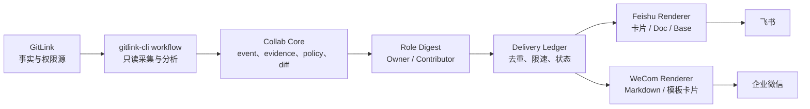

# GitLink 飞书阶段成果与企业微信接入计划汇报

汇报版本：v1.0  
整理日期：2026-07-29  
建议时长：8–10 分钟

## 1. 一页结论

项目已经完成从 GitLink 只读数据到飞书协作界面的第一阶段验证，形成了“分析、预览、通知、知识沉淀”的基础链路。下一步不再继续堆叠飞书 API，而是抽取平台无关的协作事件模型，以企业微信群消息推送作为最小接入点，证明同一套 GitLink 协作核心可以同时服务飞书和企业微信。

本轮建议批准的范围是：

1. 收敛飞书稳定通知能力，保留 DocX/Wiki、多维表格和任务写入为实验能力。
2. 建设统一 `CollabEvent`、增量识别、投递去重和角色化摘要。
3. 完成企业微信 webhook 的预览、模板卡片、受控发送和测试群验证。
4. 企业微信长连接机器人只做独立、只读技术验证，不进入稳定 CLI 主流程。
5. 暂不开放飞书或企业微信到 GitLink 的自动写回。

一句话定位：

> GitLink 是协作事实与权限源，gitlink-cli 是可审计的分析和执行面，飞书与企业微信是低噪声通知、知识沉淀和只读交互入口。

## 2. 当前要解决的问题

拥有者和贡献者通常不缺数据，缺的是低噪声、带证据、能立即行动的协作上下文：

- 拥有者需要知道“今天最需要处理哪 3–5 件事”。
- 贡献者需要知道“我的 PR 当前处于什么阶段，下一步做什么”。
- 团队需要避免重复提醒、无依据风险标签和跨平台口径不一致。
- 智能体需要在身份、仓库、权限或证据不足时停止，而不是猜测或越权。

因此项目目标不是把 GitLink 数据完整搬进办公平台，而是识别真正值得关注的变化，把证据和下一步送到合适的协作界面。

## 3. 飞书阶段成果

### 3.1 已形成的端到端链路

```text
GitLink 只读数据
    -> workflow 本地规则分析
    -> Owner / Contributor 角色摘要
    -> 飞书卡片、Markdown、DocX/Wiki、Bitable、Task
    -> 默认预览，显式发送或写入
```

飞书模块复用 workflow JSON，而不是重新实现 GitLink 数据分析。这使业务判断与平台渲染保持解耦，也为企业微信适配提供了基础。

### 3.2 能力分层

| 层级 | 已有能力 | 当前判断 |
| --- | --- | --- |
| 稳定通知与本地输出 | `+bot-test`、`+notify`、`+weekly-report`、`+owner-digest`、`+contributor-digest` | 可作为主演示路径 |
| 稳定预览 | `+bitable-schema`、`+bitable-records`、`+task-preview` | 只生成本地候选，不承诺远端落地 |
| 稳定诊断 | `+app-check`、`+doc-check`、`+bitable-check`、`+task-check` | 默认本地检查，`--remote` 才访问检查端点 |
| 实验写入 | `+doc-export`、`+bitable-sync`、`+task-create` | 已有真实环境验证，但仍依赖租户权限和既有资源 |

稳定层的核心安全行为包括：

- 默认只预览，真实发送必须显式触发。
- webhook、token 和资源 URL 做脱敏。
- 输出保留 GitLink 原始链接、生成时间和数据范围。
- 规则风险提示与正式人工 Review 结论分开表达。
- 未建立身份映射时，不做贡献者个人定向。

### 3.3 已验证价值

基于仓库固定 fixture 的本地实验已经证明：

- `workflow +repo-report` 可以作为飞书和企业微信共用的分析核心。
- Owner 摘要能够聚焦高风险 Issue、信息缺失和待审 PR。
- Contributor 摘要能够输出 Review 关注点和建议下一步。
- 同一协作事件可以同时渲染为飞书卡片和企业微信模板卡片。
- 五组 dry-run 均正常退出，未使用平台凭证，也未触发网络写入。

### 3.4 当前缺口

飞书侧仍有四类关键缺口：

1. 当前摘要主要是报告级和角色级，还不是完整的 PR/Issue 行级协作模型。
2. 缺少上次快照、增量变化识别和跨运行投递账本。
3. Task 只有本地唯一键，远端搜索去重、负责人、项目和分组尚未闭环。
4. 飞书 `open_id`、企业微信 `userid` 与 GitLink username 尚无显式绑定关系。

因此下一阶段的价值中心应从“新增平台 API”转向“统一事件、证据、身份和投递治理”。

## 4. 为什么接入企业微信

企业微信接入不是复制一套飞书业务逻辑，而是验证平台无关架构：

```text
                 -> Feishu Renderer -> 飞书卡片
GitLink -> CollabEvent
                 -> WeCom Renderer  -> 企业微信 Markdown / 模板卡片
```

接入企业微信可以带来三项直接价值：

- 覆盖以企业微信为主要协作入口的团队。
- 证明 GitLink 分析核心不依赖单一办公平台。
- 用较低成本的群消息推送完成双平台演示和真实测试。

第一版不追求企业微信全能力接入，只解决“同一事件、同一证据、同一下一步、不同平台表达”的问题。

## 5. 企业微信接入方案

### 5.1 第一期：企业微信群通知

建议新增命令：

```text
wecom +check
wecom +bot-test
wecom +notify
wecom +owner-digest
wecom +contributor-digest
```

第一期支持：

- Markdown 和模板卡片两种渲染。
- 默认 preview，显式 `--send`。
- Webhook 只从环境变量或凭证系统读取。
- 完整隐藏 webhook query/key。
- 单群内部限速不超过 15 条/分钟，为平台限制预留余量。
- 超时、限流、5xx 和平台业务错误的可解释处理。
- 同一事件重复运行时默认不重复发送。
- 每条消息带 GitLink 链接、生成时间、数据范围和未知项。

第一期不做：

- 根据显示名自动匹配个人。
- 企业微信智能表格写入。
- 从卡片按钮修改 GitLink。
- 自动 Review、Merge、Close、Comment 或权限变更。

### 5.2 第二期：只读智能机器人技术验证

长连接机器人作为独立 bridge 运行，不嵌入一次性 Go CLI 进程。建议使用企业微信官方 Node.js SDK，并只开放有限的只读意图：

```text
help
repo.health
repo.attention
pr.summary
pr.review_evidence
issue.summary
contributor.next_step
```

处理流程：

```text
企业微信消息
    -> msgid / req_id 去重
    -> 校验群和仓库绑定
    -> 自然语言映射到固定只读意图
    -> 以参数数组调用 gitlink-cli
    -> 解析结构化 JSON
    -> 返回证据、未知项和 GitLink 深链
```

技术验证必须满足：

- 单连接运行，支持心跳、断线检测和重连。
- 不启动 shell，不允许任意命令或任意 Raw API。
- 长耗时分析异步执行，平台回调先快速确认。
- 不记录 Bot Secret、GitLink token 和完整敏感对话。
- 断线重连或重复回调不产生重复回复。

### 5.3 后续：身份与动作网关

该阶段不进入本轮。只有全部满足以下条件后，才讨论由办公平台发起 GitLink 写操作：

```text
仓库显式绑定
-> 平台身份与 GitLink 身份可绑定、查看和撤销
-> 每次动作重新校验 GitLink 权限
-> 展示动作预览和影响范围
-> 用户明确确认
-> 执行并记录完整审计
-> 失败可追踪、必要时可恢复
```

## 6. 统一技术架构



建议新增公共模块：

```text
internal/collab/
  event.go
  evidence.go
  snapshot.go
  diff.go
  policy.go
  digest.go
  ledger.go
  redact.go
```

平台适配器只负责：

```text
render_preview(event)
send(event, binding)
redact(binding)
```

GitLink 读取、风险规则、身份判断和权限策略不得散落在 Feishu/WeCom renderer 中。

## 7. 分阶段计划与验收

| 阶段 | 目标 | 核心交付 | 退出条件 |
| --- | --- | --- | --- |
| A：契约收口 | 统一双平台输入 | `CollabEvent`、证据模型、稳定 `event_id`、快照 diff、投递账本接口 | 同一输入产生稳定事件；平台差异只在 renderer |
| B：飞书收敛 | 稳定已有价值 | Owner Top 3–5、Contributor 状态预览、重复投递抑制、飞书回归测试 | 默认无写入；每项有证据、范围和链接 |
| C：企微群通知 | 完成最小接入 | `shortcuts/wecom`、Markdown/模板卡片、限速、脱敏、mock 测试 | 离线演示可复现；测试群 smoke 成功；重复事件不重复发 |
| D：只读机器人 Spike | 验证交互方向 | 独立 Node bridge、白名单意图、心跳重连、流式回复 | 只能只读；不能构造任意命令；重连不重复 |
| E：身份与动作网关 | 受控写回 | 身份绑定、权限复核、预览确认、审计恢复 | 不属于本轮，需单独立项和安全评审 |

建议按两个迭代交付：

### 迭代 1：复赛稳定交付

- 完成阶段 A、B、C。
- 固定 fixture 和一次真实 GitLink 只读快照。
- 输出 Owner/Contributor 两种视图。
- 输出飞书/企业微信两个平台预览。
- 在测试群完成各一条受控发送验证。
- 提供一键离线演示、单元测试和 mock HTTP 证据。

### 迭代 2：赛后技术验证

- 完成阶段 D。
- 验证机器人单活、心跳、重连、幂等和只读问答。
- 评估企业微信智能表格和个人应用消息。
- 只有身份、权限、审计成熟后再评估阶段 E。

## 8. 风险与控制措施

| 风险 | 影响 | 控制措施 |
| --- | --- | --- |
| 重复通知 | 群内刷屏、降低信任 | 稳定事件 ID、快照 diff、投递账本 |
| 凭证泄露 | 平台被滥用 | 环境变量、完整 query 脱敏、日志禁记 secret |
| 身份误配 | 消息发错人或越权 | 显式映射；无映射只允许群级摘要或本地预览 |
| 规则误判 | 把提示冒充人工结论 | 事实、规则推断、未知项和建议分栏 |
| 平台限流/超时 | 投递失败或状态不确定 | 内部限速、退避、unknown 状态、避免盲目重发 |
| 功能范围过大 | 无法在复赛前稳定 | 稳定/实验/未来三层；优先统一核心和 webhook |
| 协作平台触发写回 | 高权限误操作 | 本轮完全禁止；后续必须预览、确认、审计 |

## 9. 汇报演示建议

建议用一个固定 PR 风险事件完成 4 分钟主演示：

1. 展示 GitLink 原始事实和 workflow JSON。
2. 生成同一个 `CollabEvent`，说明证据、未知项和建议下一步。
3. 展示飞书 Owner 卡片预览。
4. 展示企业微信模板卡片预览。
5. 再次运行，展示投递账本将重复事件标记为 suppressed。
6. 最后展示 `--send` 才会进入测试群，并说明写回 GitLink 被明确禁止。

演示成功标准不是“接了多少 API”，而是：

- 同一事实在两个平台语义一致。
- Owner 一眼看到 3–5 个决策项。
- Contributor 能从一条消息判断下一步。
- 默认无网络写入。
- 每条建议都有来源、范围和停止条件。

## 10. 需要确认的决策

建议本轮确认以下五项：

1. 企业微信第一期只做群消息推送，不做个人定向和智能表格写入。
2. 飞书 DocX/Wiki、Bitable Sync、Task Create 继续保持实验标签。
3. 飞书和企业微信强制共享 `internal/collab`，禁止复制业务规则。
4. 长连接机器人只做独立、只读、测试群 Spike。
5. 飞书/企业微信到 GitLink 的写回不进入本轮。

批准后，团队可以把精力集中在统一事件、低噪声投递和双平台可复现证据上，形成一条边界清晰、能真实演示、也能继续扩展的复赛主线。

## 参考材料

- [当前项目盘点与边界](01-当前项目盘点与边界.md)
- [飞书与企业微信接入知识库](02-飞书与企业微信接入知识库.md)
- [功能策划与一轮拓展计划](04-功能策划与一轮拓展计划.md)
- [集成尝试结果与未来展望](06-集成尝试结果与未来展望.md)
- [GitLink 企业微信机器人接入方案 v1](08-GitLink企业微信机器人接入方案-v1.md)
- [离线集成契约样例](experiments/README.md)
