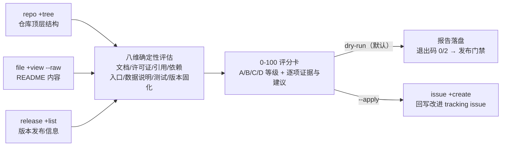

# 科研项目复现性审计（repro-audit）

把 [`gitlink-repro-audit` Skill](../../../skills/gitlink-repro-audit/SKILL.md) 包成**可直接运行的科研辅助工具**（子赛题四：应用 GitLink 辅助科研）：

> **采集 → 评估 → 报告 → 回写**：用 `repo +tree` / `file +view --raw` / `release +list` 采集仓库结构、README 与发布信息，做八维**确定性复现性检查**（文档 / 许可证 / 引用 / 依赖固化 / 运行入口 / 数据说明 / 测试 / 版本固化），输出 0-100 评分卡 + A/B/C/D 等级 + 逐项修复建议，并（仅在 `--apply` 时）用 `issue +create` 把报告作为改进 tracking issue 回写。

## 科研赋能价值

- **课题组自查**：论文投稿/开源发布前对代码仓库做复现性体检，逐项补齐
- **学术规范检查**：许可证、引用信息（CITATION.cff/BibTeX）、数据可得性一次性核验
- **可进 CI**：退出码 `2` 表示存在明显复现缺口，可作为科研仓库的发布门禁

## 架构图



## 交付物

- `scripts/repro_audit.py`：完整审计闭环（纯标准库，Python ≥3.9，零第三方依赖）
- `tests/test_audit.py`：确定性回归护栏（7/7 全绿，同输入同分同等级）
- `docs/verification.md`：真实科研仓库验证证据
- `examples/demo-outputs/`：两个真实仓库的审计报告

## 快速运行（默认 dry-run，不写远端）

```bash
npm install -g @gitlink-ai/cli
gitlink-cli auth login

python3 scripts/repro_audit.py --owner <owner> --repo <repo> --output-dir outputs
# 回写改进 tracking issue（请先确认报告内容）：加 --apply

# 批量审计（实验室/课题组场景）：清单每行 owner/repo，# 为注释
python3 scripts/repro_audit.py --repos-file repos.txt --output-dir outputs
# 输出逐仓库报告 + repro-audit-summary.md 汇总排名（得分降序，退出码 2 表示存在 <70 分仓库）
```

## 已在真实科研仓库验证

见 [`docs/verification.md`](docs/verification.md)：

| 仓库 | 类型 | 得分 | 等级 |
|------|------|------|------|
| GengzhaoWang/UAV-Paper | 论文笔记仓库 | 8/100 | D（复现困难，符合预期） |
| momomym/paper-summarizer | 科研工具代码仓库 | 58/100 | C（缺引用/数据说明/release，建议明确） |

两个仓库得分区分度显著，逐项证据均可在仓库页面人工复核。

## 评分标准

| 检查项 | 分值 | 判据 |
|--------|------|------|
| README 与运行说明 | 15 | README 存在且含运行/复现章节（仅 README 得 8） |
| 开源许可证 | 15 | LICENSE / COPYING |
| 引用信息 | 10 | CITATION.cff 或 README BibTeX |
| 依赖清单 | 15 | requirements.txt / environment.yml / go.mod 等 |
| 运行入口 | 10 | Makefile / run.sh / main.py / Dockerfile / scripts |
| 数据可得性说明 | 10 | data 目录或 README 数据说明 |
| 测试/验证代码 | 10 | tests 目录 |
| 版本发布 | 15 | ≥1 个 release |

等级：≥85 A / ≥70 B / ≥50 C / <50 D。

> 依赖 `file` 快捷命令组（PR #330）；在其合并前可用 `--cli` 指向包含该命令的本地构建。
