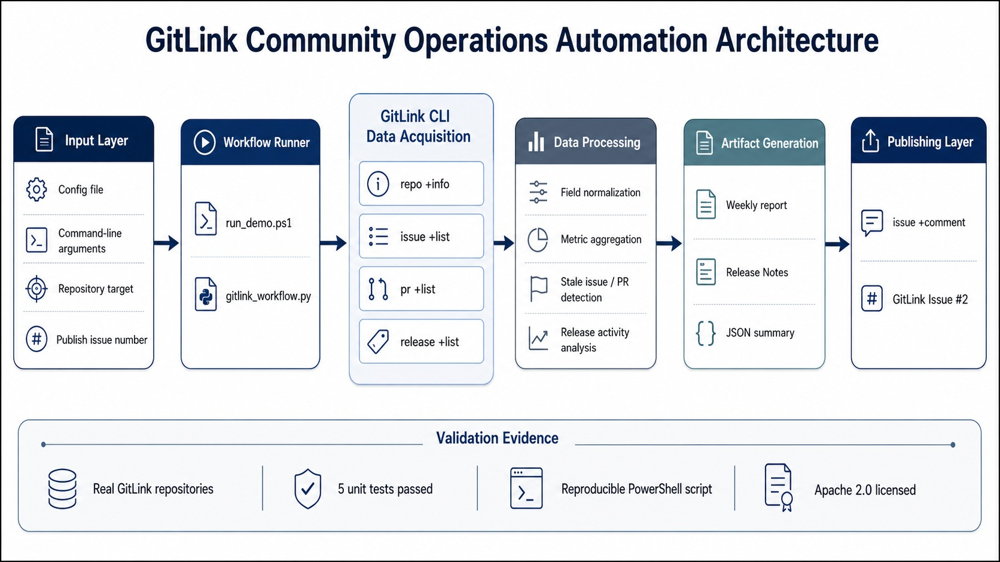

# 架构说明

本项目采用“采集 -> 归一化 -> 分析 -> 生成 -> 发布”的五段式流程。

## 设计目标

- 低门槛：只依赖 `gitlink-cli` 和 Python 标准库
- 可复现：同一配置可重复跑出同类报告
- 可维护：采集、归一化、分析、生成和发布步骤保持清晰边界
- 可验证：报告文件、结构化摘要和 Issue 评论均可作为运行结果核验依据

## 为什么选这个链路

子赛题三要求使用现有命令或 Skill 组合形成完整解决方案。本方案覆盖：

1. 仓库信息采集
2. Issue 列表采集
3. PR 列表采集
4. Release 列表采集
5. 报告生成
6. Issue 摘要发布

该链路满足不少于 3 个 CLI 调用的要求，并形成从数据获取到结果发布的端到端闭环。

