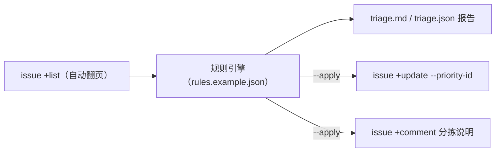

# Issue 自动分拣工作流（issue-triage-automation）

补齐起步资源包承诺的三个参考工作流之一「Issue 自动分拣」：

> **采集 → 分类 → 报告 →（可选）回写**：拉取仓库全部 open issue（自动翻页合并），按规则文件做**确定性分类**（关键词 → 建议优先级/标签/负责人；超龄未更新 → stale），产出 markdown + json 分拣报告；仅在 `--apply` 时把优先级更新与分拣评论真实回写到 GitLink。

## 架构



## 交付物

- `scripts/issue_triage.py`：单文件工作流（纯标准库，Python ≥ 3.9，零第三方依赖）
- `rules.example.json`：规则样例（bug / feature / docs / question 四类，含平台优先级 ID 映射：1 低 / 2 正常 / 3 高 / 4 紧急）
- `tests/test_triage.py`：10 个确定性单测（规则命中、stale 判定、首个命中规则生效、同输入同输出、报告排序）

## 快速运行（默认 dry-run，不写远端）

```bash
gitlink-cli auth login

python3 scripts/issue_triage.py --owner <owner> --repo <repo> --output-dir triage-out
# 产出 triage-out/triage.md（人读）与 triage.json（机读）

# 真实回写（优先级 + 分拣评论；请先在自有仓库演练）
python3 scripts/issue_triage.py --owner <me> --repo <mine> --apply
```

## 已在真实平台验证（2026-07-10）

- **只读分拣**：`Gitlink/forgeplus` 35 个 open issue，命中规则 13 个、stale 32 个，报告确定性可复现
- **回写闭环**：自有仓库探针 issue（标题含"报错 bug"）→ 命中 bug 规则 → `issue +update --priority-id 4` 优先级变为「紧急」+ 分拣评论落盘 → `issue +view` 验证 `priority.name == 紧急`、评论数 +1 → 探针清理

## 定制规则

编辑 `rules.example.json`：每条规则含 `keywords_any`（标题/描述任一命中，大小写不敏感）、`set_priority` / `set_priority_id`、`add_tags`、`route_to`。规则**从上到下首个命中生效**，顺序即优先级。

## CI / Agent 集成

- 定时任务：`cron` 每日 dry-run 产出报告，人工确认后 `--apply`
- Agent：本工作流与 `skills/gitlink-issue-triage` Skill 同源互补——Skill 供 Agent 交互式分拣，本脚本供确定性批量闭环
