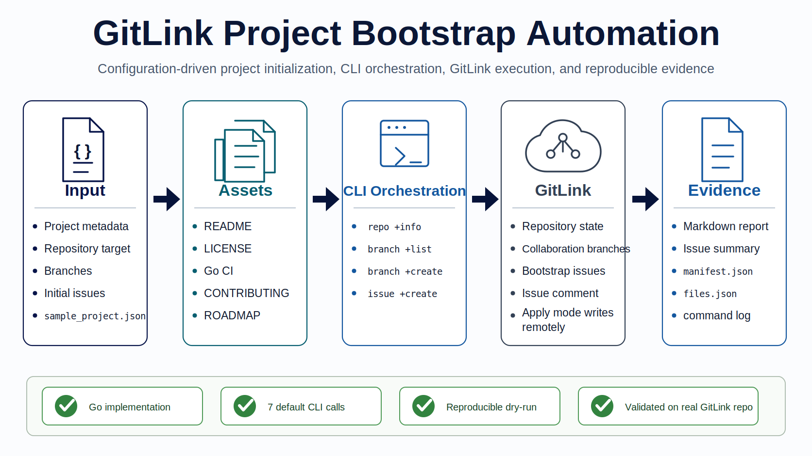
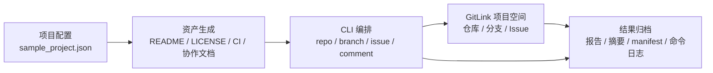

# 架构说明

本工作流采用“配置输入 -> 资产生成 -> CLI 编排 -> GitLink 落地 -> 结果归档”的五段式架构。正式架构图见 `docs/assets/bootstrap-architecture.svg`。

## 模块职责

| 模块 | 职责 |
| --- | --- |
| 配置输入 | 描述项目名称、目标仓库、初始化分支和初始 Issue |
| 资产生成 | 生成 README、LICENSE、CI 配置、贡献指南和路线图 |
| CLI 编排 | 规划或执行 `gitlink-cli` 命令，串联仓库、分支、Issue 和评论能力 |
| GitLink 落地 | 在真实 GitLink 仓库中创建分支、Issue，并可回写摘要 |
| 结果归档 | 输出 Markdown 报告、摘要、JSON manifest 和命令日志 |

## 端到端链路

1. 读取 `examples/sample_project.json`。
2. 生成初始化文件包。
3. 规划 `repo +info` 和 `branch +list` 检查目标状态。
4. 规划或执行 `branch +create` 创建协作分支。
5. 规划或执行 `issue +create` 创建初始任务。
6. 可选执行 `issue +comment` 发布初始化摘要。
7. 生成报告与命令日志，支撑复现和审计。
