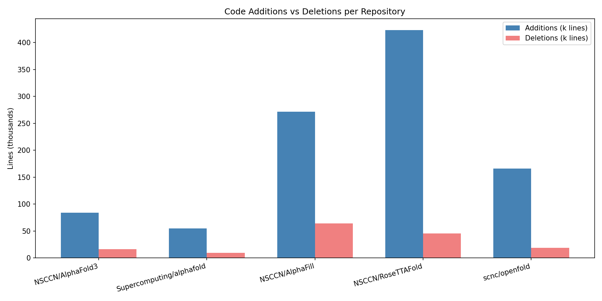
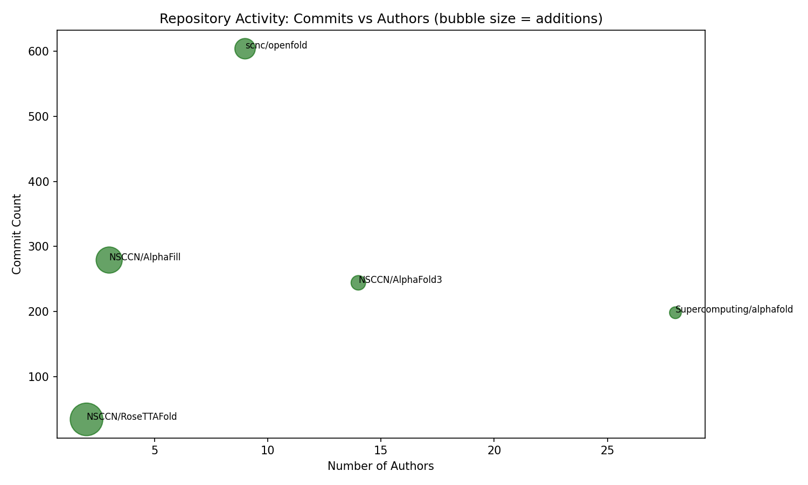
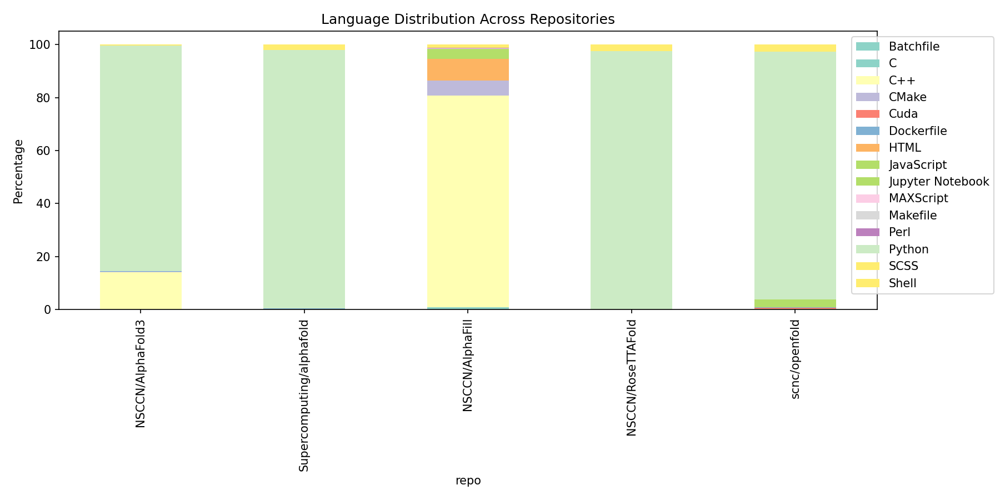
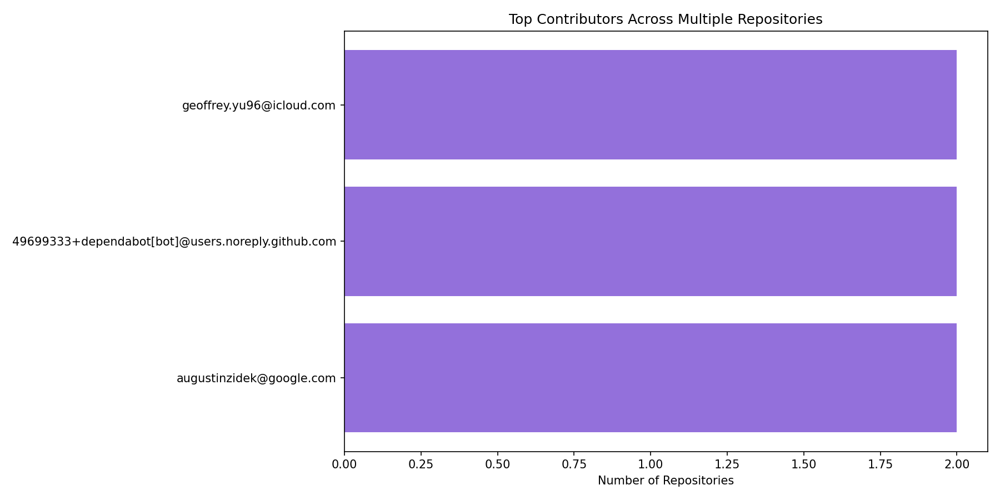

# 蛋白质结构预测开源镜像仓库科研趋势分析报告

## 1. 引言
蛋白质结构预测是 AI for Science 领域的核心方向。本报告基于 GitLink 平台 5 个镜像仓库的代码统计与贡献者数据，分析其开发活跃度、技术栈与协作生态，为国内科研团队提供参考。

## 2. 数据来源与方法
1. 平台：GitLink（https://gitlink.org.cn）
2. 工具：gitlink-cli + Python pandas/matplotlib
3. 仓库：NSCCN/AlphaFold3、Supercomputing/alphafold、NSCCN/AlphaFill、NSCCN/RoseTTAFold、scnc/openfold
4. 数据维度：代码量、提交次数、贡献者、语言分布

## 3. 代码规模与活跃度

### 3.1 代码新增与删除量

RoseTTAFold 以 42.3 万行新增代码居首，AlphaFill 新增 27.1 万行，两者均以一次大规模导入为主。OpenFold 新增 16.6 万行且提交 604 次，是五个仓库中迭代最活跃的。AlphaFold3 镜像体量最小（8.3 万行），处于早期阶段。

### 3.2 提交次数与贡献者人数

OpenFold 贡献者仅 9 人但提交 604 次，呈现精英团队高强度开发特征。AlphaFold（Supercomputing）贡献者最多（28 人），社区参与度最高。AlphaFill 和 RoseTTAFold 仅 2-3 名贡献者主导，体现核心开发者模式。

## 4. 技术栈分析

Python 在所有仓库中占绝对主导（85%-95%），C++ 在 AlphaFold3 和 OpenFold 中分别占 14% 和 11%，用于性能敏感模块。Shell 和 Dockerfile 占比均低于 0.5%，仅用于部署。技术栈统一意味着跨项目迁移成本低。

## 5. 贡献者网络

Augustin Zidek 是唯一跨仓库核心贡献者，体现 DeepMind 团队的技术辐射力。大部分贡献者仅活跃于单一仓库，各项目社区交叉度低，以独立演进为主。

## 6. 镜像生态特征
五个仓库均为 GitHub 源项目的镜像，在 GitLink 上无 Issue/PR 活动，但代码同步完整。这种模式降低了国内访问门槛，适合本地部署和二次开发，但社区互动仍需在源平台进行。

## 7. 结论
蛋白质结构预测开源生态已形成“核心团队+全球镜像”格局。国内研究者可从镜像入手学习代码结构，在 GitHub 源仓库参与讨论。未来可推动镜像仓库的本地化协作功能。