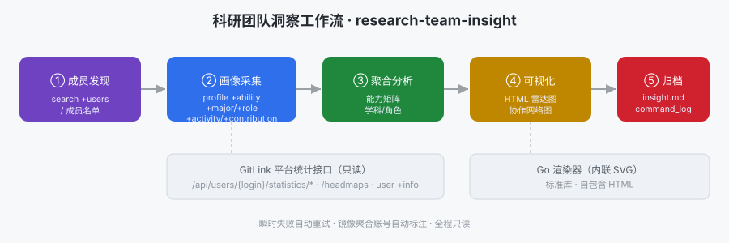

# 架构与流程说明



## 设计目标

把分散的 GitLink 平台统计能力，编排成一个**可复现、可审计、零第三方依赖**的科研团队洞察流水线，
输出供科研评审/组队/选题直接使用的可视化与结构化成果。

## 五个阶段

| 阶段 | 动作 | 使用的命令 | 产物 |
|------|------|-----------|------|
| ① 成员发现 | 由方向关键词检索候选，或直接使用给定名单 | `gitlink-cli search +users -k`（可选） | 成员 login 列表 |
| ② 画像采集 | 对每位成员拉取 5 类统计 + 基础资料 | `api GET /users/{login}/statistics/{develop,major,role,activity}`、`/headmaps`、`user +info` | `data/<login>/*.json` |
| ③ 聚合分析 | 计算能力矩阵均值、学科共有/独有、技术栈、角色结构、最强成员 | `insight.go`（标准库） | 内存聚合结构 |
| ④ 可视化 | 渲染能力雷达（多成员叠加）+ 能力矩阵 + 共有/独有方向 + 协作网络图 | `render.go`（内联 SVG） | `team-report.html` |
| ⑤ 归档 | 生成洞察报告与命令日志 | `insight.go` | `team-insight.md`、`command_log.json` |

## 关键设计

- **与主仓库技术栈一致**：Go 实现，复用根 `go.mod`，可被主仓库 CI 直接覆盖（`go build`/`golangci-lint`/`go test`）。
- **零第三方依赖**：可视化用标准库拼装内联 SVG 生成自包含 HTML，评审在任何环境用浏览器即可查看。
- **可复现**：`--no-fetch --data-root` 可基于已归档数据离线重跑，产出一致；`command_log.json` 记录全部命令。
- **健壮性**：网络命令对瞬时 TLS 超时自动重试（间隔 3s，最多 2 次）。
- **数据治理**：对持有大量镜像项目的平台/管理员账号（`user +info.mirror_projects_count`），报告自动标注"角色/学科分布偏泛"，避免误读。
- **只读安全**：全流程不写任何远端数据。

## 输入 / 输出契约

- 输入：`--members`（逗号分隔）/ `--config` / `--keyword` 三选一。
- 每位成员数据目录需含 `develop/major/role/activity/contribution/user.json`（采集阶段自动生成）。
- 输出目录固定产出 `team-report.html` / `team-insight.md` / `command_log.json` / `data/`。

## 代码结构

```
scripts/
├── insight.go        # main：flag 解析、成员解析、采集编排、命令日志
├── render.go         # 聚合渲染：Markdown 报告 + HTML/SVG（雷达图、协作网络图）
└── insight_test.go   # 单元测试（解析、聚合、渲染，全部离线）
```
