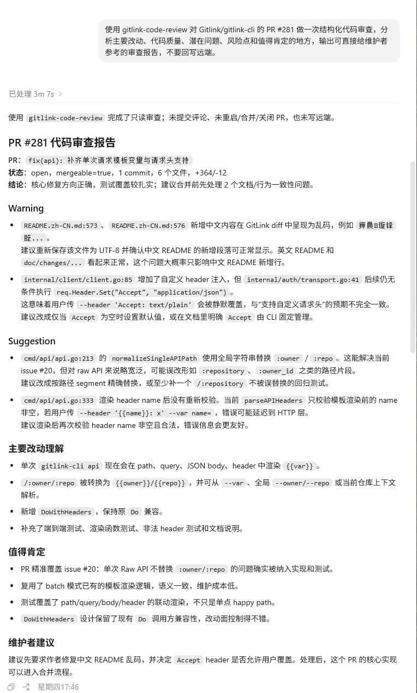

# Codex 验证记录（2026-06-25）

本记录用于提交 `gitlink-code-review` 的 Agent 平台验证材料，包含技能目录截图、实际使用截图和完整输出转录。

## 验证平台

- 平台：Codex
- 仓库：`Gitlink/gitlink-cli`
- 目标 PR：`#281`
- 执行约束：只读分析，不回写评论、不提交 review、不执行合并或关闭操作

## 触发提示词

```text
使用 gitlink-code-review 对 Gitlink/gitlink-cli 的 PR #281 做一次结构化代码审查，分析主要改动、代码质量、潜在问题、风险点和值得肯定的地方，输出可直接给维护者参考的审查报告，不要回写远端。
```

## 技能目录截图


## 输出结果全文

```markdown
使用 gitlink-code-review 完成了只读审查；未提交评论、未重启/合并/关闭 PR，也未写远端。

## PR #281 代码审查报告

PR: `fix(api): 补齐单次请求模板变量与请求头支持`
状态: `open`，`mergeable=true`，1 commit，6 个文件，`+364/-12`
结论: 核心修复方向正确，测试覆盖较扎实；建议合并前先处理 2 个文档/行为一致性问题。

### Warning

- `README.zh-CN.md:573`、`README.zh-CN.md:576`
  新增中文内容在 GitLink diff 中呈现为乱码，中文 README 新增段落需要按 UTF-8 重新保存并确认显示正常。英文 README 和 `doc/changes/...` 看起来正常，这个问题大概率只影响中文 README 的新增行。

- `internal/client/client.go:85`
  增加了自定义 header 注入，但 `internal/auth/transport.go:41` 后续仍会条件执行 `req.Header.Set("Accept", "application/json")`。这意味着用户传 `--header 'Accept: text/plain'` 会被静默覆盖，与“支持自定义请求头”的预期不完全一致。建议改成仅当 `Accept` 为空时设置默认值，或在文档里明确由 CLI 固定管理。

### Suggestion

- `cmd/api/api.go:213` 的 `normalizeSingleAPIPath` 使用全局字符串替换 `:owner` / `:repo`。这能解决当前 issue #20，但对 raw API 来说路径宽泛，可能误改形如 `:repository`、`:owner_id` 之类的路径片段。建议改成路径 segment 级替换，或至少补一个 `:repository` 不被误替换的回归测试。

- `cmd/api/api.go:333` 渲染 `header name` 后没有重新校验。当前 `parseAPIHeaders` 只校验模板渲染前的 `name` 非空，若用户传 `--header '{{name}}: x' --var name=`，错误可能延迟到 HTTP 层。建议渲染后再次校验 `header name` 非空且合法，错误信息也会更好。

### 主要改动理解

- 单次 `gitlink-cli api` 现在会在 `path`、`query`、`JSON body`、`header` 中渲染 `{{var}}`。
- `/:owner/:repo` 被转换为 `{{owner}}/{{repo}}`，并可从 `--var`、全局 `--owner/--repo` 或当前仓库上下文解析。
- 新增 `DoWithHeaders`，保持原 `Do` 兼容。
- 补充了端到端测试、渲染函数测试、非法 header 测试和文档说明。

### 值得肯定

- PR 精准覆盖 issue #20：单次 Raw API 不替换 `:owner/:repo` 的问题确实被纳入实现和测试。
- 复用了 batch 模式已有的模板渲染逻辑，语义一致，维护成本低。
- 测试覆盖了 `path/query/body/header` 的联动渲染，不只是单点 happy path。
- `DoWithHeaders` 设计保留了现有 `Do` 调用方兼容性，改动面控制得不错。

### 维护者建议

建议先要求作者修复中文 README 乱码，并决定 `Accept` header 是否允许用户覆盖。处理后，这个 PR 的核心实现可以进入合并流程。
```

## 输出截图



## 结构校验

```powershell
python -X utf8 "C:\Users\Z Y\.codex\skills\.system\skill-creator\scripts\quick_validate.py" "D:\temp\gitlink-cli-skills-submit\skills\gitlink-code-review"
Skill is valid!
```
