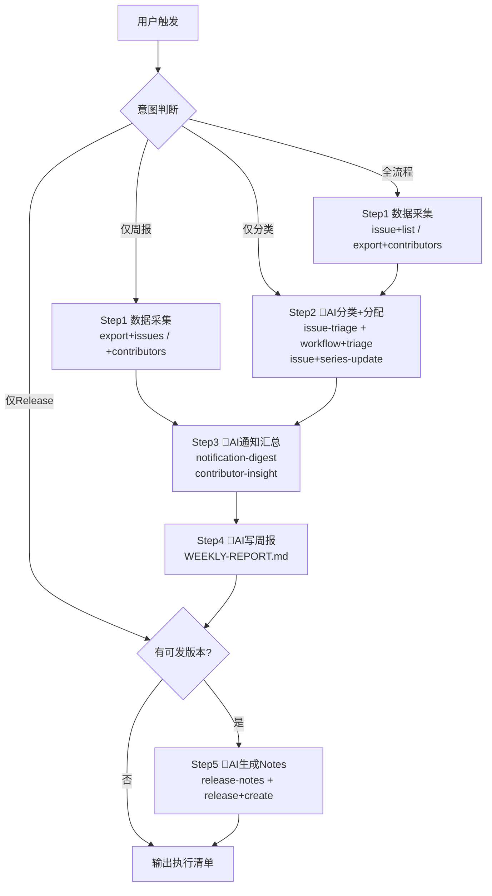

# gitlink-community-ops（社区运营自动化编排）

**CRITICAL — 开始前必须先阅读 [`../gitlink-shared/SKILL.md`](../gitlink-shared/SKILL.md)，认证/权限/API 注意事项。**
**CRITICAL — 所有写入/删除操作（series-update、release create、issue comment）前，务必先确认用户意图。**
**CRITICAL — GitLink 操作只能用 gitlink-cli。禁止用 gh（GitHub CLI）操作 GitLink 资源。**
**CRITICAL — 本编排型 Skill 只做"导演"，指挥子 Skill 与 CLI 命令的执行顺序，不重写子 Skill 的内部逻辑。**

---

## 工作流总览

---

## 编排的子 Skill

| 子 Skill | 职责 | 调用时机 |
|---|---|---|
| gitlink-issue-triage | Issue 自动分类、打标签、判断优先级与责任人 | Step2：新 Issue 分诊 |
| gitlink-notification-digest | 聚合近期通知、未读消息、待办提醒 | Step3：周报素材 |
| gitlink-contributor-insight | 贡献者活跃度、新贡献者识别 | Step3：周报人物板块 |
| gitlink-release-auto | 拉取合并 PR、组装 Release 候选 | Step5：发版前置 |
| gitlink-release-notes | 生成 Release Notes 文案 | Step5：release+create 内容 |

---

## 详细步骤

### Step 1: 数据采集（纯命令）

- 命令：
  - `gitlink-cli issue +list --owner <owner> --repo <repo> --state open --limit 50 --format json` — 拉取开放 Issue
  - `gitlink-cli export +contributors --owner <owner> --repo <repo> --format json --output contributors.json` — 导出贡献者
  - `gitlink-cli export +issues --owner <owner> --repo <repo> --state all --format json --output issues.json` — 导出全部 Issue 供分析
- 🤖AI 判断点：解析 Issue 列表，识别「无标签 / 无 assignee / 长期未更新」三类待处理 Issue，作为 Step2 输入；仓库为空或解析失败时告知用户并停止。
- 本步全部只读，无需确认。

### Step 2: Issue 自动分类与分配（🤖AI 判断点 + 写入命令）

- 调子 Skill：`gitlink-issue-triage`
- 纯命令前置（拉取可用元数据）：
  - `gitlink-cli workflow +triage --owner <owner> --repo <repo> --state open --limit 50 --lang zh-CN --format json` — 内置分诊规则给初步分类
  - `gitlink-cli issue +priorities --owner <owner> --repo <repo>` — 仓库可用优先级
  - `gitlink-cli issue +tags --owner <owner> --repo <repo>` — 仓库可用标签
  - `gitlink-cli issue +assigners --owner <owner> --repo <repo>` — 可分配人员
- 🤖AI 判断点：对每个待处理 Issue，结合 title/body 与贡献者擅长领域，决定优先级、标签、责任人，组装批量参数。
- ⚠️写入命令（执行前必须回显方案给用户确认）：
  - `gitlink-cli issue +series-update --owner <owner> --repo <repo> --ids <id1,id2,id3> --status open` — 批量更新状态
- 确认话术："共 N 条 Issue，预计修改状态/责任人，是否执行？"

### Step 3: 社区动态汇总（🤖AI 判断点）

- 调子 Skill：`gitlink-notification-digest`、`gitlink-contributor-insight`
- 纯命令：
  - `gitlink-cli notification +list --limit 50 --format json` — 拉取通知（默认未读）
  - `gitlink-cli repo +activity --owner <owner> --repo <repo>` — 仓库活跃曲线
  - `gitlink-cli user +heatmap --login <owner>` — 贡献热力图
  - `gitlink-cli user +stats --login <owner>` — 统计数据
- 🤖AI 判断点：
  - 通知去重归类（PR / Issue / Release / CI），提炼本周待办。
  - 识别「本周新晋贡献者」「Top 活跃」「需感谢的人」。
  - 输出结构化中间结果供 Step4 引用。

### Step 4: 撰写社区周报（🤖AI 判断点）

- 🤖AI 判断点：汇总 Step1-3 结构化结果，按以下板块撰写 `WEEKLY-REPORT.md`：
  1. 本周数据概览（新增 Issue N / 合并 PR M / 新贡献者 K）
  2. 重点 Issue 进展
  3. 贡献者榜单
  4. 待跟进事项
  5. 下周计划
- 落地：工作目录生成 `WEEKLY-REPORT.md`（落盘前向用户展示大纲）。
- 可选纯命令：`gitlink-cli pm +weekly --project <project_id>` — 补充官方周报数据（需项目 ID）。

### Step 5: Release 候选与发布（🤖AI 判断点 + 写入命令）

- 调子 Skill：`gitlink-release-auto`、`gitlink-release-notes`
- 纯命令（采集发版素材）：
  - `gitlink-cli repo +tags --owner <owner> --repo <repo>` — 最近 tag，确定发版起点
  - `gitlink-cli repo +commits --owner <owner> --repo <repo>` — 自上 tag 以来提交
  - `gitlink-cli pr +list --owner <owner> --repo <repo> --state closed --limit 50` — 近期 PR（从中筛选已合并）
  - `gitlink-cli repo +compare --owner <owner> --repo <repo> --base <last_tag> --head master` — 完整 diff 摘要
- 🤖AI 判断点：
  - 判断变更是否值得发版（仅文档微调则建议跳过）。
  - 按 conventional commits（feat/fix/perf/docs）分组，识别 BREAKING CHANGE。
  - 生成 Release Notes 正文，让用户确认版本号（major/minor/patch）。
- ⚠️写入命令（发布前回显 tag、标题、正文预览）：
  - `gitlink-cli release +list --owner <owner> --repo <repo>` — 确认 tag 未被占用
  - `gitlink-cli release +create --owner <owner> --repo <repo> --tag <version> --name "<version>" --body "<Release Notes>" --target master`

---

## 触发模式（可裁剪）

本 Skill 支持全流程与单点触发：
- **全流程**："跑一遍社区运营" → Step1→5
- **仅 Issue 分类**："把今天的新 Issue 分一下" → Step1→2
- **仅周报**："出本周社区周报" → Step1→3→4
- **仅 Release**："发个 v1.2.0" → Step5

Agent 第一步先与用户确认走哪种模式，避免多余写入。

---

## Agent 触发示例

**用户**："把 gitlink-cli-demo 这周的社区运营跑一遍，顺便发个新版本。"

**Agent**：
1. 确认 owner=jiangtx、repo=gitlink-cli-demo，版本号意向 → 全流程模式。
2. Step1（纯命令）：`issue +list --state open`、`export +contributors`、`export +issues`，解析出 12 条待分类 Issue。
3. Step2（AI + 命令）：`workflow +triage` + `issue +priorities/tags/assigners`，给出分类与责任人方案 → 回显 → 用户确认 → `issue +series-update` 落地。
4. Step3（AI + 命令）：`notification +list`、`repo +activity`、`user +heatmap` + contributor-insight，产出中间结果。
5. Step4（AI）：撰写 `WEEKLY-REPORT.md`，展示大纲 → 确认 → 落盘。
6. Step5（AI + 命令）：`repo +tags`、`pr +list --state closed`、`repo +compare`，识别 8 个合并 PR，判定值得发版 → 调 release-notes 生成正文 → 用户确认 v1.4.0 → `release +create` 发布。
7. 输出执行清单：分诊 12 条、周报路径、Release URL。
