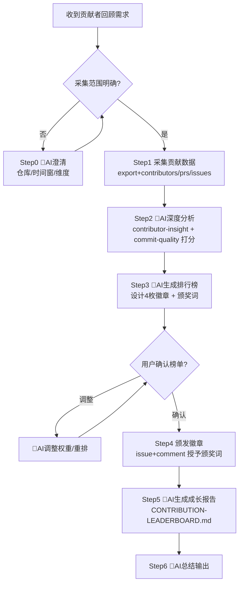

# gitlink-contributor-growth（贡献者成长体系编排）

**CRITICAL — 开始前必须先阅读 [`../gitlink-shared/SKILL.md`](../gitlink-shared/SKILL.md)，认证/权限/API 注意事项。**
**CRITICAL — 所有写入操作（issue comment、repo create-file/update-file）前，务必先确认用户意图。**
**CRITICAL — GitLink 操作只能用 gitlink-cli。禁止用 gh（GitHub CLI）操作 GitLink 资源。**
**CRITICAL — 徽章授予是对真实用户的公开评价，颁奖词须客观、正向、避免贬损，颁布前向用户复述最终文案。**

---

## 工作流总览

---

## 编排的子 Skill

| 子 Skill | 职责 | 调用时机 |
|---|---|---|
| gitlink-contributor-insight | 贡献者活跃度、贡献类型、影响力画像 | Step2 逐人画像 |
| gitlink-user | 用户资料、heatmap、stats 核验 | Step2 候选人细化、Step4 颁奖词引用 |
| gitlink-commit-quality | 提交/PR 质量评估 | Step2 引入质量维度，避免只看数量 |
| gitlink-release-auto | 结构化亮点提炼 | Step5 报告"本期亮点"段落 |

---

## 详细步骤

### Step 0: 🤖AI 澄清采集范围（AI 判断点）

- 🤖AI 判断点：向用户确认四要素：
  1. **目标仓库**（owner/repo）—— 若只给仓库名，用 `gitlink-cli search +repos -k <name>` 反查。
  2. **时间窗**（周/月/季度或起止日期）。
  3. **榜单维度**（默认综合榜；可选修复/文档/新人榜）。
  4. **是否公开发榜**（决定 Step4 是否评论、Step5 是否提交文件）。
- 信息齐全则跳过本步。

### Step 1: 采集贡献数据（纯命令）

优先用 `export` 模块（稳定、批量、结构化）：
- `gitlink-cli export +contributors --owner <owner> --repo <repo> --format json --output contributors.json`
- `gitlink-cli export +prs --owner <owner> --repo <repo> --format json --output prs.json`
- `gitlink-cli export +issues --owner <owner> --repo <repo> --format json --output issues.json`
- 补充核验（字段不全时）：
  - `gitlink-cli repo +contributors --owner <owner> --repo <repo>`
  - `gitlink-cli repo +activity --owner <owner> --repo <repo>`
- 🤖AI 判断点：读取三个 JSON，按 login 聚合 PR/Issue/评论/合并数；识别新人（首次贡献在时间窗内）与老贡献者；取 Top N（默认 15）候选。

### Step 2: 🤖AI 深度分析（AI 判断点 + 子 Skill）

- 调 `gitlink-contributor-insight`：每人活跃度、贡献类型（feature/bugfix/docs/refactor）、影响力。
- 调 `gitlink-commit-quality`：代表性 PR 质量评估（规范、测试、聚焦度），0-100 质量分。
- 调 `gitlink-user` 核验 Top 候选：
  - `gitlink-cli user +info --login <login>`
  - `gitlink-cli user +heatmap --login <login>`
  - `gitlink-cli user +stats --login <login>`
- 🤖AI 判断点：综合打分（透明可解释）：
  - `综合分 = 0.4*活跃度 + 0.3*质量分 + 0.2*影响力 + 0.1*趋势`
  - 分项分写入本地草稿 `scoring.md`（不提交），标注是否新人。

### Step 3: 🤖AI 生成排行榜 + 设计徽章（AI 判断点）

- 🤖AI 判断点：徽章体系（可在 Step0 自定义，默认）：
  - 🏆 **本周之星 / 月度之星**：综合分第一（时间窗>1 月改"季度之星"）
  - 🔧 **修复达人**：bugfix 类 PR 合并最多且质量分达标
  - 📖 **文档能手**：docs 类贡献最多
  - 🌱 **新人突破奖**：时间窗内首次贡献且进 Top N 的新人
- 🤖AI 判断点：为每位获奖者撰颁奖词草稿——客观陈述（X PR、Y Issue、质量分 Z）、正向具体、≤120 字、引用真实数据。
- ⚠️强制确认：把"榜单 + 徽章归属 + 颁奖词全文"复述给用户，确认或调整后才进入 Step4。

### Step 4: 颁发徽章（纯命令，须先经 Step3 确认）

在仓库"欢迎 Issue / 贡献者公告 Issue"下发表评论授予颁奖词。若无，先建一个：
- 查找：
  - `gitlink-cli issue +list --owner <owner> --repo <repo> --state open --limit 50`
- 创建（若无）：
  - `gitlink-cli issue +create --owner <owner> --repo <repo> --title "贡献者成长榜 · <时间窗>" --body "<榜单概述>"`
- 颁发（每位获奖者一条 comment）：
  - `gitlink-cli issue +comment --owner <owner> --repo <repo> --number <issue_number> --body "<🆔 @login | 🏅 徽章 | 📝 颁奖词>"`
- ⚠️执行前：(1) 已获 Step3 确认；(2) 每条 comment 全文再复述一次；(3) 用户点头后批量发出。
- 🤖AI 判断点：用户若要"静默颁奖"则跳过本步，仅在 Step5 报告列出。

### Step 5: 🤖AI 生成成长报告（AI 判断点 + 写入命令）

- 🤖AI 判断点：撰写 `CONTRIBUTION-LEADERBOARD.md`：
  1. 头部：时间窗、仓库、覆盖人数、总 PR/Issue 数
  2. 本期亮点：调 release-auto 提炼 3-5 条高光时刻
  3. 完整排行榜：rank / login / 综合分 / 分项 / 徽章
  4. 徽章授予记录：颁奖词全文
  5. 致谢与展望
- ⚠️写入命令（确认目标分支与路径后）：
  - `gitlink-cli repo +create-file --owner <owner> --repo <repo> --filepath CONTRIBUTION-LEADERBOARD.md --content "<报告>" --message "docs: 更新贡献者成长榜"`
  - 文件已存在则用 `repo +update-file`（同参数）。
- 🤖AI 判断点：用户若要本地落盘不入库，则写本地文件，跳过 CLI 写入。

### Step 6: 🤖AI 总结输出（AI 判断点）

- 🤖AI 判断点：汇报执行结果：
  - 采集覆盖：人数、PR 数、Issue 数
  - 榜单：Top N 与徽章归属
  - 颁奖：在哪个 Issue 发了多少条 comment（或说明静默）
  - 报告：`CONTRIBUTION-LEADERBOARD.md` 最终位置
  - 后续建议：是否周期执行、是否补 `release +create` 发版公告

---

## Agent 触发示例

**用户**："帮我给 myorg/core-repo 这个仓库做上个月的贡献者回顾，颁个奖。"

**Agent**：
1. Step0（🤖AI）：确认 owner=myorg、repo=core-repo、时间窗=上月、综合榜+三枚徽章、公开颁榜 → 复述确认。
2. Step1（纯命令）：并行 `export +contributors/prs/issues`，按 login 聚合，取 Top 15 候选。
3. Step2（🤖AI）：调 contributor-insight 画像、commit-quality 打分、Top 5 用 `user +info/heatmap/stats` 核验；算综合分写 `scoring.md`。
4. Step3（🤖AI）：生成榜单与四枚徽章（🏆月度之星/🔧修复达人/📖文档能手/🌱新人突破），写颁奖词 → 复述确认。
5. Step4（纯命令）：用户确认后 `issue +list` 找欢迎 Issue，无则 `issue +create`；对每位获奖者 `issue +comment` 颁奖（每条再次复述后发出）。
6. Step5（🤖AI+纯命令）：撰写 `CONTRIBUTION-LEADERBOARD.md`，`repo +update-file`（或 +create-file）写入仓库。
7. Step6（🤖AI）：汇报覆盖 23 人/47 PR/81 Issue，Top 3 榜单，颁发 4 枚徽章于 Issue #128，报告位于仓库根。

---

## 注意事项

- **只读 vs 写**：Step0-2 全只读；Step3 颁奖词须确认；Step4 comment、Step5 create-file/update-file 为写入须确认。
- **颁奖词红线**：客观、正向、避免贬损，颁布前复述。
- **不替代子 Skill**：贡献者深度分析仍由 contributor-insight/user/commit-quality 各自负责。
