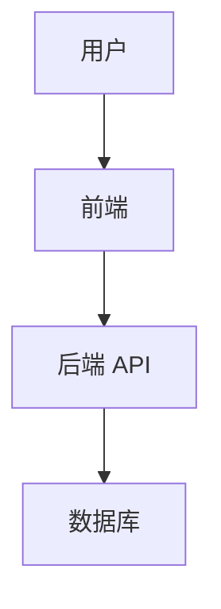

# 标准文档模板

## README.md 模板

```markdown
# <项目名称>

> <一句话项目简介>

## 技术栈

| 层次 | 技术 |
|------|------|
| 前端 | ... |
| 后端 | ... |
| 数据库 | ... |

## 本地开发启动

```bash
# 安装依赖
npm install / pip install -r requirements.txt / go mod tidy

# 启动开发服务
npm run dev / python main.py / go run main.go

# 运行测试
npm test / pytest / go test ./...
```

## 目录结构

```
src/          源代码
docs/         项目文档（需求、设计、测试报告等）
tests/        测试代码
config/       配置文件
```

## 相关文档

- [需求文档](docs/requirements.md)
- [技术设计](docs/design.md)
- [API 文档](docs/api.md)
- [测试报告](docs/test-report.md)
- [CHANGELOG](CHANGELOG.md)
```

---

## 需求文档模板（docs/requirements.md）

```markdown
# 需求文档：<需求名称>

**版本：** v1.0  
**日期：** YYYY-MM-DD  
**作者：** <姓名>  
**状态：** 草稿 / 评审中 / 已确认

---

## 背景

<描述业务背景，为什么要做这个需求>

## 目标用户

<描述主要使用该功能的用户群体>

## 用户故事

| # | 用户故事 |
|---|---------|
| US-1 | As a <角色>, I want to <行为>, so that <价值> |
| US-2 | ... |

## 功能清单

1. **功能 A**：<详细描述>
2. **功能 B**：<详细描述>
3. ...

## 验收标准（AC）

### AC-1：<功能 A 的验收>
- **Given**：<前置条件>
- **When**：<用户操作>
- **Then**：<期望结果>

### AC-2：<功能 B 的验收>
- **Given**：...
- **When**：...
- **Then**：...

## Out of Scope（不做的内容）

- <明确排除项 1>
- <明确排除项 2>

## 依赖与风险

- <依赖项 / 外部风险>
```

---

## 技术设计文档模板（docs/design.md）

```markdown
# 技术设计：<需求名称>

**版本：** v1.0  
**日期：** YYYY-MM-DD  
**作者：** <姓名>

---

## 技术栈

| 层次 | 技术选型 | 理由 |
|------|---------|------|
| 前端 | React + TypeScript | ... |
| 后端 | FastAPI (Python) | ... |
| 数据库 | PostgreSQL | ... |

## 系统架构

<用 Mermaid 或 Excalidraw 画架构图，说明模块间调用关系>



## 数据模型

```sql
CREATE TABLE example (
    id SERIAL PRIMARY KEY,
    name VARCHAR(255) NOT NULL,
    created_at TIMESTAMPTZ DEFAULT NOW()
);
```

## 接口契约

### POST /api/v1/example

**请求：**
```json
{
  "name": "string"
}
```

**响应（200）：**
```json
{
  "id": 1,
  "name": "string",
  "created_at": "2026-01-01T00:00:00Z"
}
```

**错误码：**
| 状态码 | 含义 |
|--------|------|
| 400 | 参数校验失败 |
| 500 | 服务器内部错误 |

## 关键实现思路

<描述核心算法、复杂逻辑的实现方式>

## 风险与缓解措施

| 风险 | 影响 | 缓解措施 |
|------|------|---------|
| ... | ... | ... |
```

---

## API 文档模板（docs/api.md）

```markdown
# API 文档：<项目名称>

**版本：** v1.0  
**更新日期：** YYYY-MM-DD

---

## 接口列表

| 方法 | 路径 | 说明 | 认证 |
|------|------|------|------|
| POST | /api/v1/xxx | 创建XXX | 需要 |
| GET | /api/v1/xxx | 查询XXX | 需要 |
| PUT | /api/v1/xxx/:id | 更新XXX | 需要 |
| DELETE | /api/v1/xxx/:id | 删除XXX | 需要 |

---

## 接口详情

### POST /api/v1/xxx

**请求参数：**
| 字段 | 类型 | 必填 | 说明 |
|------|------|------|------|
| name | string | 是 | 名称 |
| type | int | 否 | 类型（默认0） |

**响应（200）：**
```json
{
  "code": 0,
  "data": { ... },
  "message": "success"
}
```

**错误码：**
| 状态码 | code | 说明 |
|--------|------|------|
| 400 | 10001 | 参数校验失败 |
| 401 | 10002 | 未认证 |
| 500 | 20001 | 服务器内部错误 |
```

---

## 测试报告模板（docs/test-report.md）

```markdown
# 测试报告：<需求名称>

**版本：** v1.0  
**日期：** YYYY-MM-DD  
**测试环境：** release_daily / release_pre

---

## 测试范围

<描述本次测试覆盖的功能模块>

## 测试环境

| 项目 | 配置 |
|------|------|
| 环境 | daily / pre |
| 分支 | release_daily / release_pre |
| 数据库 | ... |

## AC 验证结果

| AC编号 | 验收标准 | 结果 | 备注 |
|--------|---------|------|------|
| AC-1 | <描述> | ✅ 通过 | |
| AC-2 | <描述> | ❌ 未通过 | <原因与修复计划> |

## 单元测试

| 模块 | 测试数 | 通过 | 失败 | 覆盖率 |
|------|--------|------|------|--------|
| 模块A | 15 | 15 | 0 | 85% |
| 模块B | 10 | 9 | 1 | 72% |

## 遗留问题

| # | 问题 | 严重程度 | 计划处理方式 |
|---|------|---------|-------------|
| 1 | <描述> | 高/中/低 | 下一版本修复 / 本次忽略 |
```

---

## CHANGELOG 条目模板

```markdown
## [1.2.0] - YYYY-MM-DD

### Added
- 新增 <功能名称>：<一句话描述>

### Changed
- 优化 <模块名称>：<改动描述>

### Fixed
- 修复 <Bug 描述>

### Breaking Changes
- <如有不兼容变更，在此说明>
```

---

## 发布通知模板（docs/release-notes.md）

```markdown
# 发布通知：<需求名称>

**版本：** v1.2.0  
**上线时间：** YYYY-MM-DD HH:MM  
**环境：** 生产环境

---

## 更新内容

1. <功能 A>：<简要描述>
2. <功能 B>：<简要描述>

## 验证方式

<简要描述如何验证功能正常>

## 回滚方案

<如需回滚，执行 xxx 命令或回滚到 v1.1.0>

## 注意事项

- <需要关注的事项，如数据迁移、配置变更等>

## 联系人

<负责人>
```