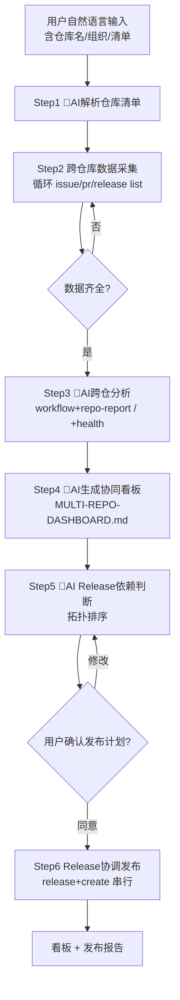

# gitlink-multi-repo-ops（多仓库协同编排）

**CRITICAL — 开始前必须先阅读 [`../gitlink-shared/SKILL.md`](../gitlink-shared/SKILL.md)，认证/权限/API 注意事项。**
**CRITICAL — 所有写入/删除操作（批量 release create、issue batch-close）前，务必先确认用户意图。**
**CRITICAL — GitLink 操作只能用 gitlink-cli。禁止用 gh（GitHub CLI）操作 GitLink 资源。**
**CRITICAL — 编排型 Skill 只做"导演"，不重写子 Skill 内部逻辑。**

---

## 工作流总览

---

## 编排的子 Skill

| 子 Skill | 职责 | 调用时机 |
|---|---|---|
| gitlink-issue | 单仓 Issue 的 list/view/close | Step2 采集、Step6 发布前阻断检查 |
| gitlink-pr | 单仓 PR 的 list/view/merge/check-merge | Step2 采集、Step6 发布前阻断检查 |
| gitlink-release | 单仓 Release 的 list/create/view | Step2 采集、Step6 协调发布 |
| gitlink-insight | 仓库画像、贡献者、活跃度 | Step3 跨仓分析 |
| gitlink-workflow | repo-report / triage / health 汇总 | Step3 单仓报告、Step4 看板合成 |

---

## 详细步骤

### Step 1: 🤖AI 解析仓库清单（AI 判断点）

- 输入：用户自然语言（如"看看 acme 组织下的 frontend、backend、infra 三个库"）。
- 🤖AI 判断点：抽取规范化的 `owner/repo` 列表，去重、补全大小写。若只给组织名，先拉候选再请用户确认。
- 纯命令（仅当需枚举候选时）：
  - `gitlink-cli org +list --owner <org>`
  - `gitlink-cli repo +list --owner <org> --limit 50`
- 🤖AI 判断点：清单为空或歧义时**必须暂停确认**，不得擅自推断。
- 产出：内部 `repo_list` 数组，供后续循环。

### Step 2: 跨仓库数据采集（纯命令，循环执行）

对 `repo_list` 每个 repo 循环执行只读命令，结果按仓库归档：
- `gitlink-cli issue +list --owner <owner> --repo <repo> --state open --limit 50`
- `gitlink-cli pr +list --owner <owner> --repo <repo> --state open --limit 50`
- `gitlink-cli release +list --owner <owner> --repo <repo> --limit 10`
- `gitlink-cli milestone +list --owner <owner> --repo <repo>`
- `gitlink-cli repo +info --owner <owner> --repo <repo>`
- 🤖AI 判断点：某仓库采集失败（404/无权限）记入 errors[]，**不中断流程**，继续下一个，最终看板标注"采集失败"。
- 全部 GET，安全无需确认。

### Step 3: 🤖AI 跨仓统一分析（AI 判断点）

- 纯命令（逐仓库）：
  - `gitlink-cli workflow +repo-report --repository <owner>/<repo>`
  - `gitlink-cli workflow +health --repository <owner>/<repo>`
  - `gitlink-cli workflow +triage --owner <owner> --repo <repo> --state open`（若 issue 堆积）
- 🤖AI 判断点：
  - 对比各仓"未关闭 Issue / 未合并 PR / 距上次 Release 时长"，找瓶颈仓库与风险仓库。
  - 识别跨仓关联 Issue（标题/标签相似）、共享贡献者、依赖同一里程碑的发布计划。
  - 汇总每仓 P0/P1 issue 与阻塞 PR，形成优先级矩阵。

### Step 4: 🤖AI 生成协同看板（AI 判断点）

- 纯命令（可选，补充活跃度）：
  - `gitlink-cli repo +activity --owner <owner> --repo <repo>`
  - `gitlink-cli repo +contributors --owner <owner> --repo <repo> --limit 10`
- 🤖AI 判断点：撰写 `MULTI-REPO-DASHBOARD.md`，结构：
  1. 仓库总览表（仓库 | 开放 Issue | 开放 PR | 最新 Release | 健康分）
  2. 跨仓 Issue 看板（按优先级/标签归并）
  3. 跨仓 PR 看板（可合并 / 阻塞 / 冲突）
  4. Release 协调时间线
  5. 风险提示
- 🤖AI 判断点：若用户提及"导出"：
  - `gitlink-cli export +issues --owner <owner> --repo <repo> --output issues.csv`
  - `gitlink-cli export +prs --owner <owner> --repo <repo> --output prs.csv`

### Step 5: 🤖AI Release 依赖判断（AI 判断点，关键决策）

- 纯命令（核对可合并性与现有 release）：
  - `gitlink-cli pr +check-merge --owner <owner> --repo <repo> --number <pr>` — 发布分支 PR 冲突预检
  - `gitlink-cli release +view --owner <owner> --repo <repo> --id <version_id>`
- 🤖AI 判断点：
  - **依赖拓扑排序**：backend 依赖 infra、frontend 依赖 backend → 发布顺序 `infra → backend → frontend`。
  - **发布门禁**：任一仓库有阻断级未合并 PR 或 P0 issue，先警告，不得自动跳过。
  - 生成"建议发布顺序"草案（每仓 tag、notes 要点、顺序）。
- ⚠️强制确认：暂停并向用户确认发布计划与顺序，未确认严禁进入 Step6。

### Step 6: Release 协调发布（纯命令，需用户确认）

按拓扑顺序逐仓库串行执行（前一个失败则停止，避免半发布）：
- `gitlink-cli release +create --owner <owner> --repo <repo> --tag <vX.Y.Z> --name "<标题>" --body "<notes>" --target <branch>`
- 每仓发布后核对：
  - `gitlink-cli release +view --owner <owner> --repo <repo> --id <version_id>`
- 🤖AI 判断点：中间某仓失败，记录已成功与失败仓，回滚交由用户（不擅自 `release +delete`）。
- 可选（用户明确要求清理"已发布修复"的 issue，再次确认后）：
  - `gitlink-cli issue +batch-close --owner <owner> --repo <repo> --numbers <n,n>`

---

## Agent 触发示例

**用户**："帮我盘点 acme 组织的 frontend、backend、infra 三个仓库的进度，顺便把该发的版本协调发一下。"

**Agent**：
1. Step1（🤖AI）：提取 `repo_list = [acme/frontend, acme/backend, acme/infra]`。
2. Step2（纯命令）：循环三仓跑 `issue +list`、`pr +list`、`release +list`、`milestone +list`、`repo +info`，落盘 `data/`。
3. Step3（🤖AI）：逐仓 `workflow +repo-report`、`workflow +health`；对比得出"backend PR #142 阻塞 frontend，infra 已 4 个月未发版"。
4. Step4（🤖AI）：生成 `MULTI-REPO-DASHBOARD.md`，含总览表、PR 看板、Release 时间线、风险。
5. Step5（🤖AI）：判断依赖顺序 `infra(v2.1.0) → backend(v3.4.0) → frontend(v1.9.0)`；`pr +check-merge` 确认 backend 发布分支无冲突 → 暂停确认。
6. 用户批准后 Step6（纯命令）：按顺序 `release +create` 三仓，每发一个即 `release +view` 核对，汇总发布结果。

---

## 注意事项

- **只读 vs 写**：Step1-4 全只读可自由执行；Step5 决策与 Step6 写操作必须显式确认。
- **幂等性**：采集失败不重试到死循环；发布失败不自动回滚。
- **不替代子 Skill**：单仓深度操作细节仍由 issue/pr/release/insight/workflow 各自负责。
