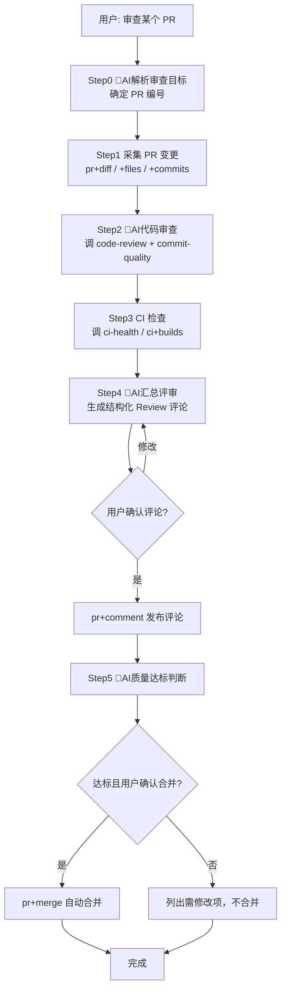

# gitlink-pr-gate（代码质量看门人编排）

**CRITICAL — 开始前必须先阅读 [`../gitlink-shared/SKILL.md`](../gitlink-shared/SKILL.md)，认证/权限/API 注意事项。**
**CRITICAL — 所有写入操作（pr +comment、pr +merge）前，务必先确认用户意图。**
**CRITICAL — 自动合并是高风险写操作，必须把审查结论完整复述给用户，确认后才合并。**
**CRITICAL — GitLink 操作只能用 gitlink-cli。禁止用 gh（GitHub CLI）操作 GitLink 资源。**

---

## 工作流总览



---

## 编排的子 Skill

| 子 Skill | 职责 | 调用时机 |
|---|---|---|
| gitlink-code-review | AI 语义代码审查（逻辑/安全/性能/可读性） | Step2 核心 |
| gitlink-commit-quality | 提交规范检查（Conventional Commits、PR 描述） | Step2 规范 |
| gitlink-ci-health | CI 构建状态与成功率 | Step3 CI |
| gitlink-pr | PR 的 diff/files/commits/comment/merge/check-merge | Step1、Step4、Step5 |

---

## 详细步骤

### Step 0: 🤖AI 解析审查目标（AI 判断点）

- 🤖AI 判断点：确认审查对象：
  - 用户给了 PR 编号/URL → 直接用
  - 用户说"最近的 PR"/"待审 PR" → `gitlink-cli pr +list --owner <owner> --repo <repo> --state open` 找出候选，列给用户确认
- 纯命令：
  - `gitlink-cli pr +view --owner <owner> --repo <repo> --number <pr_number>` — 确认 PR 存在、拿基本信息（标题、分支、作者）

### Step 1: 采集 PR 变更（纯命令）

- 纯命令（拉取审查素材）：
  - `gitlink-cli pr +diff --owner <owner> --repo <repo> --number <pr_number>` — 完整 diff
  - `gitlink-cli pr +files --owner <owner> --repo <repo> --number <pr_number>` — 变更文件清单
  - `gitlink-cli pr +commits --owner <owner> --repo <repo> --number <pr_number>` — 提交历史
- 本步全部只读，无需确认。

### Step 2: 🤖AI 代码审查（AI 判断点 + 子 Skill）

- 调 `gitlink-code-review`：对 diff 做语义分析，找潜在问题——
  - 逻辑错误、边界条件、空指针、资源泄漏
  - 安全隐患（注入、鉴权、敏感信息）
  - 性能问题、可读性、命名
- 调 `gitlink-commit-quality`：检查提交规范——
  - Conventional Commits（feat/fix/docs/...）
  - PR 描述完整性、分支命名
- 🤖AI 判断点：把审查结果分级：
  - 🔴 阻断问题（必须改才能合并）
  - 🟡 建议改进（可改可不改）
  - 🟢 优点（值得肯定的写法）
- 纯命令（可选，辅助判断可合并性）：
  - `gitlink-cli pr +check-merge --owner <owner> --repo <repo> --number <pr_number>` — 冲突预检

### Step 3: CI 检查（纯命令 + 子 Skill）

- 调 `gitlink-ci-health`：拉取该 PR 相关构建状态。
- 纯命令：
  - `gitlink-cli ci +builds --owner <owner> --repo <repo> --limit 10` — 最近构建列表
  - `gitlink-cli ci +logs --owner <owner> --repo <repo> --number <build_id>` — 失败时查日志
- 🤖AI 判断点：
  - CI 全绿 → 客观质量达标
  - CI 失败 → 标记阻断，合并前必须修复
  - 无 CI 记录 → 提示用户该 PR 未跑 CI，合并风险自担

### Step 4: 🤖AI 汇总评审 → 评论（AI 判断点 + 写命令）

- 🤖AI 判断点：综合 Step2 审查 + Step3 CI，生成结构化 Review 评论，结构：
  ```
  ## 🤖 自动审查结论
  **CI 状态**: ✅全绿 / ❌失败 / ⚠️未跑
  **可合并**: 是 / 否（原因）

  🔴 阻断问题:
  - <文件:行> <问题描述>
  🟡 建议改进:
  - <建议>
  🟢 亮点:
  - <肯定>
  ```
- ⚠️写入命令（评论全文先复述给用户确认）：
  - `gitlink-cli pr +comment --owner <owner> --repo <repo> --number <pr_number> --body "<评审全文>"`

### Step 5: 🤖AI 质量达标判断 → 合并（AI 判断点 + 写命令）

- 🤖AI 判断点：综合判断是否达标——
  - **达标条件**：无 🔴 阻断问题 + CI 全绿 + 无合并冲突
  - **不达标**：有任一阻断项 → 列出需修改项，**不合并**，等作者修
- ⚠️写入命令（达标且用户明确确认后）：
  - `gitlink-cli pr +merge --owner <owner> --repo <repo> --number <pr_number>`
- 🤖AI 判断点：合并后可选——关闭相关 Issue、更新里程碑（需用户二次确认）。

---

## Agent 触发示例

**用户**："帮我审查 jiangtx/gitlink-cli 的 PR #25，没问题就合并。"

**Agent**：
1. Step0（🤖AI）：确认 PR #25 → `pr +view` 拿基本信息。
2. Step1（纯命令）：`pr +diff`、`pr +files`、`pr +commits` 拉取变更（改了 5 个文件，+120/-30）。
3. Step2（🤖AI）：调 code-review 发现 1 个 🟡 建议（函数过长）+ commit-quality 发现提交信息符合规范；`pr +check-merge` 无冲突。
4. Step3（纯命令）：调 ci-health + `ci +builds`，CI 全绿。
5. Step4（🤖AI）：生成结构化评论 → 复述给用户 → 确认 → `pr +comment` 发布。
6. Step5（🤖AI）：无 🔴 阻断 + CI 全绿 → 判定达标 → 用户确认合并 → `pr +merge`。
7. 输出：审查结论已评论、PR 已合并。

---

## 注意事项

- **只读 vs 写**：Step0-3 全只读；Step4 comment、Step5 merge 为写入，须确认。
- **AI 审查 ≠ 替代人工**：本 Skill 的 AI 审查是辅助，最终合并决策须用户拍板。
- **不替代子 Skill**：代码审查深度仍由 code-review/commit-quality/ci-health 各自负责，本 Skill 只编排顺序与做汇总判断。
- **纯命令串联**：pr +view / +diff / +files / +commits / +comment / +merge / +check-merge + ci +builds = 8+ 命令，满足"≥3 个命令串联"。
