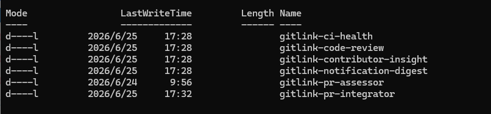
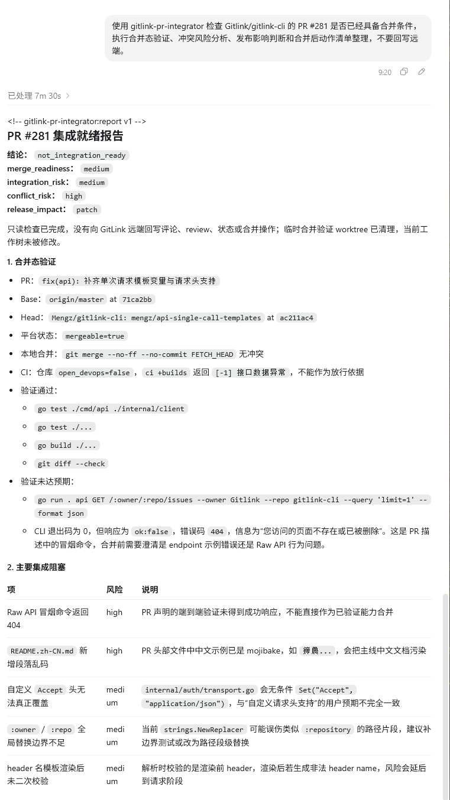
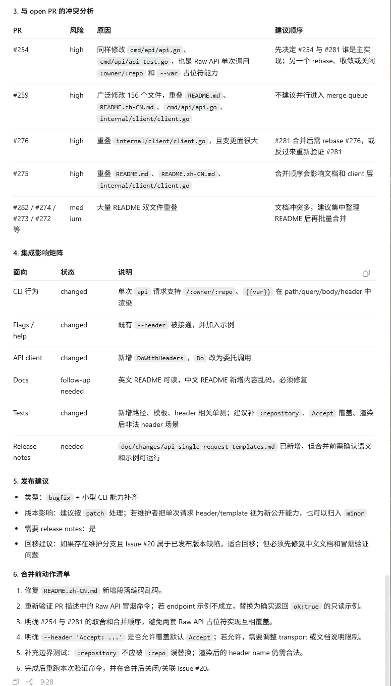

# Codex 验证记录（2026-06-25）

本记录用于提交 `gitlink-pr-integrator` 的 Agent 平台验证材料，包含技能目录截图、实际使用截图和完整输出转录。

## 验证平台

- 平台：Codex
- 仓库：`Gitlink/gitlink-cli`
- 目标 PR：`#281`
- 执行范围：校验合并态、集成风险、与其他 open PR 的冲突关系、发布影响和合并前动作
- 执行约束：只读分析，不回写 review、评论、状态或合并操作

## 触发提示词

```text
使用 gitlink-pr-integrator 检查 Gitlink/gitlink-cli 的 PR #281 是否已经具备合并条件，执行合并态验证、冲突风险分析、发布影响判断和合并后动作清单整理，不要回写远端。
```

## 技能目录截图



## 输出结果全文

```markdown
<!-- gitlink-pr-integrator:report v1 -->
## PR #281 集成就绪报告

结论：`not_integration_ready`
merge_readiness：`medium`
integration_risk：`medium`
conflict_risk：`high`
release_impact：`patch`

只读检查已完成，没有向 GitLink 远端回写评论、review、状态或合并操作；临时合并验证 worktree 已清理，当前工作树未被修改。

### 1. 合并态验证

- PR：`fix(api): 补齐单次请求模板变量与请求头支持`
- Base：`origin/master` at `71ca2bb`
- Head：`Mengz/gitlink-cli: mengz/api-single-call-templates` at `ac211ac4`
- 平台状态：`mergeable=true`
- 本地合并：`git merge --no-ff --no-commit FETCH_HEAD` 无冲突
- CI：仓库 `open_devops=false`，`ci +builds` 返回 `[-1]` 接口数据异常，不能作为放行依据
- 验证通过过：
  - `go test ./cmd/api ./internal/client`
  - `go test ./...`
  - `go build ./...`
  - `git diff --check`
- 验证未达预期：
  - `go run . api GET /:owner/:repo/issues --owner Gitlink --repo gitlink-cli --query 'limit=1' --format json`
  - CLI 退出码为 0，但响应为 `ok:false`，错误码 `404`，信息为“您访问的页面不存在或已被删除”。这是 PR 描述中的冒烟命令，合并前需要澄清 endpoint 示例错误还是 Raw API 行为问题。

### 2. 主要集成阻塞

| 项 | 风险 | 说明 |
|----|------|------|
| Raw API 冒烟命令返回 404 | high | PR 声明的端到端验证未得到成功响应，不能直接作为已验证能力合并 |
| `README.zh-CN.md` 新增段落乱码 | high | PR 头部文件中中文示例是 mojibake，会把主线中文文档污染 |
| 自定义 `Accept` 头无法真正覆盖 | medium | `internal/auth/transport.go` 会条件 `Set("Accept", "application/json")`，与“自定义请求头支持”的用户预期不完全一致 |
| `:owner` / `:repo` 全局替换边界不足 | medium | 当前 `strings.NewReplacer` 可能误伤类似 `:repository` 的路径片段，建议补边界测试或改为路径级替换 |
| header 名模板渲染后未二次校验 | medium | 解析时校验的是渲染前 header，渲染后若生成非法 header name，风险会延后到请求阶段 |

### 3. 与 open PR 的冲突分析

| PR | 风险 | 原因 | 建议顺序 |
|----|------|------|----------|
| #254 | high | 同样修改 `cmd/api/api.go`、`cmd/api/api_test.go`，也是 Raw API 单次调用 `:owner/:repo` 和 `--var` 占位符能力 | 先决定 #254 与 #281 谁是主实现；另一个 rebase、收敛或关闭 |
| #259 | high | 广泛修改 156 个文件，重叠 `README.md`、`README.zh-CN.md`、`cmd/api/api.go`、`internal/client/client.go` | 不建议并行进入 merge queue |
| #276 | high | 重叠 `internal/client/client.go`，且变更面很大 | #281 合并后需 rebase #276，或反过来重新验证 #281 |
| #275 | high | 重叠 `README.md`、`README.zh-CN.md`、`internal/client/client.go` | 合并顺序会影响文档和 client 层 |
| #282 / #274 / #273 / #272 等 | medium | 大量 README 双文件重叠 | 文档冲突多，建议集中整理 README 后再批量合并 |

### 4. 集成影响矩阵

| 面向 | 状态 | 说明 |
|------|------|------|
| CLI 行为 | changed | 单次 `api` 请求支持 `/:owner/:repo`、`{{var}}` 在 `path/query/body/header` 中渲染 |
| Flags / help | changed | 既有 `--header` 被打通，并加入示例 |
| API client | changed | 新增 `DoWithHeaders`，`Do` 改为委托调用 |
| Docs | follow-up needed | 英文 README 可读，中文 README 新增内容乱码，必须修复 |
| Tests | changed | 新增路径、模板、header 相关单测；建议补 `:repository`、`Accept` 覆盖、渲染后非法 header 场景 |
| Release notes | needed | `doc/changes/api-single-request-templates.md` 已新增，但合并前需确认语义和示例可运行 |

### 5. 发布建议

- 类型：`bugfix + 小型 CLI 能力补齐`
- 版本影响：建议按 `patch` 处理；若维护者把单次请求 `header/template` 视为新公开能力，也可以归入 `minor`
- 需要 release notes：是
- 回移建议：如果存在维护分支且 Issue #20 属于已发布版本缺陷，适合回移；但必须先修复中文文档和冒烟验证问题

### 6. 合并前动作清单

1. 修复 `README.zh-CN.md` 新增段落编码乱码。
2. 重新验证 PR 描述中的 Raw API 冒烟命令；若 endpoint 示例不成立，替换为确实返回 `ok:true` 的只读示例。
3. 明确 #254 与 #281 的取舍和合并顺序，避免两套 Raw API 占位符实现互相覆盖。
4. 明确 `--header 'Accept: ...'` 是否允许覆盖默认 `Accept`；若允许，需要调整 transport 或文档说明限制。
5. 补充边界测试：`:repository` 不应被 `:repo` 误替换；渲染后的 header name 仍需合法。
6. 完成后重跑本次验证命令，并在合并后关闭或关联 Issue #20。
```

## 输出截图





## 结构校验

```powershell
python -X utf8 "C:\Users\Z Y\.codex\skills\.system\skill-creator\scripts\quick_validate.py" "D:\temp\gitlink-cli-skills-submit\skills\gitlink-pr-integrator"
Skill is valid!
```
