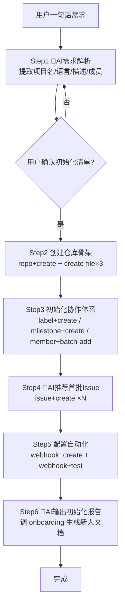

# gitlink-project-bootstrap（项目一键初始化编排）

**CRITICAL — 开始前必须先阅读 [`../gitlink-shared/SKILL.md`](../gitlink-shared/SKILL.md)，认证/权限/API 注意事项。**
**CRITICAL — 本 Skill 几乎全是写入操作（建仓库/建文件/加成员），每一步执行前务必先确认用户意图。**
**CRITICAL — GitLink 操作只能用 gitlink-cli。禁止用 gh（GitHub CLI）操作 GitLink 资源。**
**CRITICAL — 失败后不自动 `repo +delete` 回滚，必须用户授权才清理。**

---

## 工作流总览

---

## 编排的子 Skill

| 子 Skill | 职责 | 调用时机 |
|---|---|---|
| gitlink-repo | 创建仓库、写入 README/LICENSE/CI 文件 | Step2 |
| gitlink-label | 初始化标签体系（bug/feature/doc...） | Step3 |
| gitlink-milestone | 创建首个里程碑（Sprint 1 / MVP） | Step3 |
| gitlink-member | 批量添加初始成员 | Step3 |
| gitlink-issue | 创建首批 Issue | Step4 |
| gitlink-webhook | 配置 CI/webhook 回调 | Step5 |
| gitlink-onboarding | 生成新人引导文档 | Step6 |

---

## 详细步骤

### Step 1: 🤖AI 需求解析（AI 判断点）

- 🤖AI 判断点：从用户一句话提取并生成「初始化清单」：
  - 项目名（name）
  - 描述（description）
  - 语言/技术栈（决定 README/CI 模板）
  - 可见性（private 默认）
  - 成员列表（user_id 或 login）
  - 缺省字段需明确标注「(推断)」，不得静默补全。
- 纯命令（核验身份/补全成员 ID）：
  - `gitlink-cli user +me` — 当前操作者
  - `gitlink-cli search +users -k <姓名>` — 反查用户 ID
- ⚠️强制确认：把完整清单出示给用户，确认或修改后才进入 Step2。

### Step 2: 创建仓库骨架（纯命令 + 🤖AI 生成内容）

- 纯命令（建仓库）：
  - `gitlink-cli repo +create --name <name> --description "<desc>" --private <true|false>`
- 🤖AI 判断点：根据语言生成 README.md / LICENSE / CI 配置内容（如 Python→pytest 模板、Go→go build 模板）。
- ⚠️写入命令（逐个创建文件，每个都需确认）：
  - `gitlink-cli repo +create-file --owner <owner> --repo <name> --filepath README.md --content "<内容>" --message "docs: add README"`
  - `gitlink-cli repo +create-file --owner <owner> --repo <name> --filepath LICENSE --content "<MIT...>" --message "docs: add LICENSE"`
  - `gitlink-cli repo +create-file --owner <owner> --repo <name> --filepath .gitlink-ci.yml --content "<CI配置>" --message "ci: add pipeline config"`

### Step 3: 初始化协作体系（纯命令）

- 标签体系（🤖AI 推荐配色）：
  - `gitlink-cli label +create --owner <owner> --repo <name> --name bug --color "#d73a4a"`
  - `gitlink-cli label +create --owner <owner> --repo <name> --name feature --color "#a2eeef"`
  - `gitlink-cli label +create --owner <owner> --repo <name> --name documentation --color "#0075ca"`
- 里程碑：
  - `gitlink-cli milestone +create --owner <owner> --repo <name> --name "Sprint 1"`
- 成员（批量）：
  - `gitlink-cli member +batch-add --owner <owner> --repo <name> --user-ids <id1,id2,id3> --dry-run` — 先预览
  - 确认后去掉 `--dry-run` 正式添加

### Step 4: 🤖AI 推荐首批 Issue（AI 判断点 + 写入命令）

- 🤖AI 判断点：根据项目类型推荐 3-5 个初始 Issue（如"搭建项目结构""配置 CI""编写使用文档""冒烟测试"）。
- ⚠️写入命令（确认后逐条创建）：
  - `gitlink-cli issue +create --owner <owner> --repo <name> --title "搭建项目结构" --body "<描述>" --label <label>`

### Step 5: 配置自动化（纯命令）

- ⚠️写入命令：
  - `gitlink-cli webhook +create --owner <owner> --repo <name> --url <回调URL> --events push,merge_request`
  - `gitlink-cli webhook +test --owner <owner> --repo <name> --id <webhook_id>` — 测试连通性

### Step 6: 🤖AI 输出初始化报告（AI 判断点）

- 调子 Skill：`gitlink-onboarding` — 生成新人上手文档段落。
- 🤖AI 判断点：汇总输出初始化报告：
  - 仓库地址、可见性
  - 已创建文件清单（README/LICENSE/CI）
  - 标签数、里程碑、成员数
  - 首批 Issue 列表
  - Webhook 配置与测试结果
- 可选建议：`gitlink-cli repo +info --owner <owner> --repo <name>` 复核仓库状态。

---

## 错误处理与回滚

- **逐步熔断**：关键命令（repo +create、repo +create-file、milestone +create）失败，立即停止后续步骤。
- **不自动删除**：本 Skill **不**自动 `repo +delete`，失败后由用户决定是否回滚。
- **部分失败汇总**：成员添加、Issue 创建、Webhook 测试的个别失败不阻塞，统一在 Step6 报告列出。

---

## Agent 触发示例

**用户**："帮我初始化一个 Python 的数据分析项目 data-analysis-demo，成员有小王和小李，先私有。"

**Agent**：
1. Step1（🤖AI）：解析 → 项目名 `data-analysis-demo`，语言 Python，成员含小王小李，私有 → 出示清单等待确认。
2. 用户确认后：
   - `repo +create --name data-analysis-demo --description "..." --private true`
   - 🤖 生成 README.md / LICENSE(MIT) / .gitlink-ci.yml(python pytest) → 三个 `repo +create-file`。
3. `label +create`（bug/feature/docs 三色）；`milestone +create --name "MVP"`；`member +batch-add --user-ids <小王,小李> --dry-run` → 确认 → 正式添加。
4. 🤖 推荐 5 条 Issue（环境脚手架/数据加载器/CI 联调/文档/冒烟测试）→ 确认 → 逐条 `issue +create`。
5. 询问 Webhook URL → `webhook +create` + `webhook +test`。
6. 调 onboarding 生成新人文档，输出初始化报告。

---

## 反模式（禁止行为）

- ❌ 未确认初始化清单就执行写入命令。
- ❌ 编造本文件未列出的命令（如 `repo +bootstrap`、`issue +bulk-create`）。
- ❌ 用 `gh`、`curl` 绕过 gitlink-cli。
- ❌ 静默补全缺失字段而不告知用户。
- ❌ 失败后自动 `repo +delete` 清理（必须用户授权）。
