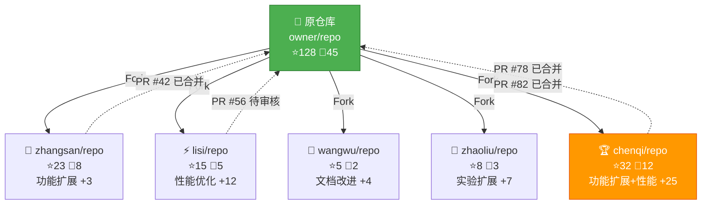

# gitlink-research-fork-impact（科研 Fork 影响力分析）

**CRITICAL — 开始前必须先阅读 [`../gitlink-shared/SKILL.md`](../gitlink-shared/SKILL.md)。**
**CRITICAL — GitLink 操作只能用 `gitlink-cli`。**

> **前置条件：** 先阅读 [`../gitlink-shared/SKILL.md`](../gitlink-shared/SKILL.md) 了解认证和全局参数。


## 功能概述

本技能分析一个科研仓库被 Fork 后的传播与影响，核心回答：**这个科研想法被 Fork 后如何传播和改进？哪个 Fork 最有价值？**

分析维度：

1. **Fork 仓库发现** — 获取目标仓库的所有 Fork 列表
2. **独立 Commit 分析** — 识别各 Fork 中原仓库没有的独立提交
3. **改进方向分类** — AI 将 Fork 的改进方向进行分类
4. **Fork 影响力评估** — 评估各 Fork 的 Star/Fork/活跃度
5. **科研想法传播图谱** — 生成传播路径 Mermaid 图

---

## 一、Fork 仓库发现

### 1.1 获取目标仓库基本信息

```bash
# 获取仓库详情（含 Fork 数）
gitlink-cli repo +info --owner <owner> --repo <repo> --format json
```

### 1.2 获取 Fork 列表

```bash
# 搜索同名仓库（Fork 通常保持相同名称）
gitlink-cli search +repos -k "<repo_name>" --format json
```

### 1.3 Fork 仓库识别规则

AI 从搜索结果中识别真正的 Fork 仓库：

```
✅ Fork 识别条件（满足任一）：
  - 仓库名与原仓库相同，但 owner 不同
  - 仓库描述中提及"基于 xxx 修改"或"fork from xxx"
  - 仓库创建时间晚于原仓库
  - 仓库有与原仓库相同的初始 commit

❌ 排除条件：
  - 原仓库自身
  - 仅 Fork 但无任何独立提交的仓库（"空 Fork"）
  - 名称相似但完全独立的项目
```

### 1.4 对每个 Fork 获取详细信息

```bash
# 获取每个 Fork 的仓库信息
gitlink-cli repo +info --owner <fork_owner> --repo <fork_repo> --format json
```

---

## 二、独立 Commit 分析

> **核心思路**：通过对比原仓库与 Fork 仓库的 commit SHA 列表，找到分叉点（共同祖先），再利用 Compare API 精确获取 Fork 后的独有提交。不能直接用原仓库最新 commit 作为基准，因为 Fork 后原仓库可能新增了 commit，这些 commit 在 Fork 仓库中不存在，会导致 Compare 报错或返回空结果。

### 2.1 构建原仓库 commit SHA 集合

```bash
# 获取原仓库默认分支（如 master）的 commit SHA 列表，分页拉取构建 SHA 集合
gitlink-cli api GET /{owner}/{repo}/commits --query "sha=master&page=1&limit=100" --format json

# 如果 commit 数量 > 100，继续翻页，最多计入500条
gitlink-cli api GET /{owner}/{repo}/commits --query "sha=master&page=2&limit=100" --format json
```

将所有返回的 `commits[].sha` 收集到一个集合 `original_shas` 中，作为后续分叉点查找的基准。

### 2.2 查找分叉点并获取独立 commit

**原理**：Fork 仓库从新到旧遍历 commit 列表，第一个同时存在于原仓库 SHA 集合中的 commit 就是分叉点。分叉点之后的所有 commit 即为 Fork 的独立贡献。

```bash
# Step A：获取 Fork 仓库默认分支的 commit 列表（从新到旧）
gitlink-cli api GET /{fork_owner}/{repo}/commits --query "sha=master&page=1&limit=100" --format json

# 遍历返回的 commits，从新到旧逐个检查：
#   - 如果 commit.sha 在 original_shas 集合中 → 这就是分叉点，记录为 divergence_sha
#   - 如果 commit.sha 不在 original_shas 中 → 这是 Fork 独有的 commit，暂存到列表
#   一旦找到 divergence_sha 就停止遍历

# 如果第一页没找到分叉点（说明 Fork 有大量独立 commit），继续翻页，如果5页内仍未发现交叉点，则默认取第五页最后一个提交作为交叉点
gitlink-cli api GET /{fork_owner}/{repo}/commits --query "sha=master&page=2&limit=100" --format json
```

**找到分叉点后，使用 Compare API 获取完整差异**：

```bash
# Step B：用 Compare API 获取分叉点到 Fork 最新 commit 之间的所有独有 commit（含 diff 详情）
gitlink-cli api GET /{fork_owner}/{repo}/compare --query "from={divergence_sha}&to=master" --format json

# 返回结果中的 commits 列表即为 Fork 的独立贡献
# 返回结果还包含 diff 信息（文件变更统计），可用于改进方向分析
```

### 2.2.1 多分支检测

Fork 仓库可能新建了原仓库不存在的分支，这些分支上的 commit 全部是独立贡献。

```bash
# Step C：获取 Fork 仓库的分支列表
gitlink-cli api GET /{fork_owner}/{repo}/branches --format json

# 对每个非默认分支（且非原仓库已有的分支）：
gitlink-cli api GET /{fork_owner}/{repo}/commits --query "sha={branch_name}&page=1&limit=100" --format json

# 判断分支是否为原仓库已有：
#   - 如果该分支名在原仓库分支列表中也能找到 → 按 2.2 流程查找分叉点后 compare
#   - 如果该分支名仅存在于 Fork 仓库 → 按 2.2 流程查找分叉点后 compare
```

### 2.2.2 分叉点查找流程图

```
原仓库 commits:  A → B → C → D → E     (E 是最新)
                        ↑
                  fork 发生在这里（分叉点 C）

Fork 仓库 commits:  A → B → C → F → G  (G 是最新)

查找过程：
  1. original_shas = {A, B, C, D, E}
  2. 遍历 Fork commits: G(不在)→ F(不在)→ C(在!✓) → divergence_sha = C
  3. Compare: from=C & to=master → 返回 [F, G] = Fork 独有提交
```

### 2.2.3 边界情况处理

| 场景 | 处理方式 |
|---|---|
| Fork 后从未提交（完全同步） | SHA 列表完全一致，分叉点就是最新 commit，compare 返回 0 条，标记为"空 Fork" |
| Fork 后同步过上游 | Fork 仓库包含原仓库新 commit，但分叉点仍可通过 SHA 交集找到 |
| Fork 仓库 commit 量远大于原仓库 | 可能需要多翻几页原仓库 commit 来确保 SHA 集合足够大，以命中交集 |
| 原仓库默认分支与 Fork 不同名 | 需要分别查询两边实际的默认分支名（通过 repo +info 获取） |
| compare API 返回的 commit 数量过多 | compare 结果自带 `commits_count`，可评估是否需要分页（通常一次返回完整列表） |

### 2.3 独立 Commit 分类规则

AI 分析每个独立 commit 的消息，判断其改进类型：

```
改进方向分类体系：

1. 🚀 功能扩展（Feature Extension）
   - 关键词：feat/add/support/new/新增/支持/扩展
   - 示例：feat: add multi-scale training support

2. ⚡ 性能优化（Performance Optimization）
   - 关键词：perf/optimize/speed/faster/优化/加速
   - 示例：perf: optimize inference speed by 30%

3. 🐛 问题修复（Bug Fix）
   - 关键词：fix/bug/issue/patch/修复
   - 示例：fix: correct gradient computation in loss function

4. 📝 文档改进（Documentation）
   - 关键词：docs/readme/tutorial/文档/说明
   - 示例：docs: add English README and installation guide

5. 🔬 实验扩展（Experiment Extension）
   - 关键词：experiment/benchmark/dataset/eval/实验/评估/数据集
   - 示例：feat: add evaluation script for COCO dataset

6. 🔧 适配修改（Adaptation）
   - 关键词：adapt/port/migrate/compat/适配/移植/兼容
   - 示例：fix: adapt to PyTorch 2.0 API changes

7. 🏗️ 架构重构（Refactoring）
   - 关键词：refactor/restructure/rewrite/reorganize/重构
   - 示例：refactor: reorganize model architecture for extensibility
```

---

## 三、Fork 影响力评估

### 3.1 影响力评分维度

```
评分公式：
  Fork 影响力得分 = Star × 0.3 + Fork × 0.3 + 独立Commit × 0.2 + 回流PR × 0.2

各维度说明：
  - Star：该 Fork 获得的关注数（反映社区认可度）
  - Fork：该 Fork 被再次 Fork 的次数（反映传播广度）
  - 独立Commit：该 Fork 相对原仓库的独立提交数（反映改进深度）
  - 回流PR：该 Fork 向原仓库提交的 PR 数及合并状态（反映对原项目的贡献）
```

### 3.2 获取 Fork 的 PR 回流情况

```bash
# 查看原仓库中已合并的提交
gitlink-cli pr +list --owner <original_owner> --repo <repo> --state merged format json

# 查询原仓库中已开放的提交
gitlink-cli pr +list --owner <original_owner> --repo <repo> --state open format json
# 根据不同的作者进行匹配
```

### 3.3 影响力等级划分

| 等级 | 条件 | 含义 |
|------|------|------|
| 🏆 核心贡献 | 回流 PR ≥ 2 且已合并 | Fork 的改进已被原仓库采纳 |
| ⭐ 高影响 | Star > 10 或 独立 Commit > 20 | 有实质性改进且被社区认可 |
| 📊 中等影响 | 独立 Commit 5-20 | 有一定改进但影响有限 |
| 📝 低影响 | 独立 Commit 1-4 | 仅有少量调整 |
| 💤 空 Fork | 无独立 Commit | 仅 Fork 未做任何改进 |

---

## 四、科研想法传播图谱

### 4.1 图谱节点定义

```
节点类型及样式：

  [原仓库] ─── 方框，加粗边框
  [Fork仓库] ── 圆角框
  [PR回流] ─── 菱形

节点信息：
  - 名称：owner/repo
  - 标签：改进方向（功能扩展/性能优化/实验扩展/...）
  - 数据：Star × Fork × 独立Commit数
```

### 4.2 图谱边定义

```
边类型：
  → Fork 关系：原仓库 → Fork 仓库（实线）
  → PR 回流：Fork 仓库 → 原仓库（虚线，标注 PR 数量）
  → 二次 Fork：Fork → Fork（点线）
```

### 4.3 Mermaid 图谱模板



### 4.4 ASCII 文本图谱（报告嵌入用）

```
科研想法传播图谱：

                    ┌──────────────────────────────┐
                    │ 🔬 原仓库: owner/repo          │
                    │ ⭐128  🍴45                    │
                    └──────┬───────────────────────┘
                           │
           ┌───────────────┼───────────────────────┐
           │               │                       │
           ▼               ▼                       ▼
  ┌────────────────┐ ┌────────────────┐ ┌────────────────┐
  │ 🚀 zhangsan     │ │ ⚡ lisi         │ │ 🏆 chenqi      │
  │ ⭐23  🍴8      │ │ ⭐15  🍴5      │ │ ⭐32  🍴12     │
  │ 功能扩展 +3     │ │ 性能优化 +12   │ │ 功能+性能 +25  │
  │                 │ │                │ │                │
  │ ← PR #42 合并   │ │ ← PR #56 审核  │ │ ← PR #78,82   │
  └────────────────┘ └────────────────┘ └────────────────┘
```

---

## 五、完整 Fork 影响力分析报告模板

```markdown
## 🌳 科研 Fork 影响力分析报告

**原仓库：** <owner>/<repo>
**分析时间：** 2026-06-08
**Fork 总数：** 12 个（含空 Fork 7 个，有效 Fork 5 个）

---

### 一、Fork 总览

| Fork | Star | Fork | 独立 Commit | 改进方向 | 影响力等级 |
|------|------|------|-------------|----------|------------|
| chenqi/repo | 32 | 12 | 25 | 功能扩展+性能优化 | 🏆 核心贡献 |
| zhangsan/repo | 23 | 8 | 3 | 功能扩展 | ⭐ 高影响 |
| lisi/repo | 15 | 5 | 12 | 性能优化 | ⭐ 高影响 |
| zhaoliu/repo | 8 | 3 | 7 | 实验扩展 | 📊 中等影响 |
| wangwu/repo | 5 | 2 | 4 | 文档改进 | 📝 低影响 |

---

### 二、高影响力 Fork 详情

#### 🏆 chenqi/repo（核心贡献）

**基本信息：**
| 指标 | 数值 |
|------|------|
| Star | 32 |
| Fork | 12 |
| 独立 Commit | 25 |
| 回流 PR | 2 个（均已合并） |
| 最近更新 | 2026-05-28 |

**改进方向分布：**
| 方向 | Commit 数 | 关键改进 |
|------|-----------|----------|
| 功能扩展 | 12 | 新增多尺度训练、分布式推理 |
| 性能优化 | 8 | 推理速度提升 30%、内存占用降低 40% |
| 架构重构 | 3 | 模型接口抽象化 |
| 问题修复 | 2 | 修复梯度计算和并发问题 |

**回流贡献：**
- PR #78：添加分布式训练支持 ✅ 已合并
- PR #82：优化推理内存占用 ✅ 已合并

**影响评价：** 该 Fork 对原仓库有实质性贡献，2 个回流 PR 已被合并，是最具影响力的分支。

---

#### ⭐ zhangsan/repo（高影响）

**基本信息：**
| 指标 | 数值 |
|------|------|
| Star | 23 |
| Fork | 8 |
| 独立 Commit | 3 |
| 回流 PR | 1 个（已合并） |
| 最近更新 | 2026-04-15 |

**改进方向：** 功能扩展
- 新增对 COCO 数据集的评估脚本
- 新增模型导出为 ONNX 格式
- 新增中文 README

**回流贡献：**
- PR #42：添加 COCO 评估脚本 ✅ 已合并

---

### 三、改进方向统计

```
改进方向分布（仅统计有效 Fork）：

功能扩展     ████████████████  15 commits (38%)
性能优化     ████████████      10 commits (24%)
实验扩展     ██████            7 commits (17%)
架构重构     ████              3 commits (7%)
文档改进     ████              4 commits (10%)
问题修复     ██                2 commits (5%)
```

---

### 四、科研想法传播图谱

```
                    ┌──────────────────────────────┐
                    │ 🔬 原仓库: owner/repo          │
                    │ ⭐128  🍴45                    │
                    └──────┬───────────────────────┘
                           │
           ┌───────────────┼───────────────────────┐
           │               │                       │
           ▼               ▼                       ▼
  ┌────────────────┐ ┌────────────────┐ ┌────────────────┐
  │ 🚀 zhangsan     │ │ ⚡ lisi         │ │ 🏆 chenqi      │
  │ ⭐23  🍴8      │ │ ⭐15  🍴5      │ │ ⭐32  🍴12     │
  │ 功能扩展 +3     │ │ 性能优化 +12   │ │ 功能+性能 +25  │
  └────────────────┘ └────────────────┘ └────────────────┘
         │                    │                    │
    ← PR #42 合并      ← PR #56 审核中      ← PR #78,82 合并
```

---

### 五、传播特征分析

1. **主要传播方向：** 功能扩展（38%的独立 commit 属于此方向），说明原仓库在功能完整性方面有较大改进空间
2. **核心贡献者：** chenqi 贡献最突出，25 个独立 commit + 2 个回流 PR，建议原仓库维护者主动邀请其成为协作者
3. **传播深度：** 12 个 Fork 中 5 个有独立开发（42%有效率），7 个为空 Fork，传播有效率中等
4. **回流比例：** 5 个有效 Fork 中 3 个有回流 PR（60%），说明社区贡献意愿较强

---

## 六、执行步骤总览

```bash
# Step 1：获取原仓库基本信息和 Fork 数
gitlink-cli repo +info --owner <owner> --repo <repo> --format json

# Step 2：搜索 Fork 仓库
gitlink-cli search +repos -k "<repo_name>" --format json

# Step 3：对每个 Fork 获取详细信息
gitlink-cli repo +info --owner <fork_owner> --repo <fork_repo> --format json

# Step 4：获取基准 commit 列表
gitlink-cli api GET /owner/repo/commits --query "sha=master&page=1&limit=20" --format json

# Step 5：对每个有效 Fork分析独立 commit
gitlink-cli api GET /owner/repo/commits --query "sha=master&page=1&limit=20" --format json

# Step 6：获取原仓库的 PR 列表，识别回流 PR
gitlink-cli pr +list --state merged --owner <original_owner> --repo <repo> --format json
gitlink-cli pr +list --state open --owner <original_owner> --repo <repo> --format json

# Step 7：AI 综合分析，生成 Fork 影响力分析报告
# - 各 Fork 影响力评分
# - 改进方向分类
# - 科研想法传播图谱
```

---

## 注意事项

- ✅ **空 Fork 处理**：大量 Fork 可能仅有 Fork 动作而无实际开发，需先过滤空 Fork
- ⚠️ **Fork 数量可能很大**：热门仓库可能有 50+ Fork，建议按 Star 数排序后重点分析 Top 10
- ✅ **搜索 Fork 的替代方式**：如果 `search +repos` 返回不完整，可通过 `repo +info` 中的 `fork_info` 字段补充
- ⚠️ **报告生成**：以markdown形式产出报告
- ✅ **二次 Fork 追踪**：Fork 的 Fork 也值得关注，但分析深度可适当降低
- ⚠️ **隐私考虑**：Fork 分析涉及其他用户的活动数据，报告中应尊重用户隐私，仅公开可见数据
- ⚠️ **图谱生成**：作图时要注意图像边距，不要造成遮盖信息，不要图像错位。