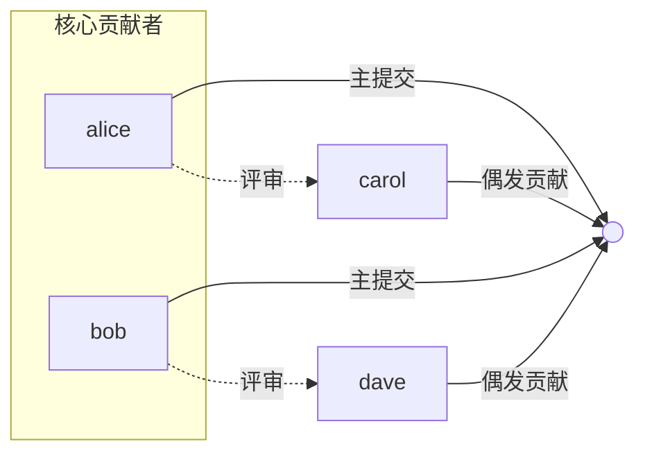

# gitlink-research-insight（科研仓库画像）

**CRITICAL — 开始前必须先阅读 [`../gitlink-shared/SKILL.md`](../gitlink-shared/SKILL.md)，其中包含认证、权限处理和 API 注意事项。**
**CRITICAL — 本 Skill 为只读分析，不修改任何仓库数据。**
**CRITICAL — GitLink 操作只能用 `gitlink-cli`。禁止用 `gh`。**

> **前置条件：** 先读 [`../gitlink-shared/SKILL.md`](../gitlink-shared/SKILL.md)、[`../gitlink-health/SKILL.md`](../gitlink-health/SKILL.md)（工程健康度指标，本 Skill 在其基础上加科研视角）。

---

## 子赛题四 · 场景 S1：仓库级科研项目洞悉（lineage 谱系分析）

> 子赛题四「应用 GitLink 辅助科研」· 场景 **S1 仓库级科研项目洞悉** ——
> 本 Skill 的可复现算法实现，技术栈 = **Go 出数据（gitlink-cli + collect.py）+ Python 做算法（lineage.py）**。

### 何时使用（S1）
- 想快速看懂一个陌生科研代码仓库「是怎么一步步长成现在这样的」（提交谱系、合并节奏）。
- 评估一个开源科研项目「值得引用/复现到哪一步」「哪些合并是关键创新/里程碑」。
- 为论文综述/相关工作梳理某仓库的演进脉络（提交时间线 + 高影响合并 + 文档演进 + 实验组织）。

### 前置条件
1. 已 `gitlink-cli auth login`（Token 7 天有效）。
2. 已 `pip install -r scripts/research/requirements.txt`（本场景实际只用标准库，无重型依赖）。
3. 目标仓库存在且有默认分支提交历史（`repo +info` 能取到 `default_branch`）。

### 工作流（S1：lineage.py，Go 出数据 + Python 做算法）
1. **取数**（collect.py 薄封装 gitlink-cli）：
   - `c.repo_info`（默认分支）、`c.commits(ref=默认分支, max_pages=10)`（提交历史）
   - `c.prs(state=merged)`（已合并 PR）、`c.tree` / `c.tree(path='docs')`（仓库树 + 文档树）、`c.readme`。
2. **算法**（lineage.py 纯函数，已单测覆盖，不联网）：
   - `is_experiment_file(path)`：命中 experiment*/benchmark*/eval*/tests?/data/ → 科研产物文件。
   - `is_doc_file(path)`：*.md / docs/* → 文档。
   - `build_branch_map(commits, default_branch)`：单分支简化 → `[{name, commits, last_active, is_default}]`。
   - `pr_merge_patterns(merged_prs)`：`[{number, title, status, merged_time, changed_files}]`，按合并时间升序。
   - `doc_evolution(tree)`：docs/*.md 的 `{file, last_date（近似）}`。
   - `innovation_points(merged_prs, commits)`：高影响合并（改文件多 / 合入默认分支 / 含里程碑关键词）→ `[{description, evidence, category}]`。
3. **产物**：
   - `lineage.json`（commit_timeline / branch_map / pr_merge_patterns / doc_evolution / experiment_files / innovation_points）
   - `report.md`（中文洞悉报告）
   - `branch_graph.mmd`（Mermaid **gitGraph** 分支演进图）

### 命令（S1）
```bash
# 默认输出到 stdout（JSON）
python scripts/research/lineage.py --owner mindspore-Ecosystem --repo mindspore

# 输出三件产物到目录
python scripts/research/lineage.py --owner <OWNER> --repo <REPO> --branches-limit 5 --out ./out

# 可复现脚本（封装了上述流程）
bash skills/gitlink-research-insight/examples/research-insight-workflow.sh <OWNER> <REPO> [OUT_DIR]
```

### 输出结构（lineage.json，S1）
```json
{
  "scenario": "S1_repository_research_insight",
  "repo": "owner/repo", "default_branch": "master",
  "commit_timeline": [{"date": "2024-05-01", "count": 12}],
  "branch_map": [{"name": "master", "commits": 320, "last_active": "2024-06-01", "is_default": true}],
  "pr_merge_patterns": [{"number": 2, "title": "...", "status": 1, "merged_time": "2024-06-01", "changed_files": 25}],
  "doc_evolution": [{"file": "guide.md", "last_date": "2024-03-01"}],
  "experiment_files": ["benchmark/eval.py", "tests/test_model.py"],
  "innovation_points": [{"description": "...", "evidence": "PR #2 ...", "category": "大规模重构/新特性"}],
  "meta": {"commit_count": 320, "merged_pr_count": 9, "doc_count": 5, "experiment_file_count": 8}
}
```

### 验证（S1）
已在真实科研仓库 **`mindspore-Ecosystem/mindspore`**（default_branch=master；issue≈20346；PR=9；贡献者=6）验证：
默认分支提交时间线、合并 PR 演进模式、docs 文档清单、benchmark/tests 等实验文件均正确识别；
高影响合并被标为「大规模重构/新特性」或「特性引入」创新点。

### 兼容性（S1）
兼容 Claude Code 等 AI Agent：本 SKILL.md 即为 Agent 编排依据，
Agent 可直接调上述命令并把 `lineage.json` / `report.md` / `branch_graph.mmd` 读回做进一步解读与文案化。
单测 `python scripts/research/test_lineage.py` 全部离线通过（不联网、不调 gitlink-cli）。

---


## 定位：科研辅助，与 gitlink-health 的分工

| Skill | 视角 | 核心问题 |
|-------|------|---------|
| `gitlink-health` | **工程健康度** | 这个项目维护得好不好？（Issue 响应、PR 效率、贡献者活跃） |
| `gitlink-research-insight`（本 Skill） | **科研价值** | 这个开源科研项目**值不值得引用/复现/参与**？（可复现性、引用价值、协作网络） |

> 本 Skill 服务科研工作者：快速评估一个 GitLink 上的开源科研项目，辅助论文引用、实验复现、合作选择。

---

## 工作流概览（4 步）

| 阶段 | 操作 | 命令 | 产出 |
|------|------|------|------|
| ① 数据采集 | fork 检测 + 拉仓库全貌 | `repo +info/+languages/+contributors`、`file +get`、`issue +list`、`git log`(本地兜底) | 原始数据 |
| ② 多维分析 | 按 4 维科研指标评分 | AI 计算（见指标体系） | 各维度得分 |
| ③ 协作图谱 | 构建贡献者协作网络 | AI 从贡献者/PR 数据生成 mermaid | 知识图谱 |
| ④ 生成报告 | 输出科研画像报告 | Markdown 模板 | 评估报告 |

---

## 详细工作流

### Step 0：fork 检测（关键，避免给 fork 错评）

先读 `repo +info` 的 `fork_info` 字段。**若是 fork，引用价值/活跃度应改评 upstream**（fork 数据常为空或滞后，直接评会得出错误结论）。

```bash
gitlink-cli repo +info --owner <owner> --repo <repo> --format json
# 看 fork_info.fork_from_name / fork_project_user_login：
#   - 为空 → 独立仓库，正常评估
#   - 非空 → 是 fork，记下 fork_project_user_login（upstream owner），
#           后续「引用价值」改评 upstream：
#           gitlink-cli repo +info --owner <upstream> --repo <repo>
```

### Step 1：采集科研仓库数据

> ⚠️ **重要（实测）**：GitLink API 的 `commits`/`tags`/`releases` **列表端点返回 SPA HTML（非 JSON）**，故 `repo +commits`/`+tags`/`+raw` 命令**不存在、也无法补**（没有 JSON 可封装，属平台限制非 CLI 缺陷）。本步骤用「可用命令 + `git` 本地 + `file +get`」组合采集。

```bash
# 基础画像（API 可用）
gitlink-cli repo +info --owner <owner> --repo <repo> --format json
  # 关键字段：version_releases_count（版本归档）、pull_requests_count、fork_info、contributor_users_count
gitlink-cli repo +languages --owner <owner> --repo <repo> --format json
gitlink-cli repo +contributors --owner <owner> --repo <repo> --format json
  # ⚠️ 口径：contributors 返回含纯邮箱提交者（可能 20 条），
  #          而 contributor_users_count 只数 GitLink 注册用户（可能 3）—— 巴士因子用 contributors 列表
gitlink-cli repo +readme --owner <owner> --repo <repo>

# 合规/复现性文件（用 file +get 读文件内容，替代不存在的 repo +raw）
gitlink-cli file +get --owner <owner> --repo <repo> --path LICENSE
gitlink-cli file +get --owner <owner> --repo <repo> --path .gitea/workflows/ci.yml   # 或 .github/workflows/ci.yml

# 活跃度 / 版本归档（API 无列表 JSON → 用计数 + 本地 git 兜底）
gitlink-cli issue +list --owner <owner> --repo <repo> --format json     # Issue 列表可用
gitlink-cli pr +list --owner <owner> --repo <repo> --format json        # ⚠️ 可能因 GitLink quirk 返回空（见降级）
#   版本归档：从 repo +info 的 version_releases_count 判断有无 release（API 取不到 tag 列表）
#   提交/合并历史：需 git clone 后本地分析
git clone --depth 100 https://gitlink.org.cn/<owner>/<repo>.git /tmp/<repo> 2>/dev/null
git -C /tmp/<repo> log --oneline --since="3 months ago"   # 近 3 月提交（活跃度）
git -C /tmp/<repo> tag                                    # 真实 tag 列表（API 取不到）
git -C /tmp/<repo> log --merges --oneline                 # 已合并 PR（pr +list 空时的兜底）
```

**降级方案**（API 取不到数据时）：
- `pr +list` 空 → 用 `repo +info` 的 `pull_requests_count`（总数）+ `git log --merges`（本地合并历史）
- `repo +contributor-stats` 报错 → 改用 `repo +contributors`（行数），报告标注「代码行统计不可用」
- 协作数据全断 → 巴士因子仅用 `contributors` 列表的 `contribution_perc`，报告标注「数据来源：本地 git + contributors」

### Step 2：四维科研评分（AI 分析）

#### 维度 1：可复现性（Reproducibility）—— 科研最核心，满分 10

> **工程类 vs 科研数据类适配**：默认按「工程类仓库」（CLI/工具/库）评分。
> 只有评估**数据科学/实验型项目**（含数据集、实验脚本）时，「数据/数据获取说明」项才适用；
> 工程类项目该项算 **N/A（不计入分母，满分降为 8）**，避免扣冤枉分。

| 检查项 | 分值 | 判定 |
|--------|:---:|------|
| 有 CI 配置 | +2 | `.gitea/workflows` 或 `.github/workflows` 存在 |
| 依赖锁定文件 | +2 | `go.sum` / `package-lock.json` / `requirements.txt` 等存在 |
| 数据/数据获取说明 | +2 | README 提及数据集，或有 `data/` 目录 |
| 运行/环境文档 | +2 | README 有安装、运行、环境要求说明 |
| 版本归档 | +2 | 有 release 或 tag（可引用特定版本） |

#### 维度 2：活跃度（Activity）
- 近 3 个月提交频率（`git log --since="3 months ago"` 本地；API 无 commits JSON 端点）
- Issue/PR 近期活跃数（`issue +list` + `pull_requests_count`）
- 贡献者增长趋势（`repo +contributors` 的时间分布，本地 git）

#### 维度 3：引用价值（Citation-worthiness）
- 有 LICENSE（开源协议清晰）
- 有版本归档（可引用固定版本，科研刚需）
- 文档完整（README/Wiki）
- 星标/关注量

#### 维度 4：协作健康（Collaboration）
- Issue 平均响应时长
- PR 合并率
- **巴士因子**：核心贡献者提交占比（越分散越健康，集中度高=高风险）
- 贡献者协作网络（见 Step 3）

### Step 3：协作知识图谱

AI 从贡献者列表 + PR 协作数据，生成 mermaid 协作网络图：



> 协作密集度 + 核心圈识别 = 科研合作潜力评估。

### Step 4：科研画像报告（见输出模板）

---

## 输出模板：科研仓库画像报告

```markdown
# 🔬 科研仓库画像 — <owner>/<repo>

> 一句话定性：<这是一个 [活跃维护/停滞/新兴] 的 [领域] 科研项目，[适合/谨慎/不建议] 引用与复现。>

## 📊 综合评分：<⭐ x/10>

| 维度 | 得分 | 评价 |
|------|:---:|------|
| 🔁 可复现性 | <x>/10 | <能否复现实验结果> |
| 📈 活跃度 | <x>/10 | <近期维护状态> |
| 📑 引用价值 | <x>/10 | <是否适合论文引用> |
| 🤝 协作健康 | <x>/10 | <社区协作质量> |

## 📋 基础信息
| 项 | 值 |
|----|-----|
| 描述 | <description> |
| 主要语言 | <language> |
| 许可证 | <license> |
| 贡献者数 | <n> |
| 版本归档 | <有/无，最新 tag> |

## 🔁 可复现性详情（科研核心）
- CI 配置：<✅ 有 / ❌ 无>
- 依赖锁定：<✅ go.sum / ❌ 无>
- 数据说明：<✅ 有 / ❌ 无>
- 运行文档：<✅ 完整 / ⚠️ 部分 / ❌ 无>
- 版本归档：<✅ v1.x / ❌ 无>
> 可复现性结论：<他人能否独立跑出同样结果>

## 🤝 协作网络图
<mermaid 协作图谱>
- 巴士因子：<核心贡献者提交占比 X%，<健康/集中风险>>

## 💡 给科研工作者的建议
1. **引用**：<建议引用最新 tag vX.Y，协议 XXX / 谨慎：无明确版本>
2. **复现**：<按 README + CI 可复现 / 需补充环境说明>
3. **合作**：<协作网络健康，可联系 @核心贡献者 / 核心圈封闭，贡献门槛高>

---
*由 gitlink-research-insight 科研画像自动生成*
```

---

## 决策规则

| 场景 | 处理 |
|------|------|
| 用户说"分析这个科研项目值不值得用" | 跑完整 4 步，重点出可复现性 + 引用价值 |
| 用户只关心能否复现 | 聚焦维度 1（可复现性），输出 5 项检查清单 |
| 用户要做领域综述 | 建议对多个仓库重复本流程，汇总对比（衔接方向 B 热点追踪） |
| 仓库无 LICENSE / 无 README | 可复现性和引用价值直接扣分，报告标注风险 |
| 巴士因子 < 0.5（核心贡献者 >50% 提交） | 协作健康标 ⚠️ 单点风险 |

---

## 注意事项

- **纯只读**：本 Skill 只采集和分析，不改任何数据
- **科研视角**：区别于 health 的工程视角，重点在可复现性/引用价值/协作网络
- **协作图谱**：mermaid 图基于贡献者 + PR 协作关系，AI 从数据推断
- **评分主观性**：评分体系透明可调，AI 给分需附判定依据（哪项 +分）
- **真实仓库验证**：选 GitLink 上一个科研类仓库（有 LICENSE/CI/数据的项目最佳）演示
- **可复现**：配套 `research-insight-workflow.sh` 脚本可端到端复现

## References

- [gitlink-shared](../gitlink-shared/SKILL.md) — 认证与全局参数
- [gitlink-health](../gitlink-health/SKILL.md) — 工程健康度（本 Skill 复用其指标并加科研视角）
- [gitlink-repo](../gitlink-repo/SKILL.md) / [gitlink-issue](../gitlink-issue/SKILL.md) / [gitlink-pr](../gitlink-pr/SKILL.md) — 数据采集命令
