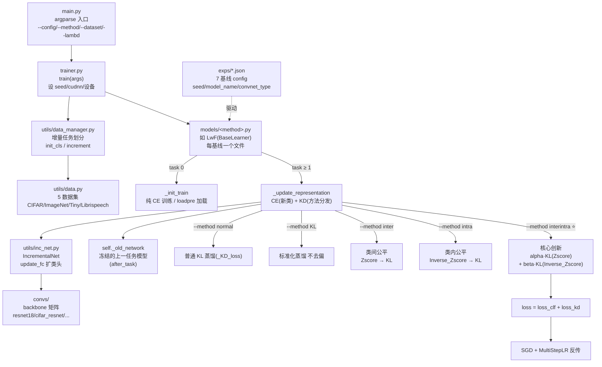

# 🧬 方法—代码实现剖析：Maintaining Fairness in LKD for CIL

> 剖析对象：`gaozijian19/Maintaining-Fairness-in-LKD-for-CIL` ｜ 数据来源：GitLink（gitlink-cli 实时采集）｜ 剖析时间：2026-07-03
> 本文档由 `gitlink-research-insight` skill 的 **A2 模式**产出，回答"论文方法如何落到代码、想改某模块该看哪个文件"。所有结论可经 gitlink-cli 复现核查。
> 配套：内涵解读见 [`maintaining-fairness-lkd-cil-insight.md`](maintaining-fairness-lkd-cil-insight.md)；复现性体检见 `../../gitlink-research-repro/examples/`。

---

## 一、架构总览（Mermaid）



> 关键边：**`--method` 一个参数**就在 `_update_representation` 里切换 6+ 种蒸馏策略；核心创新 `interintra` 完全落在该分支内，**不改训练骨架、不加参数**，这就是论文宣称"即插即用"的代码依据。

---

## 二、方法—代码映射表

| # | 论文/方法概念 | 对应文件 : 位置 | 一句话作用 |
|---|--------------|-----------------|-----------|
| 1 | **类间公平 inter-class fairness**（logit 全类归一化） | `models/lwf.py` → `Zscore(logits)` | 对每个样本在**所有类**维度做 z-score（`(x-mean)/std`，`dim=-1`），消除 logit 量级偏置，让 student 学习类间相对关系而非绝对值 |
| 2 | **类内公平 intra-class fairness** | `models/lwf.py` → `Inverse_Zscore(logits)` | 对每个**类**在 batch 维度做 z-score（`dim=0`），压制 overconfident teacher 的类内偏置，保证旧类内部也公平 |
| 3 | **标准化知识蒸馏** | `models/lwf.py` → `DistillKL_logit_stand(y_s,y_t,T)` | 对标准化后 logit 做 KL 蒸馏：`KLDivLoss(log_softmax(s/T), softmax(t/T)) * T²` |
| 4 | **inter+intra 联合（核心创新）** | `models/lwf.py` → `_update_representation` 的 `elif self.method=="interintra"` 分支 | `loss_kd = alpha·loss_kd1(inter) + beta·loss_kd2(intra)`；`alpha/beta` 由 `--lambd` 派生（`__init__`：`lambd=-1→alpha=2,beta=0` 纯 inter；`lambd=0→` 纯 intra） |
| 5 | **新类交叉熵 CE** | `models/lwf.py` → `_update_representation` 中 `loss_clf` | `F.cross_entropy(logits[:, known_classes:], fake_targets)`，**只对新类 logit 切片**做 CE（`fake_targets = targets - known_classes`） |
| 6 | **总损失** | `models/lwf.py` → `loss = loss_kd + loss_clf` | KD（旧类关系）+ CE（新类学习）联合优化，正是论文要消解的"KD-CE 冲突"的落点 |
| 7 | **增量网络 / 可扩分类头** | `utils/inc_net.py` → `IncrementalNet.update_fc()` + `convs/` | backbone（默认 `resnet18`，由 `exps/*.json` 的 `convnet_type` 选）+ 每任务扩展 FC 类头 |
| 8 | **训练编排 / 任务循环** | `trainer.py` + `models/base.py`（`BaseLearner`） | task 0 走 `_init_train`（纯 CE 或 `--loadpre` 加载首阶段权重）；task ≥ 1 走 `_update_representation`（CE+KD） |
| 9 | **实验矩阵 / 超参落盘** | `exps/lwf.json` 等 7 个 config | 锁定 `seed:[1993]`、`model_name`、`convnet_type:resnet18`、`memory_size` 等，复现性与消融的单一事实源 |

> ≥5 组件达标（共 9 项）。每行"论文概念 ↔ 代码位置 ↔ 作用"三栏齐全，可逐行核查。

---

## 三、核心机制代码定位（论文两创新点的确切代码）

**创新点一 · 类间公平** —— `Zscore()`（`models/lwf.py` 末尾工具函数区）：
```python
def Zscore(logits):
    mean = logits.mean(dim=-1, keepdims=True)   # 每个样本、跨所有类求均值
    stdv = logits.std(dim=-1, keepdims=True)
    return (logits - mean) / (1e-7 + stdv)       # 全类归一化 → 消除 recency bias
```

**创新点二 · 类内公平** —— `Inverse_Zscore()`：
```python
def Inverse_Zscore(logits):
    mean = logits.mean(dim=0, keepdims=True)    # 每个类、跨 batch 求均值
    stdv = logits.std(dim=0, keepdims=True)
    return (logits - mean) / (1e-7 + stdv)       # 类内归一化 → 压制 overconfident teacher
```

**两者联合** —— `--method interintra` 分支（`_update_representation`）：
```python
elif self.method == "interintra":
    loss_kd1 = DistillKL_logit_stand(Zscore(logits)[:, :self._known_classes], Zscore(old_logits), T)        # 类间
    loss_kd2 = DistillKL_logit_stand(Zscore(logits.t())[:self._known_classes, :], Zscore(old_logits.t()), T)  # 类内(转置→dim=0)
    loss_kd  = self.alpha * loss_kd1 + self.beta * loss_kd2    # alpha/beta 由 --lambd 派生
```

> 这三段就是论文 Figure/公式的代码实体。**改公平机制只需动这三个函数 + interintra 分支**，无需触碰训练循环——这正是"即插即用、零额外训练成本"的代码级证据。

---

## 四、想改 X，看哪里（快速定位表）

| 我想做的事 | 第一站文件 | 备注 |
|-----------|-----------|------|
| 换/加蒸馏策略（新 `--method`） | `models/lwf.py` → `_update_representation` 的方法分发 `if/elif` 链 | 加一个 `elif self.method=="你的方法"` 即可 |
| 调 inter/intra 权重 | `main.py --lambd`（→ `__init__` 的 `alpha/beta` 公式） | `lambd=-1` 纯 inter，`lambd=0` 纯 intra，正值联合 |
| 换 backbone | `exps/*.json` 的 `convnet_type` + `convs/` | 支持 resnet/cifar_resnet/memo_*/ucir_*/resnet_cbam 等 |
| 加新数据集 | `utils/data.py` 新增 `iData` 子类 + `download_data` | 设 `use_path` 决定自动下载或手填路径 |
| 调 KD 温度/epoch/lr | `models/lwf.py` 模块级常量（`T=2`、`epochs=100`、`lrate=0.1`…） | **硬编码在模块顶部**，非 config 驱动（A2 发现的工程债） |
| 改增量划分 | `main.py --init_cls/--increment` 或 `exps/*.json` | 决定任务数与每段类数 |

---

## 附：本剖析采集命令（可复现）

```bash
OWNER=gaozijian19; REPO=Maintaining-Fairness-in-LKD-for-CIL
gitlink-cli repo +tree --owner $OWNER --repo $REPO --format json
MSYS_NO_PATHCONV=1 gitlink-cli api GET "/$OWNER/$REPO/sub_entries" --query "filepath=models/lwf.py&ref=master" --format json
MSYS_NO_PATHCONV=1 gitlink-cli api GET "/$OWNER/$REPO/sub_entries" --query "filepath=main.py&ref=master"       --format json
MSYS_NO_PATHCONV=1 gitlink-cli api GET "/$OWNER/$REPO/sub_entries" --query "filepath=trainer.py&ref=master"     --format json
MSYS_NO_PATHCONV=1 gitlink-cli api GET "/$OWNER/$REPO/sub_entries" --query "filepath=exps/lwf.json&ref=master"  --format json
# models/、convs/、utils/ 目录结构同法用 sub_entries(filepath=<dir>) 列出
```
