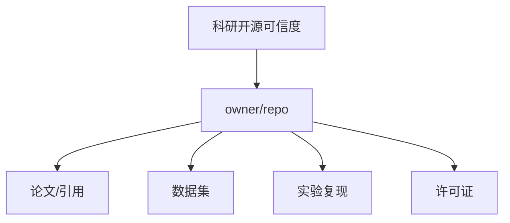

# gitlink-research-trust 使用示例

## 目标

搜索 GitLink 上公开科研仓库，评估 3-5 个候选仓库，并生成可信度报告、CSV 摘要、Mermaid 图谱和脱敏证据日志。

## 示例命令

```bash
export GITLINK_CONFIG_DIR="${GITLINK_CONFIG_DIR:-$HOME/.config/gitlink-cli}"

gitlink-cli auth status

gitlink-cli search +repos -k "research" --format json
gitlink-cli search +repos -k "dataset" --format json
gitlink-cli search +repos -k "AI" --format json

gitlink-cli repo +info --owner <owner> --repo <repo> --format json
gitlink-cli repo +tree --owner <owner> --repo <repo> --ref <default_branch> --format json
gitlink-cli repo +readme --owner <owner> --repo <repo> --ref <default_branch> --format json
```

## Agent 处理步骤

1. 合并搜索结果，按关键词命中数、活跃度、Fork/Star/关注信号排序。
2. 对每个候选仓库读取 `repo +info`、`repo +tree` 和 `repo +readme`。
3. 从目录树识别 `LICENSE`、`requirements.txt`、`pyproject.toml`、`package.json`、`go.mod`、`tests`、`scripts`、`examples`、`CITATION.cff`。
4. 从 README 识别论文、DOI、arXiv、BibTeX、数据集、实验命令、安装说明和示例。
5. 按 100 分评分模型生成报告。
6. 写入 `evidence.jsonl` 前脱敏 Token、Cookie、密码和私钥。

## 输出示例

```text
reports/research-trust-20260625/
├── index.md
├── research_trust_report.md
├── summary.csv
├── graph.mmd
├── analysis.json
└── evidence.jsonl
```

## Mermaid 图谱片段



## 注意事项

- 对第三方仓库保持只读。
- 不把认证凭据写入报告。
- 如果 README 或目录树接口失败，保留错误摘要并继续分析其他仓库。
