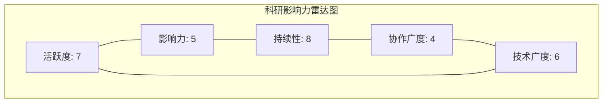

# gitlink-scholar-profile（学者/团队科研画像）

**CRITICAL — 开始前必须先阅读 [`../gitlink-shared/SKILL.md`](../gitlink-shared/SKILL.md)。**
**CRITICAL — GitLink 操作只能用 `gitlink-cli`。**

> **前置条件：** 先阅读 [`../gitlink-shared/SKILL.md`](../gitlink-shared/SKILL.md) 了解认证和全局参数。


## 功能概述

本技能为 GitLink 用户或组织生成完整的科研产出画像，核心回答：**这个学者/团队的科研产出全貌如何？**

分析维度：

1. **科研仓库发现** — 查找用户/组织名下所有科研类仓库
2. **产出数据聚合** — 聚合 Star、Fork、语言分布、维护时长
3. **研究方向聚类** — 基于仓库描述关键词自动聚类研究方向
4. **代表性成果识别** — 识别高影响力仓库
5. **影响力雷达图** — 多维度科研影响力可视化

---

## 一、获取用户/组织基本信息

### 1.0 根据用户输入，进行登录名解析

**GitLink 的显示名（username/name）和登录名（login）可能不同**。

直接 `user +info --login username` 会返回 404。

**必须按以下流程解析正确的登录名：**

```
个人用户流程：
  Step A：直接用用户输入作为 login 调用 user +info
    gitlink-cli user +info --login <user_input> --format json

  Step B：如果返回 404（用户不存在/页面不存在）
    → 调用搜索接口
    gitlink-cli search +users -k <user_input> --format json

  Step C：从搜索结果中匹配用户
    - 如果 total_count == 1：直接取 users[0].login
    - 如果 total_count > 1：按 username/name 模糊匹配，优先精确匹配
      - 优先级：login 精确匹配 > username 精确匹配 > name 精确匹配 > 包含匹配
    - 如果 total_count == 0：报告"未找到该用户"

  Step D：用解析出的 login 重新调用
    gitlink-cli user +info --login <resolved_login> --format json
	
	
组织用户流程：
  Step A：直接用用户输入作为 login 调用 org +info
    gitlink-cli org +info --login <user_input> --format json

  Step B：如果返回 404（组织不存在/页面不存在）
    → 调用搜索接口
    gitlink-cli search +repos -k <user_input> --format json

  Step C：从搜索结果中匹配组织
    - 从结果中提取org登录名
	- 如果搜索结果为空，提示未找到该组织

  Step D：用解析出的 login 重新调用

```

**⚠️ 重要：后续所有操作（repo +list、repo +info 等）都应使用解析后的 login，而非用户原始输入。**

### 1.1 获取用户信息

```bash
# 获取用户详细信息
gitlink-cli user +info --login <login> --format json

# 获取当前登录用户信息
gitlink-cli user +me --format json
```

### 1.2 获取组织信息

```bash
# 获取组织详细信息
gitlink-cli org +info --id <org_name> --format json

# 获取组织成员列表
gitlink-cli org +members --id <org_name> --format json
```

---

## 二、科研仓库发现

### 2.1 获取用户所有仓库

```bash
# 获取用户创建的仓库列表
gitlink-cli repo +list --user <login> --format json

# 如返回分页，需多次请求（关注 meta.total_count）
```

### 2.2 获取组织所有仓库

```bash
# 获取组织管理的仓库列表
gitlink-cli repo +list --category manage --format json
```

### 2.3 科研类仓库筛选规则

AI 对获取的仓库列表进行筛选，识别科研类仓库：

```
✅ 科研类仓库特征（满足任一即纳入）：
  - 仓库名/描述含学术关键词：论文/论文代码/实验/research/paper/benchmark/dataset
  - 仓库名/描述含学科关键词：深度学习/NLP/CV/机器学习/量子计算/基因组/蛋白质/分子动力学
  - 仓库名/描述含高校/科研机构名称：清华/北大/中科院/ucas/thu/pku/cas
  - 仓库名含常见科研后缀：-lab、-experiment、-thesis、-project
  - 包含 arXiv 论文链接（描述中含 arxiv.org 或 24xx.xxxxx）

❌ 非科研类仓库（排除）：
  - 纯工具类仓库（如 dotfiles、vim-config、my-scripts）
  - 课程作业仓库（含 homework、assignment、lab-course）
  - 个人博客/主页（含 blog、homepage、portfolio）
  - Fork 但无独立开发的仓库（fork=true 且无额外 commit）
```

### 2.4 获取每个仓库的详细信息

```bash
# 对每个候选仓库获取详细信息
gitlink-cli repo +info --owner <owner> --repo <repo> --format json
```

---

## 三、产出数据聚合

### 3.1 数据提取字段

对每个科研仓库，提取以下数据：

```
核心指标：
  - name：仓库名称
  - description：仓库描述
  - language：主要编程语言
  - stars_count：Star 数
  - forks_count：Fork 数
  - watchers_count：关注数
  - issues_count：Issue 数量
  - pr_count：PR 数量
  - created_at：创建时间
  - updated_at：最近更新时间

衍生指标：
  - 维护时长（月）= (updated_at - created_at) 的月数
  - 活跃度 = 最近 6 个月是否有更新
  - 社区参与度 = issues_count + pr_count
```

### 3.2 聚合统计

AI 对所有科研仓库进行聚合：

```
聚合维度：
  - 总科研仓库数
  - 总 Star 数 / 总 Fork 数
  - 主要编程语言分布（如 Python 60%、C++ 25%、Julia 15%）
  - 平均维护时长
  - 活跃仓库数 / 总仓库数
  - 社区参与仓库数（Issue/PR > 10）
```

---

## 四、研究方向聚类

### 4.1 关键词提取与聚类

AI 从所有科研仓库的 `description` 字段中提取关键词，并进行自动聚类：

```
聚类规则：
  1. 提取每个仓库描述中的技术/学科关键词
  2. 去除停用词（的、和、与、based、using 等）
  3. 按语义相近性聚合为研究方向

常见研究方向关键词映射：

  计算机视觉：目标检测/图像分类/语义分割/图像生成/目标跟踪/3D重建
  自然语言处理：文本分类/命名实体/情感分析/机器翻译/问答系统/大模型
  强化学习：策略优化/多智能体/奖励设计/博弈论
  量子计算：量子算法/量子模拟/量子纠错/量子机器学习
  生物信息：基因组/蛋白质/分子动力学/药物设计
  网络安全：漏洞检测/入侵检测/密码学/隐私保护
```

### 4.2 研究方向输出格式

```
研究方向分布：
  1. 计算机视觉（3 个仓库，占 50%）
     - <repo1>：目标检测算法优化
     - <repo2>：图像分割新架构
     - <repo3>：3D 点云处理
  2. 自然语言处理（2 个仓库，占 33%）
     - <repo4>：预训练语言模型微调
     - <repo5>：多语言机器翻译
  3. 强化学习（1 个仓库，占 17%）
     - <repo6>：多智能体协作策略
```

---

## 五、代表性成果识别

### 5.1 代表性成果筛选规则

```
代表性成果条件（满足任一即入选）：
  - Star 数 > 50（高关注度）
  - Fork 数 > 20（高复用度）
  - 近 3 个月有更新 + Issue/PR > 10（高活跃度）
  - 描述中含顶会/顶刊论文引用（NeurIPS/ICML/ICLR/CVPR/ACL/AAAI/Nature/Science）

排序规则：
  - 综合得分 = Star × 0.4 + Fork × 0.3 + 活跃度 × 0.2 + 社区参与 × 0.1
  - 活跃度：近 3 月有更新=10，6 月内=7，1 年内=4，1 年以上=1
  - 社区参与：min(Issue+PR, 50) / 50 × 10
```

### 5.2 获取代表性成果仓库的进一步信息

```bash
# 分析贡献者
gitlink-cli api GET /:owner/:repo/contributors --format json 

# 获取最近活跃度
gitlink-cli repo +info --owner owner --repo repo --format json
```

---

## 六、影响力雷达图

### 6.1 五维雷达图定义

```
雷达图五个维度（每项 0-10 分）：

1. 活跃度（Activity）
   - 基于最近 6 个月的仓库更新频率
   - 评分：≥5 个仓库有更新=10，3-4 个=7，1-2 个=4，0 个=0

2. 影响力（Impact）
   - 基于 Star + Fork 总量
   - 评分：>500=10，200-500=8，50-200=5，10-50=3，<10=0

3. 持续性（Persistence）
   - 基于仓库平均维护时长
   - 评分：>36 个月=10，24-36=8，12-24=5，6-12=3，<6=0

4. 协作广度（Collaboration）
   - 基于有外部贡献者参与的仓库比例
   - 评分：>80%=10，50-80%=7，20-50%=4，<20%=1，0%=0

5. 技术广度（Diversity）
   - 基于研究方向数量和语言种类
   - 评分：≥4 个方向 + ≥3 种语言=10，3 方向 + 2 语言=7，2 方向 + 2 语言=4，1 方向=1
```

### 6.2 雷达图 Mermaid 输出格式



AI 应使用 ASCII 文本格式输出雷达图：

```
           活跃度
             ★★★★★★★☆☆☆  7/10
              ╲         ╱
   技术广度   ╲       ╱   影响力
 ★★★★★★☆☆☆☆  ╲   ╱  ★★★★★☆☆☆☆☆  5/10
    6/10       ╲ ╱
               ★
             ╱   ╲
           ╱       ╲
 持续性   ╱           ╲   协作广度
★★★★★★★★☆☆ 8/10       ★★★★☆☆☆☆☆☆  4/10
```

---

## 七、完整科研画像报告模板

```markdown
## 👤 学者/团队科研画像报告

**画像对象：** <login> / <org_name>
**分析时间：** 2026-06-08
**数据来源：** GitLink 平台

---

### 一、基本信息

| 项目 | 信息 |
|------|------|
| 用户/组织名 | zhangsan |
| 类型 | 个人学者 / 科研团队 |
| 科研仓库数 | 6 |
| 加入 GitLink 时间 | 2024-03-15 |

---

### 二、科研产出概览

| 指标 | 数值 |
|------|------|
| 总科研仓库 | 6 个 |
| 总 Star 数 | 234 |
| 总 Fork 数 | 89 |
| 主要语言 | Python (4)、C++ (1)、Julia (1) |
| 活跃仓库（近 6 月更新） | 4 个 |
| 平均维护时长 | 18 个月 |

---

### 三、研究方向分布

1. **计算机视觉**（3 个仓库，50%）
   - `yolov8-improved`：YOLOv8 目标检测改进 ⭐ 85
   - `seg-any-extension`：Segment Anything 扩展应用 ⭐ 42
   - `point-cloud-net`：3D 点云神经网络 ⭐ 23

2. **自然语言处理**（2 个仓库，33%）
   - `llm-finetune-toolkit`：大语言模型微调工具包 ⭐ 56
   - `multi-lang-translator`：多语言翻译系统 ⭐ 18

3. **强化学习**（1 个仓库，17%）
   - `marl-coop`：多智能体协作策略 ⭐ 10

---

### 四、代表性成果

#### 🏆 成果一：`yolov8-improved`

| 指标 | 数值 |
|------|------|
| Star | 85 |
| Fork | 32 |
| 主要语言 | Python |
| 维护时长 | 14 个月 |
| 最近更新 | 2026-05-20（展示年月日即可） |
| 关联论文 | arXiv:2403.xxxxx |

**核心贡献：** 提出了改进的 YOLOv8 检测头，在小目标检测上 mAP 提升 3.2%。

#### 🏆 成果二：`llm-finetune-toolkit`

| 指标 | 数值 |
|------|------|
| Star | 56 |
| Fork | 28 |
| 主要语言 | Python |
| 维护时长 | 10 个月 |
| 最近更新 | 2026-06-01（展示年月日即可） |

**核心贡献：** 提供了 LLM 微调的一站式工具，支持 LoRA/QLoRA/P-Tuning。

---

### 五、影响力雷达图

```
           活跃度
             ★★★★★★★☆☆☆  7/10
              ╲         ╱
技术广度   ╲       ╱   影响力
★★★★★★☆☆☆☆  ╲   ╱  ★★★★★☆☆☆☆☆  5/10
6/10       ╲ ╱
★
╱   ╲
╱       ╲
持续性   ╱           ╲   协作广度
★★★★★★★★☆☆ 8/10       ★★★★☆☆☆☆☆☆  4/10
```

**综合评价：** 该学者在计算机视觉领域产出丰富，活跃度和持续性较好，但协作广度有待提升，建议加强跨团队合作。

---

### 六、改进建议（如果检索的用户非当前登录用户，不要给出这条信息）

1. **提升协作广度**：当前 4/10，建议将部分仓库设为组织仓库，邀请外部贡献者参与
2. **补充论文引用**：2 个仓库缺少 arXiv/论文链接，建议补充
3. **维护早期仓库**：`point-cloud-net` 超 6 个月未更新，建议补充文档或标记归档
4. **增加英文 README**：3 个仓库仅中文 README，建议添加英文版以扩大国际影响力
```

---

## 八、执行步骤总览

```bash
# Step 1：获取用户/组织基本信息
gitlink-cli user +info --login <login> --format json
# 或
gitlink-cli org +info --id <org_name> --format json

# Step 2：获取所有仓库列表
gitlink-cli repo +list --user <login> --format json
# 或
gitlink-cli repo +list --category manage --format json

# Step 3：AI 筛选科研类仓库（基于仓库名/描述关键词）

# Step 4：对每个科研仓库获取详细信息
gitlink-cli repo +info --owner <owner> --repo <repo> --format json

# Step 5：如果是组织，获取团队成员信息
gitlink-cli org +members --id <org_name> --format json

# Step 6：分析贡献者
gitlink-cli api GET /:owner/:repo/contributors --format json 
gitlink-cli repo +info --owner owner --repo repo --format json

# Step 7：AI 综合分析，生成科研画像报告
 - 聚合统计数据
 - 研究方向聚类
 - 代表性成果识别
 - 影响力雷达图
```

---

## 注意事项

- ✅ **仓库数量可能较多**：活跃学者可能有 20+ 仓库，建议分批处理
- ✅ **组织画像更复杂**：组织画像需聚合多个成员的产出，注意去重
- ⚠️ **Fork 仓库处理**：Fork 的仓库如果无独立开发（无额外 commit），不计入科研产出
- ✅ **搜索补充发现**：如果 `repo +list` 未列出所有仓库，可用 `search +repos` 补充：
  ```bash
  gitlink-cli search +repos -k "<login>" --format json
  ```
- ⚠️ **影响力仅基于 GitLink 数据**：学者可能在 GitHub/其他平台也有产出，本画像不涵盖
- ✅ **雷达图可用 Mermaid 渲染**：报告中的雷达图建议同时提供 Mermaid 格式以便渲染
- ✅ **生成结果**：最终生成的结果报告应以markdown形式产出
